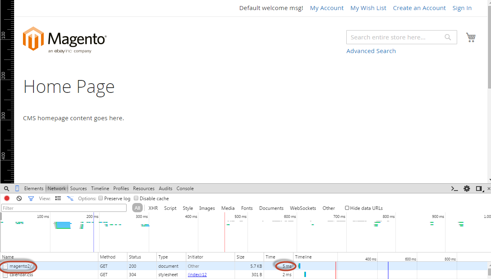

# Konfiguration der Lackierung überprüfen {#final-verification}

Nachdem Sie nun die von Commerce für Sie generierte `default.vcl` verwendet haben, können Sie einige abschließende Überprüfungen durchführen, um sicherzustellen, dass „Lack“ funktioniert.

{{varnish-config-cloud}}

## HTTP-Antwortkopfzeilen überprüfen

Verwenden Sie `curl` oder ein anderes Dienstprogramm, um HTTP-Antwort-Header anzuzeigen, wenn Sie eine Commerce-Seite in einem Webbrowser besuchen.

Stellen Sie zunächst sicher, dass Sie [Entwicklermodus](../cli/set-mode.md#change-to-developer-mode) verwenden. Andernfalls werden die Kopfzeilen nicht angezeigt.

Beispiel:

```shell
curl -I -v --location-trusted 'http://192.0.2.55/magento2'
```

Wichtige Kopfzeilen:

```text
X-Magento-Cache-Control: max-age=86400, public, s-maxage=86400
Age: 0
X-Magento-Cache-Debug: MISS
```

>[!INFO]
>
>Dieser Wert ist auch zulässig: `X-Magento-Cache-Debug: HIT`.

## Seitenladezeiten überprüfen

Wenn „Lackieren“ funktioniert, sollte jede Commerce-Seite mit zwischenspeicherbaren Blöcken in weniger als 150 ms geladen werden. Beispiele für solche Seiten sind die Kategorieseiten für die Haustür und die Storefront.

Verwenden Sie einen Browser-Inspektor, um die Seitenladezeiten zu messen.

So verwenden Sie beispielsweise den Chrome-Inspektor:

1. Greifen Sie auf alle zwischenspeicherbaren Commerce-Seiten in Chrome zu.
1. Klicken Sie mit der rechten Maustaste auf eine beliebige Stelle auf der Seite.
1. Klicken Sie im Popup-Menü auf **[!UICONTROL Inspect Element]**
1. Klicken Sie im Inspektor-Fenster auf die Registerkarte **[!UICONTROL Network]** .
1. Aktualisieren Sie die Seite.
1. Scrollen Sie zum oberen Rand des Inspektor-Fensters, damit Sie die URL der angezeigten Seite sehen können.

   Die folgende Abbildung zeigt ein Beispiel für das Laden der Seite mit dem `magento2`-Index.

   

   Die Seitenladezeit wird neben der Seiten-URL angezeigt. In diesem Fall beträgt die Ladezeit 5 ms. Dadurch lässt sich bestätigen, dass Varnish die Seite zwischengespeichert hat.

1. Um HTTP-Antwort-Header anzuzeigen, klicken Sie auf die Seiten-URL (in der Spalte Name).

   Sie können HTTP-Header anzeigen, die im Abschnitt Überprüfen von HTTP-Antwort-Headern detaillierter erläutert werden.

## Überprüfen des Commerce-Cache

Stellen Sie sicher, dass das `<magento_root>/var/page_cache` leer ist:

1. Melden Sie sich bei Ihrem Commerce-Server an oder wechseln Sie zum Dateisystembesitzer.
1. Geben Sie den folgenden Befehl ein:

   ```shell
   rm -rf <magento_root>/var/page_cache/*
   ```

1. Rufen Sie eine oder mehrere zwischenspeicherbare Commerce-Seiten auf.
1. Überprüfen Sie das `var/page_cache/`.

   Wenn das Verzeichnis leer ist, herzlichen Glückwunsch! Sie haben Varnish und Commerce erfolgreich für die Zusammenarbeit konfiguriert!

1. Wenn Sie das Verzeichnis `var/page_cache/` gelöscht haben, starten Sie Varnish neu.

>[!TIP]
>
>Wenn Sie auf 503-Fehler (Backend-Abruf fehlgeschlagen) stoßen, finden Sie weitere Informationen unter [Fehlerbehebung für 503-Fehler (Dienst nicht verfügbar](https://experienceleague.adobe.com/docs/commerce-knowledge-base/kb/troubleshooting/miscellaneous/troubleshooting-503-errors.html) im _Adobe Commerce-Hilfezentrum_.
