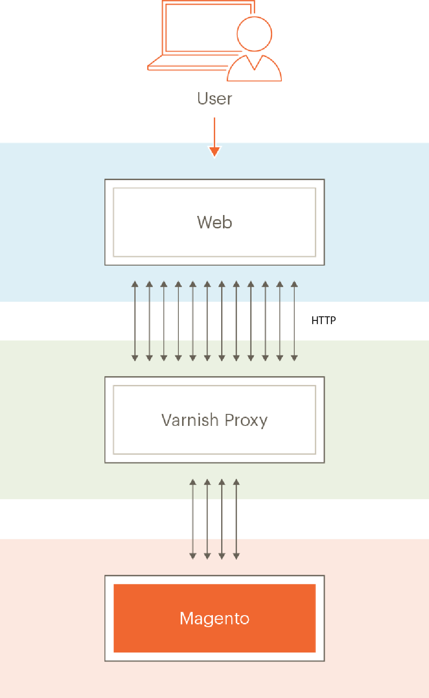

# Lack konfigurieren

[Varnish Cache] ist ein Open-Source-Webanwendungsbeschleuniger (auch als _HTTP-Beschleuniger“_ „Caching _HTTP Reverse Proxy_ bezeichnet). Varnish speichert (oder speichert) Dateien oder Fragmente von Dateien im Speicher, was Varnish in die Lage versetzt, die Antwortzeit und den Bandbreitenverbrauch bei zukünftigen, äquivalenten Anfragen zu reduzieren. Im Gegensatz zu Webservern wie Apache und Nginx wurde Varnish ausschließlich für die Verwendung mit dem HTTP-Protokoll entwickelt.

[Systemanforderungen](../../installation/system-requirements.md) listet die unterstützten Versionen von Varnish auf.

>[!WARNING]
>
>Wir _dringend empfehlen_ Sie Lack in der Produktion verwenden. Das integrierte Caching ganzer Seiten - entweder auf das Dateisystem oder auf [Datenbank](https://developer.adobe.com/commerce/php/development/cache/partial/database-caching/) - ist viel langsamer als Varnish, und Varnish wurde entwickelt, um den HTTP-Traffic zu beschleunigen.

Weitere Informationen zu Lack finden Sie unter:

- [Das große Lackbild]
- [Startoptionen lackieren]
- [Lack- und Website-Performance]

## Lacktopologie-Diagramm

Die folgende Abbildung zeigt eine Grundansicht von Lack in Ihrer Commerce-Topologie.



In der vorherigen Abbildung führen HTTP-Anfragen von Benutzern über das Internet zu zahlreichen Anfragen für CSS, HTML, JavaScript und Bilder (zusammenfassend als &quot;_&quot; bezeichnet_. Lack befindet sich vor dem Webserver und leitet diese Anfragen an den Webserver weiter.

Wenn der Webserver Assets zurückgibt, werden zwischenspeicherbare Assets in Lack gespeichert. Alle nachfolgenden Anfragen für diese Assets werden von Varnish erfüllt (d. h. die Anfragen erreichen den Webserver nicht). Lack gibt zwischengespeicherte Inhalte extrem schnell zurück. Das Ergebnis sind schnellere Antwortzeiten, mit denen die Inhalte an die Benutzer zurückgegeben werden, und eine reduzierte Anzahl von Anfragen, die von Commerce erfüllt werden müssen.

Assets, das von Varnish zwischengespeichert wird, läuft in einem konfigurierbaren Intervall ab oder wird durch neuere Versionen derselben Assets ersetzt. Sie können den Cache auch manuell löschen, indem Sie entweder den Befehl Admin oder [`magento cache:clean`](../cli/manage-cache.md#clean-and-flush-cache-types) verwenden.

## Prozessübersicht

In diesem Abschnitt wird beschrieben, wie Sie Varnish mit einem minimalen Parametersatz anfänglich installieren und testen, ob es funktioniert. Exportieren Sie dann eine Lackkonfiguration vom Commerce-Administrator und testen Sie sie erneut.

Der Prozess lässt sich wie folgt zusammenfassen:

1. Installieren Sie Varnish und testen Sie es, indem Sie auf eine beliebige Commerce-Seite zugreifen, um zu sehen, ob Sie HTTP-Antwort-Header erhalten, die anzeigen, dass Varnish funktioniert.
1. Installieren Sie die Commerce-Software und verwenden Sie den Administrator, um eine Varnish-Konfigurationsdatei zu erstellen.
1. Ersetzen Sie Ihre vorhandene Lackkonfigurationsdatei durch die vom Administrator erstellte.
1. Testen Sie alles noch einmal.

   Wenn sich nichts in Ihrem `<magento_root>/var/page_cache` befindet, haben Sie Varnish erfolgreich mit Commerce konfiguriert!

>[!NOTE]
>
>- Sofern nicht anders angegeben, müssen Sie alle in diesem Thema besprochenen Befehle als Benutzer mit `root` eingeben.
>
>- Dieses Thema wurde für Varnish unter CentOS und Apache 2.4 geschrieben. Wenn Sie Varnish in einer anderen Umgebung einrichten, können einige Befehle unterschiedlich sein. Weitere Informationen finden Sie in der Lackdokumentation .

## Bekannte Probleme

Wir kennen die folgenden Probleme mit Lack:

- [Lack unterstützt SSL nicht]

  Verwenden Sie alternativ eine SSL-Terminierung oder einen SSL-Terminierungs-Proxy.

- Wenn Sie den Inhalt des `<magento_root>/var/cache` Verzeichnisses manuell löschen, müssen Sie Varnish neu starten.

- Mögliche Fehlermeldung bei der Installation von Commerce:

  ```
  Error 503 Service Unavailable
  Service Unavailable
  XID: 303394517
  Varnish cache server
  ```

  Wenn dieser Fehler auftritt, bearbeiten Sie `default.vcl` und fügen Sie der `backend` wie folgt eine maximale Wartezeit hinzu:

  ```conf
  backend default {
      .host = "127.0.0.1";
      .port = "8080";
      .first_byte_timeout = 600s;
  }
  ```

## Übersicht über das Zwischenspeichern von Lacken

Das Zwischenspeichern von Lacken funktioniert mit Commerce mit:

- [`nginx.conf.sample`](https://github.com/magento/magento2/blob/2.4/nginx.conf.sample) aus dem GitHub-Repository von Magento 2
- `.htaccess` verteilte Konfigurationsdatei für Apache in Commerce
- `default.vcl` Konfiguration für mit dem [Admin](../cache/configure-varnish-commerce.md) generierten Lack

>[!INFO]
>
>Dieses Thema behandelt nur die Standardoptionen in der vorherigen Liste. Es gibt viele andere Möglichkeiten, das Caching in komplexen Szenarien zu konfigurieren (z. B. die Verwendung eines Content Delivery Network). Diese Methoden würden den Rahmen dieses Handbuchs sprengen.

Bei der ersten Browser-Anfrage werden zwischenspeicherbare Assets von Varnish an den Client-Browser bereitgestellt und im Browser zwischengespeichert.

Darüber hinaus verwendet Varnish ein Entity Tag (ETag) für statische Assets. Mit dem ETag können Sie bestimmen, wann sich statische Dateien auf dem Server ändern. Daher werden statische Assets an den Client gesendet, wenn sie sich auf dem Server ändern - entweder auf eine neue Anforderung eines Browsers oder wenn der Client den Browser-Cache aktualisiert, normalerweise durch Drücken von F5 oder Strg+F5.

Weitere Informationen finden Sie in den folgenden Abschnitten.

## Caching nach Browser-Anfrage

In diesem Abschnitt wird ein Browser-Inspektor verwendet, um zu zeigen, wie Assets in der ersten Anfrage an den Browser übermittelt und anschließend aus dem lokalen Browser-Cache geladen werden.

### Erste Browser-Anfrage

`nginx.conf.sample` und `.htaccess` bieten Optionen für das Client-Caching. Wenn die erste Anfrage von einem Browser für ein zwischenspeicherbares Objekt gestellt wird, stellt Varnish es an den Client bereit.

Die folgende Abbildung zeigt ein Beispiel mit einem Browser-Inspektor:


Das vorherige Beispiel zeigt eine Anfrage für die Storefront-Hauptseite (`m2_ce_my`). CSS- und JavaScript-Assets werden im Client-Browser zwischengespeichert.

>[!NOTE]
>
>Die meisten statischen Assets verfügen über einen HTTP-Status-Code 200 (OK), der angibt, dass das Asset vom Server abgerufen wurde.

### Zweite Browser-Anfrage

Wenn derselbe Browser dieselbe Seite erneut anfordert, werden diese Assets aus dem lokalen Browser-Cache bereitgestellt, wie in der folgenden Abbildung dargestellt.


Beachten Sie den Unterschied in der Antwortzeit zwischen der ersten und der zweiten Anfrage. Auch hier weisen statische Assets einen Antwort-Code von 200 (OK) auf, da sie zum ersten Mal aus dem lokalen Cache bereitgestellt werden.

## Verwendung von Etag in Commerce

Das folgende Beispiel zeigt Antwort-Header für ein bestimmtes statisches Asset.


`calendar.css` verfügt über einen ETag-Antwort-Header, was bedeutet, dass die CSS-Datei im Client-Browser mit der Datei auf dem Server verglichen werden kann.

Darüber hinaus werden statische Assets mit dem HTTP-Status-Code 304 (Nicht geändert) zurückgegeben, wie in der folgenden Abbildung dargestellt.


Der 304-Status-Code tritt auf, weil der Benutzer seinen lokalen Cache ungültig gemacht hat und sich der Inhalt auf dem Server nicht geändert hat. Aufgrund des 304-Status-Codes wird das statische Asset _content_ nicht übertragen. Nur HTTP-Kopfzeilen werden in den Browser heruntergeladen.

Wenn sich der Inhalt auf dem Server ändert, lädt der Client das statische Asset mit einem HTTP-Status-Code 200 (OK) und einem neuen E-Tag herunter.

<!-- Link Definitions -->

[Das große Lackbild]: https://www.varnish-cache.org/docs/trunk/users-guide/intro.html
[Lackcache]: https://varnish-cache.org
[Startoptionen für Lackierung]: https://www.varnish-cache.org/docs/trunk/reference/varnishd.html#ref-varnishd-options
[Lack- und Website-Performance]: https://www.varnish-cache.org/docs/trunk/users-guide/performance.html#users-performance
[Lack unterstützt kein SSL]: https://www.varnish-cache.org/docs/3.0/phk/ssl.html
