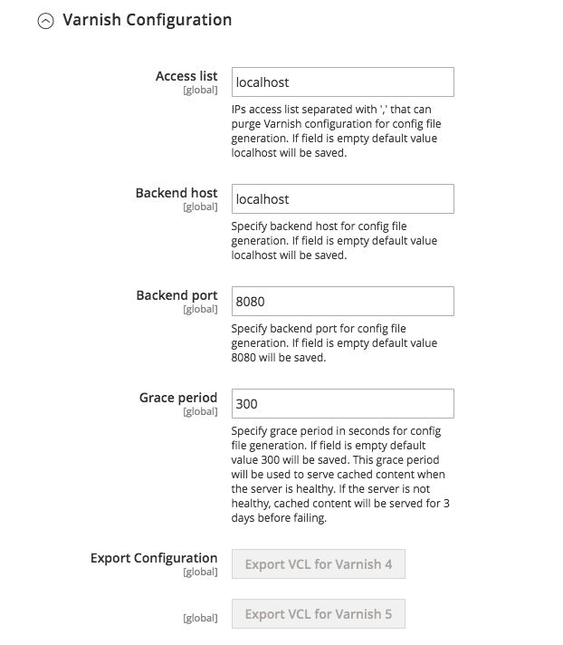

# Konfigurieren der Commerce-Anwendung für die Verwendung von Varnish

So konfigurieren Sie Commerce für die Verwendung von Varnish:

1. Melden Sie sich bei Admin als Administrator an.
1. Klicken Sie auf **[!UICONTROL Stores]** > Einstellungen > **Konfiguration** > **Erweitert** > **System** > **Vollständiger Seiten-Cache**.
1. Klicken Sie in der Liste **[!UICONTROL Caching Application]** auf **Varnish Caching**.
1. Geben Sie einen Wert in das Feld **[!UICONTROL TTL for public content]** ein.
1. Erweitern Sie **[!UICONTROL Varnish Configuration]** und geben Sie die folgenden Informationen ein:

   | Feld | Beschreibung |
   | ----- | ----------- |
   | Zugriffsliste | Geben Sie den vollständig qualifizierten Hostnamen, die IP-Adresse oder den IP-Adressbereich für die IP-Adresse [Classless Inter-Domain Routing (CIDR)](https://www.digitalocean.com/community/tutorials/understanding-ip-addresses-subnets-and-cidr-notation-for-networking)-Notation ein, für den Inhalte ungültig gemacht werden sollen. Siehe [Archivieren der Cache-Bereinigung](https://varnish-cache.org/docs/3.0/tutorial/purging.html). |
   | Backend-Host | Geben Sie den vollständig qualifizierten Hostnamen oder die IP-Adresse ein und lauschen Sie den Port des Varnish _backend_ oder _origin server_, d. h. des Servers, der den Inhalt bereitstellt, beschleunigt Varnish. Normalerweise ist dies Ihr Webserver. Siehe [ Cache-Backend-Server variieren](https://www.varnish-cache.org/docs/trunk/users-guide/vcl-backends.html). |
   | Backend-Port | Listener Port des Herkunftsservers. |
   | Übergangsphase | Bestimmt, wie lange Varnish veraltete Inhalte bereitstellt, wenn das Backend nicht reagiert. Der Standardwert ist 300 Sekunden. |
   | Handles params size | Gibt die maximale Anzahl von [Layout-Handles](https://developer.adobe.com/commerce/frontend-core/guide/layouts/#layout-handles) an, die am HTTP-Endpunkt [`{BASE-URL}/page_cache/block/esi`](use-varnish-esi.md) für die Zwischenspeicherung von Vollseiten verarbeitet werden. Eine Größenbeschränkung kann die Sicherheit und Leistung verbessern. Der Standardwert ist 100. |

1. Klicken Sie auf **Konfiguration speichern**.

Mit dem Befehlszeilen-Tool C können Sie auch die Option Varnish über die Befehlszeile aktivieren, anstatt sich beim Administrator anzumelden:

```bash
bin/magento config:set --scope=default --scope-code=0 system/full_page_cache/caching_application 2
```

## Varnish-Konfigurationsdatei exportieren

So exportieren Sie eine Varnish-Konfigurationsdatei aus dem Administrator:

1. Klicken Sie auf eine der Exportschaltflächen, um ein `varnish.vcl` zu erstellen, das Sie mit Varnish verwenden können.

   Wenn Sie beispielsweise Varnish 4 haben, klicken Sie auf **Export VCL for Varnish 4**

   Die folgende Abbildung zeigt ein Beispiel:

   

1. Sichern Sie Ihre vorhandene `default.vcl`. Benennen Sie dann die soeben exportierte `varnish.vcl`-Datei in `default.vcl` um. Kopieren Sie dann die Datei in das Verzeichnis &quot;`/etc/varnish/`&quot;.

   ```bash
   cp /etc/varnish/default.vcl /etc/varnish/default.vcl.bak2
   ```

   ```bash
   mv <download_directory>/varnish.vcl default.vcl
   ```

   ```bash
   cp <download_directory>/default.vcl /etc/varnish/default.vcl
   ```

1. Adobe empfehlen, `default.vcl` zu öffnen und den Wert von `acl purge` in die IP-Adresse des &quot;Varnish&quot;-Hosts zu ändern. (Sie können mehrere Hosts in separaten Zeilen angeben oder auch die CIDR-Notation verwenden.)

   Beispiel:

   ```conf
    acl purge {
       "localhost";
    }
   ```

1. Wenn Sie die Vagrantenkonsistenzprüfungen, den Übergangmodus oder die Konfiguration des Farbmodus anpassen möchten, lesen Sie [Erweiterte Varnish-Konfiguration](config-varnish-advanced.md).

1. Starten Sie Varnish und Ihren Webserver neu:

   ```bash
   service varnish restart
   ```

   ```bash
   service httpd restart
   ```

## Statische Cache-Dateien

Statische Dateien sollten nicht standardmäßig zwischengespeichert werden. Wenn Sie sie jedoch zwischenspeichern möchten, können Sie den Abschnitt &quot;`Static files caching`&quot;im VCL bearbeiten, um den folgenden Inhalt zu erhalten:

```conf
# Static files should not be cached by default
  return (pass);

# But if you use a few locales and do not use CDN you can enable caching static files by commenting previous line (#return (pass);) and uncommenting next 3 lines
  #unset req.http.Https;
  #unset req.http./* {{ ssl_offloaded_header }} */;
  #unset req.http.Cookie;
```

Sie müssen diese Änderungen vornehmen, bevor Sie Commerce für die Verwendung von &quot;Varnish&quot;konfigurieren.
