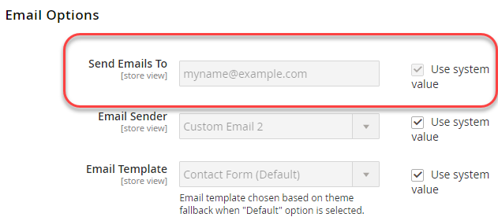

# Beispiel für die Verwendung von Umgebungsvariablen

Dieses Beispiel zeigt, wie Sie in Ihrem Entwicklungssystem gemeinsame, systemspezifische und vertrauliche Werte festlegen und dann alle Werte in Ihrem Produktionssystem mithilfe einer Kombination der gemeinsamen Konfigurations-, `config.php`- und PHP-Umgebungsvariablen festlegen.

Diese Konfigurationseinstellungen können von Entwicklungs- und Produktionssystemen gemeinsam verwendet werden:

MwSt.-Nummer und Name des Geschäfts unter **Geschäfte** > Einstellungen > **Konfiguration** > Allgemein > **Allgemein**

Diese Konfigurationseinstellungen sind entweder systemspezifisch oder sensibel, wie angegeben:

- Senden von E-Mails an (vertraulich) über **Stores** > Einstellungen > **Konfiguration** > Allgemein > **Kontakte**
- Standard-E-Mail-Domain (systemspezifisch) von **Stores** > Einstellungen > **Konfiguration** > Kunden > **Kundenkonfiguration** > **Optionen für neues Konto erstellen**

Sie können dasselbe Verfahren verwenden, um alle Einstellungen in den folgenden Verweisen zu konfigurieren:

- [Referenz zu sensiblen und systemspezifischen Konfigurationspfaden](../reference/config-reference-sens.md)
- [Referenz zu Zahlungskonfigurationspfaden](../reference/config-reference-payment.md)
- [Referenz zu allgemeinen Konfigurationspfaden](../reference/config-reference-general.md)
- [Konfigurationspfade für Commerce Enterprise B2B-Erweiterungen - Referenz](../reference/config-reference-b2b.md)

## Bevor Sie beginnen

Bevor Sie beginnen, richten Sie Dateisystemberechtigungen und -eigentümerschaft ein, wie in [Voraussetzung für Entwicklungs-, Build- und Produktionssysteme](../deployment/prerequisites.md) beschrieben.

## Annahmen

Dieses Thema enthält ein Beispiel für das Ändern der Konfiguration des Produktionssystems. Sie können bei Bedarf verschiedene Konfigurationsoptionen auswählen.

Für die Zwecke dieses Beispiels gehen wir von Folgendem aus:

- Sie verwenden die Git-Quell-Code-Verwaltung
- Das Entwicklungssystem ist in einem Git-Remote-Repository namens `mconfig` verfügbar
- Ihre Git-Arbeitsverzweigung heißt `m2.2_deploy`

## Schritt 1: Festlegen der Konfiguration im Entwicklungssystem

So legen Sie das Standardgebietsschema und die Gewichtungseinheiten in Ihrem Entwicklungssystem fest:

1. Melden Sie sich beim Administrator an.
1. Klicken Sie auf **Stores** > Einstellungen > **Konfiguration** > Allgemein > **Allgemein**.
1. Wenn mehr als eine Website verfügbar ist, verwenden Sie die Liste **Store-Ansicht** in der oberen linken Ecke, um zu einer anderen Website zu wechseln, wie in der folgenden Abbildung dargestellt.

   

1. Erweitern Sie im rechten Bereich **Informationen speichern**.
1. Deaktivieren Sie bei Bedarf das **Standard verwenden** neben dem Feld **MwSt.-Nummer**.
1. Geben Sie eine Zahl in das Feld ein (z. B. `12345`).
1. Geben **im Feld** Store-Name“ einen Wert ein (wie `My Store`).
1. Klicken Sie **Konfiguration speichern**.
1. Wählen Sie in **Liste &quot;**&quot; die **Standardkonfiguration** aus, wie in der folgenden Abbildung dargestellt.

   

1. Klicken Sie in der linken Navigation unter Allgemein auf **Kontakte**.
1. Deaktivieren Sie das **Standard verwenden** neben dem Feld **E-Mails senden an**.
1. Geben Sie eine E-Mail-Adresse ein.
1. Klicken Sie **Konfiguration speichern**.
1. Klicken Sie im linken Bereich auf Kunden > **Kundenkonfiguration**.
1. Erweitern Sie im rechten Bereich **Neue Kontooptionen erstellen**.
1. Deaktivieren Sie das **Systemwert verwenden** neben dem Feld **Standard-E-Mail-Domain**.
1. Geben Sie einen Domain-Namen in das Feld ein.
1. Klicken Sie **Konfiguration speichern**.
1. Leeren Sie den Cache, wenn Sie dazu aufgefordert werden.

## Schritt 2: Aktualisieren der Konfiguration

Nachdem Sie nun die Konfiguration im Admin-Bereich geändert haben, schreiben Sie die freigegebene Konfiguration in eine Datei, wie in diesem Abschnitt beschrieben.

{{$include /help/_includes/config-save-config.md}}

Beachten Sie, dass `app/etc/env.php` (die systemspezifische Konfiguration) zwar aktualisiert wurde, aber nicht in die Quell-Code-Verwaltung eingecheckt werden muss. Die Konfigurationseinstellungen werden später in diesem Verfahren auf Ihrem Produktionssystem erstellt.

## Schritt 3: Build-System aktualisieren und Dateien generieren

Nachdem Sie Ihre Änderungen an der freigegebenen Konfiguration in die Quell-Code-Verwaltung übertragen haben, können Sie diese Änderungen in Ihr Build-System übernehmen, Code kompilieren und statische Dateien generieren. Der letzte Schritt besteht darin, diese Änderungen an Ihr Produktionssystem zu übertragen.

{{$include /help/_includes/config-update-build-system.md}}

## Schritt 4: Aktualisieren des Produktionssystems

Der letzte Schritt im Prozess ist die Aktualisierung Ihres Produktionssystems. Sie müssen es in zwei Teilen tun:

- Aktualisieren der sensiblen und systemspezifischen Einstellungen
- Aktualisieren der freigegebenen Einstellungen

### Aktualisieren der sensiblen und systemspezifischen Einstellungen

Um die sensiblen und systemspezifischen Einstellungen mithilfe von Umgebungsvariablen festzulegen, müssen Sie Folgendes wissen:

- Umfang für jede Einstellung

  Wenn Sie die Anweisungen in Schritt 1 befolgt haben, ist der Bereich für „E-Mails senden an“ global (d. h. der Standardkonfigurationsbereich) und der Bereich für die Standard-E-Mail-Domain ist „website“.

  Sie müssen den Code der Website kennen, um den Konfigurationswert der Standard-E-Mail-Domain festzulegen. Weitere Informationen [ Auffinden finden Sie unter „Verwenden von Umgebungsvariablen zum Überschreiben ](../reference/override-config-settings.md#environment-variables) Konfigurationseinstellungen“.

- Konfigurationspfad für jede Einstellung

  Die in diesem Beispiel verwendeten Konfigurationspfade lauten wie folgt:

  | Name der Einstellung | Konfigurationspfad |
  |--------------|--------------|
  | E-Mails senden an | `contact/email/recipient_email` |
  | Standard-E-Mail-Domain | `customer/create_account/email_domain` |

  Alle sensiblen und systemspezifischen Konfigurationspfade finden Sie in [Referenz zu sensiblen und systemspezifischen Konfigurationspfaden](../reference/config-reference-sens.md).

#### Konvertieren von Konfigurationspfaden in Variablennamen

Wie in [Verwenden von Umgebungsvariablen zum Überschreiben der Konfigurationseinstellungen](../reference/override-config-settings.md#environment-variables) erläutert, lautet das Format von Variablen:

```text
<SCOPE>__<SYSTEM__VARIABLE__NAME>
```

Der Wert von `<SCOPE>` wird für den globalen Umfang `CONFIG__DEFAULT__` oder für den Website-Umfang `CONFIG__WEBSITES__<WEBSITE CODE>`.

Um den Wert von `<SYSTEM__VARIABLE__NAME>` zu finden, ersetzen Sie jedes `/` Zeichen im Konfigurationspfad durch zwei Unterstriche.

Die Variablennamen folgen:

| -Name | Konfigurationspfad | Variablenname |
|--------------|--------------|--------------|
| E-Mails senden an | `contact/email/recipient_email` | `CONFIG__DEFAULT__CONTACT__EMAIL__RECIPIENT_EMAIL` |
| Standard-E-Mail-Domain | `customer/create_account/email_domain` | `CONFIG__WEBSITES__BASE__CUSTOMER__CREATE_ACCOUNT__EMAIL_DOMAIN` |

>[!INFO]
>
>Die vorherige Tabelle enthält einen Beispiel-Website-Code `BASE` für die Konfigurationseinstellung der Standard-E-Mail-Domain . Ersetzen Sie `BASE` durch den entsprechenden Website-Code für Ihren Store.

#### Festlegen der Variablen mithilfe von Umgebungsvariablen

Sie können die Variablenwerte in der `index.php` im folgenden Format festlegen:

```php
$_ENV['VARIABLE'] = 'value';
```

**So legen Sie Variablenwerte**:

1. Melden Sie sich bei Ihrem Produktionssystem als Dateisystembesitzer an oder wechseln Sie zu diesem.
1. Öffnen Sie `<Commerce root dir>/pub/index.php` in einem Texteditor.
1. Legen Sie an einer beliebigen Stelle in `index.php` Werte für die Variablen ähnlich den folgenden fest:

   ```php
   $_ENV['CONFIG__DEFAULT__CONTACT__EMAIL__RECIPIENT_EMAIL'] = 'myname@example.com';
   $_ENV['CONFIG__WEBSITES__BASE__CUSTOMER__CREATE_ACCOUNT__EMAIL_DOMAIN'] = 'magento.com';
   ```

1. Speichern Sie Ihre Änderungen in `pub/index.php` und beenden Sie den Texteditor.
1. Fahren Sie mit dem nächsten Abschnitt fort.

### Aktualisieren der freigegebenen Einstellungen

In diesem Abschnitt wird beschrieben, wie Sie alle an Ihren Entwicklungs- und Build-Systemen vorgenommenen Änderungen abrufen können, wodurch die freigegebenen Konfigurationseinstellungen (Store-Name und MwSt.-Nummer) aktualisiert werden.

{{$include /help/_includes/config-update-prod-system.md}}

### Überprüfen der Konfigurationseinstellungen in der Admin Console

In diesem Abschnitt wird beschrieben, wie Sie die Konfigurationseinstellungen in Ihrem Produktionssystem-Administrator überprüfen können.

**Überprüfen der Konfigurationseinstellungen**:

1. Melden Sie sich beim Administrator Ihres Produktionssystems an.
1. Klicken Sie auf **Stores** > Einstellungen > **Konfiguration** > Allgemein > **Allgemein**.
1. Verwenden Sie die **Store-Ansicht** in der oberen linken Ecke, um zu einer anderen Website zu wechseln.

   Die freigegebenen Konfigurationsoptionen, die Sie im Entwicklungssystem festlegen, werden ähnlich der folgenden angezeigt.

   

   >[!INFO]
   >
   >Das **Store-Name**-Feld kann im Website-Bereich bearbeitet werden, wenn Sie jedoch zum Standard-Konfigurationsbereich wechseln, ist es nicht bearbeitbar. Dies ist das Ergebnis der Einstellung der Optionen im Entwicklungssystem. Der Wert **MwSt.-Nummer** kann im Website-Umfang nicht bearbeitet werden.

1. Wechseln Sie, falls noch nicht geschehen, zum Bereich „Standardkonfiguration“.
1. Klicken Sie in der linken Navigation unter Allgemein auf **Kontakte**.

   Das Feld **E-Mails senden an** kann nicht bearbeitet werden, wie in der folgenden Abbildung dargestellt. Dies ist ein sensibler Bereich.

   

1. Klicken Sie im linken Bereich auf Kunden > **Kundenkonfiguration**.
1. Erweitern Sie im rechten Bereich **Neue Kontooptionen erstellen**.

   Der Wert des Felds **Standard-E-Mail** Domain) wird wie folgt angezeigt. Dies ist eine systemspezifische Einstellung.

   

<!-- Last updated from includes: 2024-07-18 15:50:54 -->
