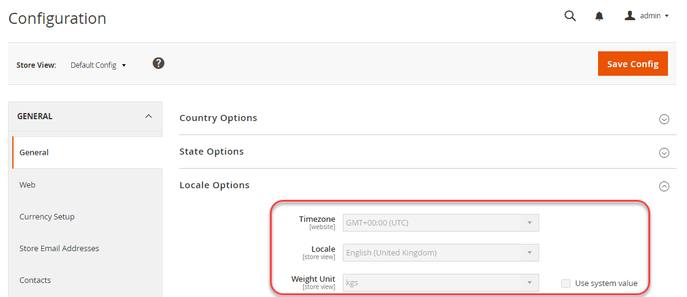

# Beispiel mit einer freigegebenen Konfiguration

Dieses Beispiel zeigt, wie Sie die folgenden Einstellungen in Ihrem Entwicklungssystem ändern, die freigegebene Konfigurationsdatei `config.php` in Ihrem Build-System aktualisieren und dieselben Einstellungen in Ihrem Produktionssystem implementieren:

- Zeitzone
- Gewichtseinheit

Diese Einstellungen sind im Admin-Bereich unter **Stores** > Einstellungen > **Konfiguration** > Allgemein > **Allgemein** verfügbar.

Mit demselben Verfahren können Sie auch nicht vertrauliche, nicht systemspezifische Einstellungen in den folgenden Verweisen konfigurieren:

- [Referenz zu anderen Konfigurationspfaden](../reference/config-reference-general.md)
- [Referenz zu Zahlungskonfigurationspfaden](../reference/config-reference-payment.md)
- [Konfigurationspfade für Commerce Enterprise B2B-Erweiterungen - Referenz](../reference/config-reference-b2b.md)

## Bevor Sie beginnen

Bevor Sie beginnen, richten Sie Dateisystemberechtigungen und -eigentümerschaft ein, wie in [Voraussetzungen für Entwicklungs-, Build- und Produktionssysteme](../deployment/prerequisites.md) beschrieben.

## Annahmen

Dieses Thema enthält ein Beispiel für das Ändern der Konfiguration des Produktionssystems. Sie können bei Bedarf verschiedene Konfigurationsoptionen auswählen.

Für die Zwecke dieses Beispiels gehen wir von Folgendem aus:

- Sie verwenden die Git-Quell-Code-Verwaltung
- Das Entwicklungssystem ist in einem Git-Remote-Repository namens `mconfig` verfügbar
- Ihre Git-Arbeitsverzweigung heißt `m2.2_deploy`

## Schritt 1: Festlegen der Konfiguration im Entwicklungssystem

So legen Sie die Zeitzonen- und Gewichtungseinheiten in Ihrem Entwicklungssystem fest:

1. Melden Sie sich beim Administrator an.
1. Klicken Sie auf **Stores** > Einstellungen > **Konfiguration** > Allgemein > **Allgemein**.
1. Erweitern Sie im rechten Bereich **Gebietsschema-Optionen**.

   Die folgende Abbildung zeigt ein Beispiel.

   

1. Klicken Sie in der **Zeitzone** auf **GMT+00:00 (UTC)**.
1. Deaktivieren Sie das **Systemwert verwenden** neben dem Feld **Gewichtungseinheit**.
1. Klicken Sie in der **Gewichtseinheit**-Liste auf **kgs**.
1. Klicken Sie **Konfiguration speichern**.
1. Leeren Sie den Cache, wenn Sie dazu aufgefordert werden.

## Schritt 2: Aktualisieren der freigegebenen Konfiguration

Generieren Sie die freigegebene Konfigurationsdatei `app/etc/config.php` in Ihrem Entwicklungssystem und übertragen Sie sie mithilfe der Versionskontrolle auf Ihr Build-System, wie in diesem Abschnitt beschrieben.

{{$include /help/_includes/config-save-config.md}}

## Schritt 3: Build-System aktualisieren und Dateien generieren

Nachdem Sie Ihre Änderungen an der freigegebenen Konfiguration in die Quell-Code-Verwaltung übertragen haben, können Sie diese Änderungen in Ihr Build-System übernehmen, Code kompilieren und statische Dateien generieren. Der letzte Schritt besteht darin, diese Änderungen an Ihr Produktionssystem zu übertragen. Daher entspricht die Konfiguration Ihres Produktionssystems Ihrem Entwicklungssystem.

{{$include /help/_includes/config-update-build-system.md}}

## Schritt 4: Aktualisieren des Produktionssystems

Der letzte Schritt im Prozess besteht darin, Ihr Produktionssystem über die Versionsverwaltung zu aktualisieren. Dadurch werden alle Änderungen abgerufen, die Sie an Ihren Entwicklungs- und Build-Systemen vorgenommen haben, was bedeutet, dass Ihr Produktionssystem völlig auf dem neuesten Stand ist.

{{$include /help/_includes/config-update-prod-system.md}}

### Überprüfen Sie die Änderungen in der Admin Console.

**So überprüfen Sie, ob diese Einstellungen im Administrator nicht bearbeitbar sind**:

1. Melden Sie sich beim Administrator an.
1. Klicken Sie auf **Stores** > Einstellungen > **Konfiguration** > Allgemein > **Allgemein**.
1. Erweitern Sie im rechten Bereich **Gebietsschema-Optionen**.

   Die soeben festgelegten Optionen werden wie folgt angezeigt:

   

>[!INFO]
>
>Um eine in Admin gesperrte Einstellung zu ändern, verwenden Sie den [`magento config:set --lock` Befehl](../cli/set-configuration-values.md).
