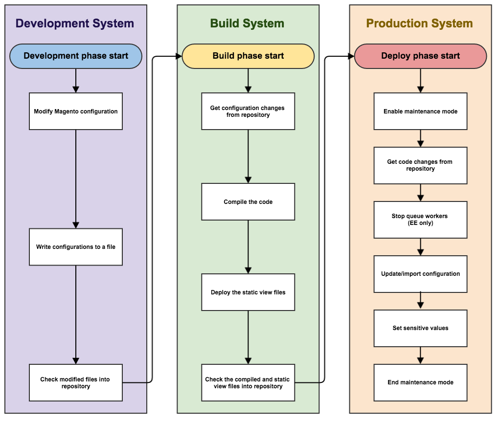

# Technische Details

In diesem Thema werden technische Implementierungsdetails zur Pipeline-Bereitstellung in Commerce 2.2 und höher erläutert. Die Verbesserungen lassen sich in folgende Bereiche unterteilen:

- [Konfigurationsverwaltung](#configuration-management)
- [Änderungen im Admin](#changes-in-the-admin)
- [Installieren und Entfernen von Cron](#install-and-remove-cron)

Dieses Thema behandelt auch die [empfohlener Workflow](#recommended-workflow) für die Pipelinebereitstellung und bietet einige Beispiele, anhand derer Sie verstehen können, wie sie funktioniert.

Lesen Sie zunächst die [Voraussetzungen für Ihre Entwicklungs-, Build- und Produktionssysteme](../deployment/prerequisites.md).

## Konfigurationsverwaltung

Verwenden Sie das folgende Überschreibungsschema, um die Konfiguration Ihrer Entwicklungs- und Produktionssysteme zu synchronisieren und zu verwalten.


Wie das Diagramm zeigt, werden die Konfigurationswerte in der folgenden Reihenfolge verwendet:

1. Umgebungsvariablen überschreiben alle anderen Werte, sofern vorhanden.
1. Aus den freigegebenen Konfigurationsdateien `env.php` und `config.php`. Werte in `env.php` Werte überschreiben in `config.php`.
1. Aus in der Datenbank gespeicherten Werten.
1. Wenn in keiner dieser Quellen ein Wert vorhanden ist, wird der Standardwert oder NULL verwendet.

### Verwalten der freigegebenen Konfiguration

Die freigegebene Konfiguration wird in `app/etc/config.php`, die sich in der Quell-Code-Verwaltung befinden sollte.

Legen Sie die freigegebene Konfiguration in Admin in Ihrer Entwicklung fest (oder Adobe Commerce in der Cloud-Infrastruktur). _Integration_) und schreiben Sie die Konfiguration in `config.php` mithilfe der [`magento app:config:dump` command](../cli/export-configuration.md).

### Systemspezifische Konfiguration verwalten

Die systemspezifische Konfiguration wird in `app/etc/env.php`, die _not_ sich in der Quell-Code-Verwaltung befinden.

Legen Sie die systemspezifische Konfiguration im Admin-System in Ihrem Entwicklungs- (oder Adobe Commerce-System für die Cloud-Infrastrukturintegration) fest und schreiben Sie die Konfiguration in `env.php` mithilfe der [`magento app:config:dump` command](../cli/export-configuration.md).

Dieser Befehl schreibt auch vertrauliche Einstellungen in `env.php`.

### Vertrauliche Konfiguration verwalten

Die vertrauliche Konfiguration wird auch unter `app/etc/env.php`.

Sie können die vertrauliche Konfiguration auf eine der folgenden Arten verwalten:

- Umgebungsvariablen
- Speichern Sie die vertrauliche Konfiguration in `env.php` in Ihrem Produktionssystem mithilfe der [`magento config:set:sensitive` command](../cli/set-configuration-values.md)

### In Admin gesperrte Konfigurationseinstellungen

Alle Konfigurationseinstellungen in `config.php` oder `env.php` sind in der Admin gesperrt; Das heißt, diese Einstellungen können nicht im Admin geändert werden.
Verwenden Sie die [`magento config:set` oder `magento config:set --lock`](../cli/export-configuration.md#config-cli-config-set) -Befehl zum Ändern der Einstellungen im `config.php` oder `env.php` Dateien.

## Der Commerce-Administrator

Der Administrator weist im Produktionsmodus folgendes Verhalten auf:

- Sie können Cache-Typen in Admin nicht aktivieren oder deaktivieren
- Entwicklereinstellungen sind nicht verfügbar (**Stores** > Einstellungen > **Konfiguration** > Erweitert > **Entwickler**), einschließlich:

   - Minimieren von CSS, JavaScript und HTML
   - CSS und JavaScript zusammenführen
   - Serverseitige oder clientseitige LESS-Kompilierung
   - Inline-Übersetzungen
   - Wie zuvor erläutert, werden alle Konfigurationseinstellungen in `config.php` oder `env.php` ist gesperrt und kann nicht in Admin bearbeitet werden.
   - Sie können das Gebietsschema &quot;Admin&quot;nur in Sprachen ändern, die von bereitgestellten Designs verwendet werden

      Die folgende Abbildung zeigt ein Beispiel der **Kontoeinstellungen** > **Gebietsschema der Benutzeroberfläche** Liste im Admin mit nur zwei bereitgestellten Gebietsschemas:

      

- Mit dem Admin können Sie die Gebietsschemakonfigurationen für keinen Bereich ändern.

   Es wird empfohlen, diese Änderungen vorzunehmen, bevor Sie in den Produktionsmodus wechseln.

   Sie können das Gebietsschema weiterhin mit Umgebungsvariablen oder der `config:set` CLI-Befehl mit dem Pfad `general/locale/code`.

## Installieren und Entfernen von Cron

In Version 2.2 helfen wir Ihnen beim erstmaligen Einrichten Ihres Cron-Auftrags durch Bereitstellung der [`magento cron:install` command](../cli/configure-cron-jobs.md). Mit diesem Befehl wird eine Crontab als der Benutzer eingerichtet, der den Befehl ausführt.

Außerdem können Sie die Registerkarte &quot;crontab&quot;mit der `magento cron:remove` Befehl.

## Empfohlener Pipeline-Bereitstellungs-Workflow

Das folgende Diagramm zeigt, wie wir empfehlen, die Pipeline-Implementierung zur Verwaltung der Konfiguration zu verwenden.



### Entwicklungssystem

Sie nehmen in Ihrem Entwicklungssystem Konfigurationsänderungen im Admin vor und generieren die freigegebene Konfiguration. `app/etc/config.php` und der systemspezifischen Konfiguration, `app/etc/env.php`. Überprüfen Sie den Commerce-Code und die freigegebene Konfiguration in die Quell-Code-Verwaltung und pushen Sie ihn an den Build-Server.

Sie sollten auch Erweiterungen installieren und Commerce-Code im Entwicklungssystem anpassen.

Auf Ihrem Entwicklungssystem:

1. Legen Sie die Konfiguration in Admin fest.

1. Verwenden Sie die `magento app:config:dump` -Befehl, um die Konfiguration in das Dateisystem zu schreiben.

   - `app/etc/config.php` ist die freigegebene Konfiguration, die alle Einstellungen enthält _Ausnahme_ vertrauliche und systemspezifische Einstellungen. Diese Datei sollte sich in der Quell-Code-Verwaltung befinden.
   - `app/etc/env.php` ist die systemspezifische Konfiguration, die Einstellungen enthält, die für ein bestimmtes System eindeutig sind (z. B. Hostnamen und Portnummern). Diese Datei sollte _not_ sich in der Quell-Code-Verwaltung befinden.

1. Fügen Sie den geänderten Code und die freigegebene Konfiguration der Quell-Code-Verwaltung hinzu.

1. Führen Sie die folgenden Befehle aus, um während der Entwicklung generierten PHP-Code und statische Asset-Dateien zu entfernen:

   ```bash
   rm -r var/view_preprocessed/*
   rm -r pub/static/*/*
   rm -r generated/*/*
   ```

Nachdem Sie die Befehle zum Löschen der Assets ausgeführt haben, generiert Commerce Arbeitsdateien.

>[!WARNING]
>
>Seien Sie vorsichtig mit dem oben genannten Ansatz. Löschen der `.htacces`s in der Datei `generated` oder `pub` -Ordner können Probleme verursachen.

### Build-System

Das Build-System kompiliert Code und generiert statische Ansichtsdateien für Designs, die in Commerce registriert sind. Es ist keine Verbindung zur Commerce-Datenbank erforderlich. Es benötigt nur die Commerce-Codebase.

Auf Ihrem Build-System:

1. Rufen Sie die freigegebene Konfigurationsdatei aus der Quell-Code-Verwaltung ab.
1. Verwenden Sie die `magento setup:di:compile` -Befehl zum Kompilieren des Codes.
1. Verwenden Sie die `magento setup:static-content:deploy -f` -Befehl zum Aktualisieren der statischen Dateiansichtsdateien.
1. Überprüfen Sie die Aktualisierungen in der Quell-Code-Verwaltung.

>[!INFO]
>
>Siehe [Bereitstellungsstrategien für statische Ansichtsdateien](../cli/static-view-file-strategy.md).

### Produktionssystem

Auf Ihrem Produktionssystem (d. h. Ihrem Live Store) rufen Sie generierte Assets und Codeaktualisierungen aus der Quellcodeverwaltung ab und legen systemspezifische und vertrauliche Konfigurationseinstellungen mithilfe der Befehlszeile oder Umgebungsvariablen fest.

In Ihrem Produktionssystem:

1. Starten Sie den Wartungsmodus.
1. Rufen Sie Code- und Konfigurationsaktualisierungen aus der Quell-Code-Verwaltung ab.
1. Wenn Sie Adobe Commerce verwenden, beenden Sie die Warteschlangenarbeiter.
1. Verwenden Sie die `magento app:config:import` -Befehl, um Konfigurationsänderungen in das Produktionssystem zu importieren.
1. Wenn Sie Komponenten installiert haben, die das Datenbankschema geändert haben, führen Sie `magento setup:upgrade --keep-generated` , um das Datenbankschema und die Daten zu aktualisieren und die erzeugten statischen Dateien beizubehalten.
1. Um systemspezifische Einstellungen festzulegen, verwenden Sie entweder die `magento config:set` -Befehl oder Umgebungsvariablen.
1. Verwenden Sie zum Festlegen vertraulicher Einstellungen entweder die `magento config:sensitive:set` -Befehl oder Umgebungsvariablen.
1. Saubere (auch als _flush_) den Cache.
1. Wartungsmodus beenden.

## Konfigurationsverwaltungsbefehle

Wir stellen die folgenden Befehle bereit, um Sie bei der Verwaltung der Konfiguration zu unterstützen:

- [`magento app:config:dump`](../cli/export-configuration.md) , um Admin-Konfigurationseinstellungen in `config.php` und `env.php` (außer bei sensiblen Einstellungen)
- [`magento config:set`](../cli/set-configuration-values.md) , um die Werte systemspezifischer Einstellungen im Produktionssystem festzulegen.

   Verwenden Sie das optionale `--lock` Option zum Sperren der Option in Admin (d. h., die Einstellung kann nicht bearbeitet werden). Wenn eine Einstellung bereits gesperrt ist, verwenden Sie die `--lock` -Option, um die Einstellung zu ändern.

- [`magento config:sensitive:set`](../cli/set-configuration-values.md) , um die Werte der sensiblen Einstellungen im Produktionssystem festzulegen.
- [`magento app:config:import`](../cli/import-configuration.md) um Konfigurationsänderungen aus zu importieren `config.php` und `env.php` in das Produktionssystem.

## Beispiele für die Konfigurationsverwaltung

In diesem Abschnitt finden Sie Beispiele für die Verwaltung der Konfiguration, sodass Sie sehen können, wie Änderungen an `config.php` und `env.php`.

### Standardgebietsschema ändern

Dieser Abschnitt zeigt die Änderung an `config.php` wenn Sie die Standardgewichtseinheit mithilfe des Administrators (**Stores** > Einstellungen > **Konfiguration** > Allgemein > **Allgemein** > **Gebietsschemaoptionen**).

Nachdem Sie die Änderung im Admin vorgenommen haben, führen Sie `bin/magento app:config:dump` , um den Wert in `config.php`. Der Wert wird in die `general` Array unter `locale` als folgendes Snippet aus `config.php` zeigt an:

```php
'general' =>
    array (
        'locale' =>
        array (
            'code' => 'en_US',
            'timezone' => 'America/Chicago',
            'weight_unit' => 'kgs'
        )
    )
```

### Mehrere Konfigurationseinstellungen ändern

In diesem Abschnitt werden die folgenden Konfigurationsänderungen besprochen:

- Hinzufügen einer Website-, Store- und Store-Ansicht (**Stores** > Einstellungen > **Alle Stores**)
- Standardmäßige E-Mail-Domain ändern (**Stores** > Einstellungen > **Konfiguration** > Kunden > **Kundenkonfiguration**)
- PayPal API-Benutzername und -API-Kennwort festlegen (**Stores** > Einstellungen > **Konfiguration** > Vertrieb > **Zahlungsmethoden** > **PayPal** > **Erforderliche PayPal-Einstellungen**)

Nachdem Sie die Änderung im Admin vorgenommen haben, führen Sie `bin/magento app:config:dump` auf Ihrem Entwicklungssystem. Diesmal werden nicht alle Ihre Änderungen in `config.php`; Tatsächlich werden nur die Website-, Store- und Store-Ansicht in diese Datei geschrieben, wie die folgenden Snippets zeigen.

### config.php

`config.php` enthält:

- Änderungen an der Website-, Store- und Store-Ansicht.
- Nicht systemspezifische Suchmaschineneinstellungen
- Nicht vertrauliche PayPal-Einstellungen
- Kommentare, die Sie über vertrauliche Einstellungen informieren, die in `config.php`

`websites` array:

```php
      'new' =>
      array (
        'website_id' => '2',
        'code' => 'new',
        'name' => 'New website',
        'sort_order' => '0',
        'default_group_id' => '2',
        'is_default' => '0',
      ),
```

`groups` array:

```php
      2 =>
      array (
        'group_id' => '2',
        'website_id' => '2',
        'code' => 'newstore',
        'name' => 'New store',
        'root_category_id' => '2',
        'default_store_id' => '2',
      ),
```

`stores` array:

```php
     'newview' =>
      array (
        'store_id' => '2',
        'code' => 'newview',
        'website_id' => '2',
        'group_id' => '2',
        'name' => 'New store view',
        'sort_order' => '0',
        'is_active' => '1',
      ),
```

`payment` array:

```php
      'payment' =>
      array (
        'paypal_express' =>
        array (
          'active' => '0',
          'in_context' => '0',
          'title' => 'PayPal Express Checkout',
          'sort_order' => NULL,
          'payment_action' => 'Authorization',
          'visible_on_product' => '1',
          'visible_on_cart' => '1',
          'allowspecific' => '0',
          'verify_peer' => '1',
          'line_items_enabled' => '1',
          'transfer_shipping_options' => '0',
          'solution_type' => 'Mark',
          'require_billing_address' => '0',
          'allow_ba_signup' => 'never',
          'skip_order_review_step' => '1',
        ),
```

### env.php

Die standardmäßige systemspezifische Konfigurationseinstellung der E-Mail-Domain wird in `app/etc/env.php`.

Die PayPal-Einstellungen werden in keine der beiden Dateien geschrieben, da die `bin/magento app:config:dump` -Befehl schreibt keine sensiblen Einstellungen. Sie müssen die PayPal-Einstellungen im Produktionssystem mit den folgenden Befehlen festlegen:

```bash
bin/magento config:sensitive:set paypal/wpp/api_username <username>
```

```bash
bin/magento config:sensitive:set paypal/wpp/api_password <password>
```
