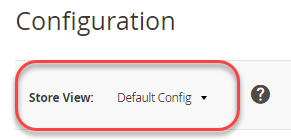

# Mehrere Ansichten in der Admin-Konsole einrichten

Für diese Aufgabe müssen Sie für jeden Store eine Stammkategorie (und ggf. zusätzliche Kategorien) erstellen. Die in diesem Thema behandelten Aufgaben bieten eine Möglichkeit, mehrere Stores einzurichten. Weitere Informationen finden Sie in den folgenden Ressourcen im Commerce-Benutzerhandbuch:

- [Kategorien](https://docs.magento.com/user-guide/catalog/categories.html)
- [Hinzufügen von Websites](https://docs.magento.com/user-guide/stores/stores-all-create-website.html)
- [Store-URLs](https://docs.magento.com/user-guide/stores/store-urls.html)
- [Inhalt](https://docs.magento.com/user-guide/cms/content-menu.html)

>[!INFO]
>
>Nur zu Beispielzwecken verwenden wir eine französische Website mit Website-Code `french` in diesem Thema. Schrittweise Tutorials finden Sie unter [Tutorial: Einrichten mehrerer Websites mit Apache](ms-apache.md) und [Tutorial: Mehrere Websites mit nginx einrichten](ms-nginx.md)

## Schritt 1: Erstellen von Stammkategorien

Das Erstellen einer Stammkategorie ist optional. Wir zeigen jedoch in diesem Tutorial, wie Sie dies durchführen können, falls Sie möchten, dass jede Website über eine eindeutige Stammkategorie verfügt. Sie können bei Bedarf weitere Kategorien erstellen.

So erstellen Sie eine Stammkategorie:

1. Melden Sie sich bei Admin als Benutzer an, der zur Erstellung von Kategorien berechtigt ist.
1. Klicken **Katalog** > **Kategorien**.
1. Klicken **Stammkategorie hinzufügen**.
1. Im **Kategoriename** eingeben, geben Sie einen eindeutigen Namen ein, um diese Kategorie zu identifizieren.
1. Stellen Sie sicher, dass Kategorie aktivieren auf **Ja**.

   Weitere Informationen zu den anderen Optionen auf dieser Seite finden Sie unter [Stammkategorien](https://docs.magento.com/user-guide/catalog/category-root.html).

   Die folgende Abbildung zeigt ein Beispiel.

   

1. Klicken **Speichern**.
1. Wiederholen Sie diese Schritte so oft wie nötig, um Stammkategorien für Ihre Geschäfte zu erstellen.

## Schritt 2: Websites erstellen

So erstellen Sie eine Website:

1. Melden Sie sich bei Admin als Benutzer an, der zum Erstellen von Websites, Geschäften und Store-Ansichten berechtigt ist.
1. Klicken **Stores** > **Einstellungen** > **Alle Stores**.
1. Im _Stores_ Seite, klicken Sie auf **Website erstellen**.

   - **Name**- Geben Sie einen Namen ein, um die Website zu identifizieren.
   - **Code**—Eindeutigen Code eingeben; Wenn Sie beispielsweise einen französischen Store haben, können Sie `french`
   - **Sortierreihenfolge**—Geben Sie eine optionale numerische Sortierreihenfolge ein.

   Die folgende Abbildung zeigt ein Beispiel.

   

1. Klicken **Website-Speicherung**.
1. Wiederholen Sie diese Schritte so oft wie nötig, um Ihre Websites zu erstellen.

## Schritt 3: Erstellen von Stores

So erstellen Sie einen Store:

1. Im _Admin_ Bereich, klicken Sie **Stores** > **Einstellungen** > **Alle Stores**.
1. Im _Stores_ Seite, klicken Sie auf **Store erstellen**.

   - **Internetseite**—Klicken Sie auf den Namen der Website, mit der dieser Store verbunden werden soll.
   - **Name**—Geben Sie einen Namen ein, um den Store zu identifizieren.
   - **Code**- Geben Sie einen eindeutigen Code ein, um den Store zu identifizieren.
   - **Stammkategorie**—Klicken Sie auf den Namen der Stammkategorie für diesen Store.

   Die folgende Abbildung zeigt ein Beispiel.

   

1. Klicken **Store speichern**.
1. Wiederholen Sie diese Schritte so oft wie nötig, um Ihre Stores zu erstellen.

## Schritt 4: Erstellen von Store-Ansichten

So erstellen Sie eine Store-Ansicht:

1. Im _Admin_ Bereich, klicken Sie **Stores** > **Einstellungen** > **Alle Stores**.
1. Klicken Sie auf der Seite &quot;Stores&quot;auf **Store-Ansicht erstellen**.

   - **Store**—Klicken Sie auf den Namen des Stores, mit dem diese Store-Ansicht verknüpft werden soll.
   - **Name**—Geben Sie einen Namen ein, um diese Store-Ansicht zu identifizieren.
   - **Code**—Geben Sie einen eindeutigen Namen ein, um diese Store-Ansicht zu identifizieren.
   - **Status**—select **Aktiviert**.

   Die folgende Abbildung zeigt ein Beispiel.

   

1. Klicken **Store-Ansicht speichern**.
1. Wiederholen Sie diese Aufgaben so oft wie nötig, um Ihre Store-Ansichten zu erstellen.

## Schritt 5: Ändern der Website-Basis-URL

Für den Zugriff auf eine Website mithilfe einer eindeutigen URL wie `http://french.magento.mg`müssen Sie die Basis-URL für jede Website im Admin ändern.

So ändern Sie die URL der Website-Basis:

1. Im _Admin_ Bereich, klicken Sie **Stores** > **Einstellungen** > **Konfiguration** > **Allgemein** > **Web**.
1. Aus dem **Store-Ansicht** Klicken Sie oben auf der Seite auf den Namen einer Ihrer Websites, wie in der folgenden Abbildung dargestellt.

   

1. Erweitern Sie im rechten Bereich **Basis-URLs**.
1. Im _Basis-URLs_ Abschnitt löschen **Systemwert verwenden**.
1. Geben Sie die `http://french.magento.mg` URL in der **Basis-URL** und **Basis-Link-URL** -Felder.

1. Wiederholen Sie den vorherigen Schritt im _Basis-URLs (sicher)_ Abschnitt.

   >[!INFO]
   >
   >Wenn Sie eine Basis-URL für die Bereitstellung von Adobe Commerce in der Cloud-Infrastruktur einrichten, müssen Sie den ersten Punkt durch drei Bindestriche ersetzen. Wenn Ihre Basis-URL beispielsweise `french.branch-sbg7pPa-f3dueAiM03tpy.us.magentosite.cloud`, eingeben `http://french---branch-sbg7pPa-f3dueAiM03tpy.us.magentosite.cloud`. Wenn Sie eine Basis-URL für lokale Tests einrichten, verwenden Sie einen Punkt.

1. Klicken **Konfiguration speichern**.

1. Wiederholen Sie diese Schritte für andere Websites.

## Schritt 6: Fügen Sie den Store-Code zur Basis-URL hinzu.

Commerce bietet Ihnen die Möglichkeit, den Store-Code zur Site-Basis-URL hinzuzufügen, was die Einrichtung mehrerer Stores vereinfacht. Mit dieser Option müssen Sie keine Ordner im Commerce-Dateisystem erstellen, um sie zu speichern `index.php` und `.htaccess`.

Dies verhindert `index.php` und `.htaccess` bei zukünftigen Upgrades nicht mehr mit der Commerce-Codebase synchronisiert werden.

Siehe [Benutzerhandbuch für Commerce](https://docs.magento.com/user-guide/stores/store-urls.html).

So fügen Sie den Store-Code zur Basis-URL hinzu:

1. Im _Admin_ Bereich, klicken Sie **Stores** > **Einstellungen** > **Konfiguration** > **Allgemein** > **Web**.
1. Aus dem **Store-Ansicht** Liste oben auf der Seite klicken Sie auf **Standardkonfiguration** wie in der folgenden Abbildung dargestellt.

   

1. Erweitern Sie im rechten Bereich **URL-Optionen**.
1. Löschen Sie die **Systemwert verwenden** Kontrollkästchen neben _Hinzufügen von Store-Code zu URLs_.
1. Aus dem _Hinzufügen von Store-Code zu URLs_ Liste, klicken Sie auf **Ja**.

   

1. Klicken **Konfiguration speichern**.
1. Wenn Sie dazu aufgefordert werden, leeren Sie den Cache. (**System** > **Cacheverwaltung**).

## Schritt 7: Standard-URL der Store-Ansichtsbasis ändern

Sie müssen diesen Schritt zuletzt ausführen, da Sie den Zugriff auf den Administrator verlieren. Ihr Zugriff wird zurückgegeben, nachdem Sie virtuelle Hosts eingerichtet haben, wie in den Web-Server-spezifischen Themen beschrieben.

So ändern Sie die Standard-URL der Store-Ansichtsbasis:

1. Im _Admin_ Bereich, klicken Sie **Stores** > **Einstellungen** > **Konfiguration** > **Allgemein** > **Web**.

1. Aus dem _Store-Ansicht_ Liste oben auf der Seite klicken Sie auf **Standardkonfiguration**.

   

1. Erweitern Sie im rechten Bereich **Basis-URLs**.
1. Im _Basis-URLs_ Abschnitt löschen **Systemwert verwenden**.
1. Geben Sie die `http://magento.mg` URL in der **Basis-URL** und **Basis-Link-URL** -Felder.

1. Wiederholen Sie den vorherigen Schritt im **Basis-URLs (sicher)** Abschnitt.

   >[!INFO]
   >
   >Wenn Sie eine Basis-URL für Adobe Commerce in der Cloud-Infrastruktur einrichten, müssen Sie den ersten Punkt durch drei Bindestriche ersetzen. Wenn Ihre Basis-URL beispielsweise `french.branch-sbg7pPa-f3dueAiM03tpy.us.magentosite.cloud`, eingeben `http://french---branch-sbg7pPa-f3dueAiM03tpy.us.magentosite.cloud`

1. Klicken **Konfiguration speichern**.
