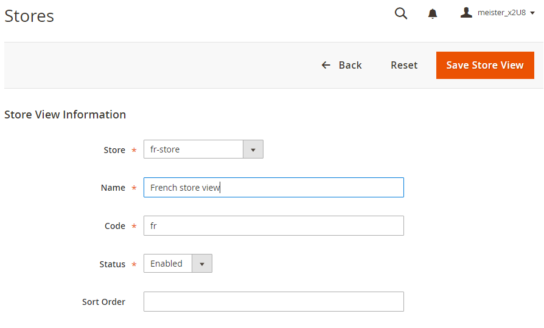

# Mehrere Ansichten in der Admin-Konsole einrichten

Für diese Aufgabe müssen Sie für jeden Store eine Stammkategorie (und ggf. zusätzliche Kategorien) erstellen. Die in diesem Thema behandelten Aufgaben bieten eine Möglichkeit, mehrere Stores einzurichten. Weitere Informationen finden Sie in den folgenden Ressourcen im Commerce-Benutzerhandbuch:

- [Kategorien](https://docs.magento.com/user-guide/catalog/categories.html)
- [Hinzufügen von Websites](https://docs.magento.com/user-guide/stores/stores-all-create-website.html)
- [Store-URLs](https://docs.magento.com/user-guide/stores/store-urls.html)
- [Inhalt](https://docs.magento.com/user-guide/cms/content-menu.html)

>[!INFO]
>
>Nur zu Beispielzwecken verwenden wir eine französische Website mit Website-Code `french` in diesem Thema. Eine schrittweise Anleitung finden Sie unter [Tutorial: Einrichten mehrerer Websites mit Apache](ms-apache.md) und [Tutorial: Einrichten mehrerer Websites mit Nginx](ms-nginx.md)

## Schritt 1: Stammkategorien erstellen

Das Erstellen einer Stammkategorie ist optional. Wir zeigen jedoch in diesem Tutorial, wie Sie dies durchführen können, falls Sie möchten, dass jede Website über eine eindeutige Stammkategorie verfügt. Sie können bei Bedarf weitere Kategorien erstellen.

So erstellen Sie eine Stammkategorie:

1. Melden Sie sich bei Admin als Benutzer an, der zur Erstellung von Kategorien berechtigt ist.
1. Klicken Sie auf **Katalog** > **Kategorien**.
1. Klicken Sie auf **Stammkategorie hinzufügen**.
1. Geben Sie im Feld **Kategoriename** einen eindeutigen Namen ein, um diese Kategorie zu identifizieren.
1. Stellen Sie sicher, dass Kategorie aktivieren auf **Ja** eingestellt ist.

   Weitere Informationen zu den anderen Optionen auf dieser Seite finden Sie unter [Stammkategorien](https://docs.magento.com/user-guide/catalog/category-root.html).

   Die folgende Abbildung zeigt ein Beispiel.

   

1. Klicken Sie auf **Speichern**.
1. Wiederholen Sie diese Schritte so oft wie nötig, um Stammkategorien für Ihre Geschäfte zu erstellen.

## Schritt 2: Erstellen von Websites

So erstellen Sie eine Website:

1. Melden Sie sich bei Admin als Benutzer an, der zum Erstellen von Websites, Geschäften und Store-Ansichten berechtigt ist.
1. Klicken Sie auf **Stores** > **Einstellungen** > **Alle Stores**.
1. Klicken Sie auf der Seite _Stores_ auf **Website erstellen**.

   - **Name**: Geben Sie einen Namen ein, um die Website zu identifizieren.
   - **Code**: Geben Sie einen eindeutigen Code ein. Wenn Sie beispielsweise einen französischen Store haben, können Sie `french` eingeben.
   - **Sortierreihenfolge**: Geben Sie eine optionale numerische Sortierreihenfolge ein.

   Die folgende Abbildung zeigt ein Beispiel.

   

1. Klicken Sie auf **Website speichern**.
1. Wiederholen Sie diese Schritte so oft wie nötig, um Ihre Websites zu erstellen.

## Schritt 3: Stores erstellen

So erstellen Sie einen Store:

1. Klicken Sie im Bedienfeld _Admin_ auf **Stores** > **Einstellungen** > **Alle Stores**.
1. Klicken Sie auf der Seite _Stores_ auf **Store erstellen**.

   - **Website**: Klicken Sie auf den Namen der Website, mit der dieser Store verbunden werden soll.
   - **Name**: Geben Sie einen Namen ein, um den Store zu identifizieren.
   - **Code**: Geben Sie einen eindeutigen Code ein, um den Store zu identifizieren.
   - **Stammkategorie**: Klicken Sie auf den Namen der Stammkategorie für diesen Store.

   Die folgende Abbildung zeigt ein Beispiel.

   

1. Klicken Sie auf **Store speichern**.
1. Wiederholen Sie diese Schritte so oft wie nötig, um Ihre Stores zu erstellen.

## Schritt 4: Erstellen von Store-Ansichten

So erstellen Sie eine Store-Ansicht:

1. Klicken Sie im Bedienfeld _Admin_ auf **Stores** > **Einstellungen** > **Alle Stores**.
1. Klicken Sie auf der Seite &quot;Stores&quot;auf **Store-Ansicht erstellen**.

   - **Store**: Klicken Sie auf den Namen des Stores, mit dem diese Store-Ansicht verknüpft werden soll.
   - **Name**: Geben Sie einen Namen ein, um diese Store-Ansicht zu identifizieren.
   - **Code**: Geben Sie einen eindeutigen Namen ein, um diese Store-Ansicht zu identifizieren.
   - **Status** - Wählen Sie **Aktiviert** aus.

   Die folgende Abbildung zeigt ein Beispiel.

   

1. Klicken Sie auf **Speicheransicht speichern**.
1. Wiederholen Sie diese Aufgaben so oft wie nötig, um Ihre Store-Ansichten zu erstellen.

## Schritt 5: Ändern der URL der Website-Basis

Um mit einer eindeutigen URL wie `http://french.magento.mg` auf eine Website zuzugreifen, müssen Sie die Basis-URL für jede Website im Admin ändern.

So ändern Sie die URL der Website-Basis:

1. Klicken Sie im Bedienfeld _Admin_ auf **Stores** > **Einstellungen** > **Konfiguration** > **Allgemein** > **Web**.
1. Klicken Sie oben auf der Seite in der Liste **Store-Ansicht** auf den Namen einer Ihrer Websites, wie in der folgenden Abbildung dargestellt.

   

1. Erweitern Sie im rechten Bereich **Basis-URLs**.
1. Löschen Sie im Abschnitt _Basis-URLs_ den Eintrag **Systemwert verwenden**.
1. Geben Sie die URL `http://french.magento.mg` in die Felder **Basis-URL** und **Basis-Link-URL** ein.

1. Wiederholen Sie den vorherigen Schritt im Abschnitt _Basis-URLs (sicher)_ .

   >[!INFO]
   >
   >Wenn Sie eine Basis-URL für die Bereitstellung von Adobe Commerce in der Cloud-Infrastruktur einrichten, müssen Sie den ersten Punkt durch drei Bindestriche ersetzen. Wenn Ihre Basis-URL beispielsweise `french.branch-sbg7pPa-f3dueAiM03tpy.us.magentosite.cloud` ist, geben Sie `http://french---branch-sbg7pPa-f3dueAiM03tpy.us.magentosite.cloud` ein. Wenn Sie eine Basis-URL für lokale Tests einrichten, verwenden Sie einen Punkt.

1. Klicken Sie auf **Konfiguration speichern**.

1. Wiederholen Sie diese Schritte für andere Websites.

## Schritt 6: Hinzufügen des Store-Codes zur Basis-URL

Commerce bietet Ihnen die Möglichkeit, den Store-Code zur Site-Basis-URL hinzuzufügen, was die Einrichtung mehrerer Stores vereinfacht. Mit dieser Option müssen Sie keine Ordner im Commerce-Dateisystem erstellen, um `index.php` und `.htaccess` zu speichern.

Dadurch wird verhindert, dass `index.php` und `.htaccess` bei zukünftigen Upgrades nicht mehr mit der Commerce-Codebase synchronisiert werden.

Weitere Informationen finden Sie im [Commerce-Benutzerhandbuch](https://docs.magento.com/user-guide/stores/store-urls.html).

So fügen Sie den Store-Code zur Basis-URL hinzu:

1. Klicken Sie im Bedienfeld _Admin_ auf **Stores** > **Einstellungen** > **Konfiguration** > **Allgemein** > **Web**.
1. Klicken Sie oben auf der Seite in der Liste **Store-Ansicht** auf **Standardkonfiguration** , wie in der folgenden Abbildung dargestellt.

    aus

1. Erweitern Sie im rechten Bereich **URL-Optionen**.
1. Deaktivieren Sie das Kontrollkästchen **Systemwert verwenden** neben _Speichercode zu URLs hinzufügen_.
1. Klicken Sie in der Liste _Speichercode zu URLs hinzufügen_ auf **Ja**.

   

1. Klicken Sie auf **Konfiguration speichern**.
1. Wenn Sie dazu aufgefordert werden, leeren Sie den Cache. (**System** > **Cache-Verwaltung**).

## Schritt 7: Ändern der Standard-URL für die Store-Ansichtsbasis

Sie müssen diesen Schritt zuletzt ausführen, da Sie den Zugriff auf den Administrator verlieren. Ihr Zugriff wird zurückgegeben, nachdem Sie virtuelle Hosts eingerichtet haben, wie in den Web-Server-spezifischen Themen beschrieben.

So ändern Sie die Standard-URL der Store-Ansichtsbasis:

1. Klicken Sie im Bedienfeld _Admin_ auf **Stores** > **Einstellungen** > **Konfiguration** > **Allgemein** > **Web**.

1. Klicken Sie oben auf der Seite in der Liste _Store-Ansicht_ auf **Standardkonfiguration**.

    aus

1. Erweitern Sie im rechten Bereich **Basis-URLs**.
1. Löschen Sie im Abschnitt _Basis-URLs_ den Eintrag **Systemwert verwenden**.
1. Geben Sie die URL `http://magento.mg` in die Felder **Basis-URL** und **Basis-Link-URL** ein.

1. Wiederholen Sie den vorherigen Schritt im Abschnitt **Basis-URLs (sicher)** .

   >[!INFO]
   >
   >Wenn Sie eine Basis-URL für Adobe Commerce in der Cloud-Infrastruktur einrichten, müssen Sie den ersten Punkt durch drei Bindestriche ersetzen. Wenn Ihre Basis-URL beispielsweise `french.branch-sbg7pPa-f3dueAiM03tpy.us.magentosite.cloud` ist, geben Sie `http://french---branch-sbg7pPa-f3dueAiM03tpy.us.magentosite.cloud` ein.

1. Klicken Sie auf **Konfiguration speichern**.

>[!INFO]
>
>Der Code für die Website-, Store- und Store-Ansicht kann nur Buchstaben (a-z oder A-Z), Zahlen (0-9) und Unterstriche (_) enthalten. Außerdem muss das erste Zeichen ein Brief sein. Wenn Groß- oder Kleinschreibung verwendet wird, wird bei der Übereinstimmung intern nicht zwischen Groß- und Kleinschreibung unterschieden, damit Konfigurationseinstellungen über Umgebungsvariablen außer Kraft gesetzt werden können. Siehe [Umgebungsvariablen verwenden, um Konfigurationseinstellungen zu überschreiben](../reference/override-config-settings.md#environment-variables).