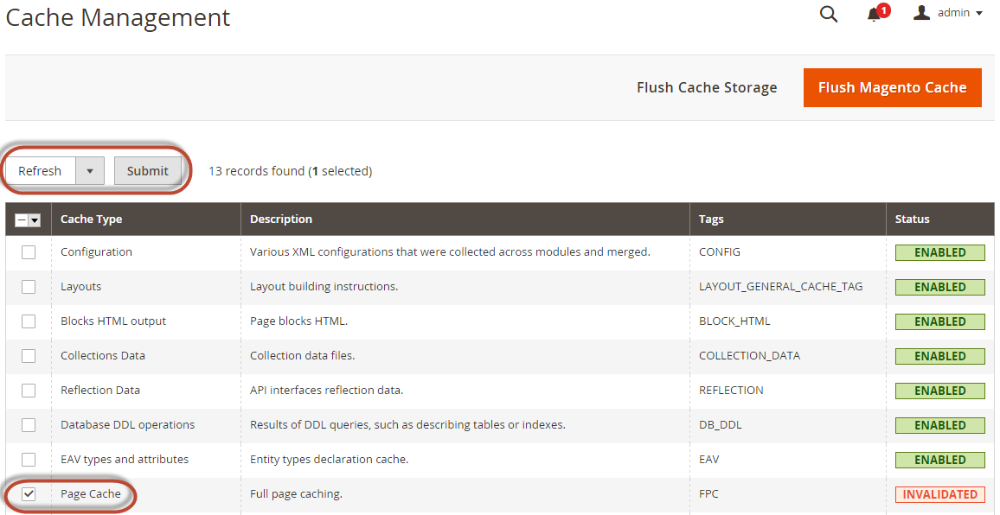

# Konfiguration von Suchmaschinen

In diesem Abschnitt werden die Mindesteinstellungen erläutert, die Sie auswählen müssen, um Elasticsearch oder OpenSearch mit lokalen Bereitstellungen von Adobe Commerce zu testen.

>[!TIP]
>
>In den Versionen 2.4.4 und 2.4.3-p2 gelten alle Felder mit der Beschriftung **Elasticsearch** auch für OpenSearch.
>>Mit der Einführung der Unterstützung für Elasticsearch 8.x in Version 2.4.6 wurden neue Bezeichnungen erstellt, um zwischen Elasticsearch- und OpenSearch-Konfigurationen zu unterscheiden.

Weitere Informationen zum Konfigurieren Ihrer Suchmaschine finden Sie im [Benutzerhandbuch](https://experienceleague.adobe.com/docs/commerce-admin/catalog/catalog/search/search-configuration.html).

## Konfigurieren der Suchmaschine über den Administrator

>[!TIP]
>
>Anleitungen für die Aktualisierung auf eine neue Suchmaschinenversion finden Sie unter [Voraussetzungen für die Aktualisierung](../../upgrade/prepare/prerequisites.md).

So konfigurieren Sie Ihr System für die Verwendung von Elasticsearch oder OpenSearch:

1. Melden Sie sich bei Admin als Admin an.
1. Klicken Sie auf **[!UICONTROL Stores]** > [!UICONTROL Settings] > **[!UICONTROL Configuration]** > **[!UICONTROL Catalog]** > **[!UICONTROL Catalog]** > **[!UICONTROL Catalog Search]**.
1. Wählen Sie in der Liste **[!UICONTROL Search Engine]** die entsprechende Version Ihrer Suchmaschine aus.

   In der folgenden Tabelle sind die erforderlichen Optionen zum Konfigurieren und Testen der Verbindung mit Commerce aufgeführt. Die Standardeinstellungen sollten funktionieren, es sei denn, Sie haben die Server-Einstellungen Ihrer Suchmaschine geändert. Springen Sie zum nächsten Schritt.

   | Option | Beschreibung |
   |--- |--- |
   | **[!UICONTROL Server Hostname]** | Geben Sie den vollqualifizierten Hostnamen oder die IP-Adresse des Computers ein, auf dem Elasticsearch oder OpenSearch ausgeführt wird.<br>Adobe Commerce auf Cloud-Infrastruktur: Nutzen Sie diesen Wert aus Ihrem Integrationssystem. |
   | **[!UICONTROL Server Port]** | Geben Sie den Webserver-Proxy-Port ein. Der Standardwert ist 9200<br>Adobe Commerce in der Cloud-Infrastruktur: Sie erhalten diesen Wert von Ihrem Integrationssystem. |
   | **[!UICONTROL Index Prefix]** | Geben Sie das Suchmaschinenindex-Präfix ein. Wenn Sie eine Instanz für mehr als eine Commerce-Installation (Staging- und Produktionsumgebungen) verwenden, müssen Sie für jede Installation ein eindeutiges Präfix angeben. Andernfalls können Sie das Standardpräfix magento2 verwenden. |
   | **[!UICONTROL Enable HTTP Auth]** | Klicken Sie nur dann auf **[!UICONTROL Yes]** , wenn Sie die Authentifizierung für Ihren Suchmaschinenserver aktiviert haben. Wenn ja, geben Sie einen Benutzernamen und ein Kennwort in die angegebenen Felder ein. |
   | **[!UICONTROL Server Timeout]** | Geben Sie die Zeit (in Sekunden) ein, die gewartet werden soll, wenn versucht wird, eine Verbindung zum Elasticsearch- oder OpenSearch-Server herzustellen. |

1. Klicken Sie auf **[!UICONTROL Test Connection]**.

   Beispielantwort:

   

   Weiter mit:

   - [Konfigurieren von Apache für Ihre Suchmaschine](../../installation/prerequisites/search-engine/configure-apache.md)
   - [Konfigurieren von nginx für Ihre Suchmaschine](../../installation/prerequisites/search-engine/configure-nginx.md)

   Oder Sie sehen:

   

Wenn ja, versuchen Sie Folgendes:

- Stellen Sie sicher, dass der Suchmaschinenserver ausgeführt wird.
- Wenn sich der Server auf einem anderen Host als Commerce befindet, melden Sie sich beim Commerce-Server an und pingen Sie den Suchmaschinenhost. Beheben Sie Probleme mit der Netzwerkverbindung und testen Sie die Verbindung erneut.
- Überprüfen Sie das Befehlsfenster, in dem Sie Elasticsearch oder OpenSearch gestartet haben, auf Stacktraces und Ausnahmen. Sie müssen diese auflösen, bevor Sie fortfahren. Stellen Sie insbesondere sicher, dass Sie Ihre Suchmaschine als Benutzer mit `root` Berechtigungen gestartet haben.
- Stellen Sie sicher, dass [UNIX-Firewall und SELinux](../../installation/prerequisites/search-engine/overview.md#firewall-and-selinux) beide deaktiviert sind, oder richten Sie Regeln ein, damit Ihre Suchmaschine und Commerce miteinander kommunizieren können.
- Überprüfen Sie den Wert des Felds **[!UICONTROL Server Hostname]** . Stellen Sie sicher, dass der Server verfügbar ist. Sie können stattdessen die IP-Adresse des Servers ausprobieren.
- Verwenden Sie den `netstat -an | grep <listen-port>`-Befehl, um zu überprüfen, ob der im Feld **[!UICONTROL Server Port]** angegebene Port von einem anderen Prozess verwendet wird.

  Verwenden Sie beispielsweise den folgenden Befehl, um zu überprüfen, ob Ihre Suchmaschine auf ihrem Standard-Port ausgeführt wird:

  ```bash
  netstat -an | grep 9200
  ```

  Wenn es auf Port 9200 ausgeführt wird, wird es ähnlich wie folgt angezeigt:

  ```
  `tcp        0      0 :::9200            :::-         LISTEN`
  ```

## Katalogsuche neu indizieren und den vollständigen Seitencache aktualisieren

Nachdem Sie die Suchmaschinenkonfiguration geändert haben, müssen Sie den Katalogsuchindex neu indizieren und den vollständigen Seitencache mithilfe von Admin oder der Befehlszeile aktualisieren.

So aktualisieren Sie den Cache mit der Admin:

1. Klicken Sie im Admin auf **[!UICONTROL System]** > **[!UICONTROL Cache Management]**.
1. Aktivieren Sie das Kontrollkästchen neben **[!UICONTROL Page Cache]**.
1. Klicken Sie in der **[!UICONTROL Actions]** oben rechts auf **Aktualisieren**.

   

So bereinigen Sie den Cache mithilfe der Befehlszeile: [`bin/magento cache:clean`](../cli/manage-cache.md#clean-and-flush-cache-types)

So indizieren Sie eine Neuindizierung über die Befehlszeile:

1. Melden Sie sich bei Ihrem Commerce-Server als oder wechseln Sie zum [Dateisystembesitzer](../../installation/prerequisites/file-system/overview.md).
1. Geben Sie einen der folgenden Befehle ein:

   Geben Sie den folgenden Befehl ein, um nur den Katalogsuchindex neu zu indizieren:

   ```bash
   bin/magento indexer:reindex catalogsearch_fulltext
   ```

   Geben Sie den folgenden Befehl ein, um alle Indexer neu zu indizieren:

   ```bash
   bin/magento indexer:reindex
   ```

1. Warten Sie, bis die Neuindizierung abgeschlossen ist.

   >[!INFO]
   >
   >Im Gegensatz zum Cache werden Indexer durch einen Cron-Auftrag aktualisiert. Stellen Sie sicher[ dass „cron](../cli/configure-cron-jobs.md) aktiviert ist, bevor Sie mit der Nutzung Ihrer Suchmaschine beginnen.
