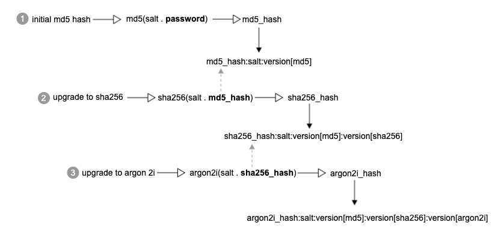

# Kennwort-Hashing

Derzeit verwendet Commerce eine eigene Strategie für das Hashing von Passwörtern, basierend auf verschiedenen nativen PHP-Hashing-Algorithmen. Commerce unterstützt mehrere Algorithmen wie `MD5`, `SHA256`oder `Argon 2ID13`. Wenn die Sodium-Erweiterung installiert ist (standardmäßig in PHP 7.3 installiert), dann `Argon 2ID13` wird als standardmäßiger Hashing-Algorithmus ausgewählt. Andernfalls `SHA256` ist der Standardwert. Commerce kann natives PHP verwenden `password_hash` Funktion mit Argon 2i-Algorithmusunterstützung.

Um zu vermeiden, dass ältere Passwörter, die mit veralteten Algorithmen wie `MD5`, bietet die aktuelle Implementierung eine Methode zum Aktualisieren des Hash, ohne das ursprüngliche Kennwort zu ändern. Im Allgemeinen hat der Kennwort-Hash das folgende Format:

```text
password_hash:salt:version<n>:version<n>
```

Wo `version<n>`...`version<n>` stellt alle Hash-Algorithmusversionen dar, die für das Kennwort verwendet werden. Außerdem wird das Salz immer zusammen mit dem Passwort-Hash gespeichert, sodass wir die gesamte Kette von Algorithmen wiederherstellen können. Ein Beispiel sieht wie folgt aus:

```text
a853b06f077b686f8a3af80c98acfca763cf10c0e03597c67e756f1c782d1ab0:8qnyO4H1OYIfGCUb:1:2
```

Der erste Teil stellt den Passwort-Hash dar. Die zweite `8qnyO4H1OYIfGCUb` ist das Salz. Die letzten beiden sind die verschiedenen Hash-Algorithmen: 1 ist `SHA256` und 2 `Argon 2ID13`. Das bedeutet, dass das Kennwort des Kunden ursprünglich mit dem Hash-Wert `SHA256` und anschließend wurde der Algorithmus mit `Argon 2ID13` und der Hash wurde mit Argon neu zerschlagen.

## Hashstrategie aktualisieren

Überlegen Sie, wie der Hash-Upgrade-Mechanismus aussieht. Angenommen, ein Kennwort wurde ursprünglich mit einem Hash-Wert `MD5` und dann wurde der Algorithmus mehrmals mit Argon 2ID13 aktualisiert. Das folgende Diagramm zeigt den Hash-Aktualisierungsfluss.


Jeder Hash-Algorithmus verwendet den vorherigen Passwort-Hash, um einen neuen Hash zu generieren. In Commerce wird das ursprüngliche Rohkennwort nicht gespeichert.



Wie oben erläutert, kann der Kennwort-Hash mehrere Hash-Versionen auf das ursprüngliche Kennwort anwenden.
So funktioniert der Mechanismus zur Kennwortüberprüfung während einer Kundenauthentifizierung.

```php
def verify(password, hash):
    restored = password

    hash_map = extract(hash)
    # iterate through all versions specified in the received hash [md5, sha256, argon2id13]
    for version in hash_map.get_versions():
        # generate new hash based on password/previous hash, salt and version
        restored = hash_func(salt . restored, version)

    # extract only password hash from the hash:salt:version chain
    hash = hash_map.get_hash()

    return compare(restored, hash)
```

Da Commerce alle verwendeten Passwort-Hash-Versionen zusammen mit dem Passwort-Hash speichert, können wir die gesamte Hash-Kette während der Passwortüberprüfung wiederherstellen. Der Hash-Überprüfungsmechanismus ähnelt der Hash-Upgrade-Strategie: Basierend auf den gemeinsam mit dem Kennwort-Hash gespeicherten Versionen generiert der Algorithmus Hashes aus dem bereitgestellten Kennwort und gibt das Vergleichsergebnis zwischen dem Hash-Kennwort und dem in der Datenbank gespeicherten Hash zurück.

## Implementierung

Die `\Magento\Framework\Encryption\Encryptor` -Klasse ist für die Erstellung und Überprüfung des Kennwort-Hash verantwortlich. Die [`bin/magento customer:hash:upgrade`](https://devdocs.magento.com/guides/v2.4/reference/cli/magento.html#customerhashupgrade) -Befehl aktualisiert einen Kunden-Passwort-Hash auf den neuesten Hash-Algorithmus.
