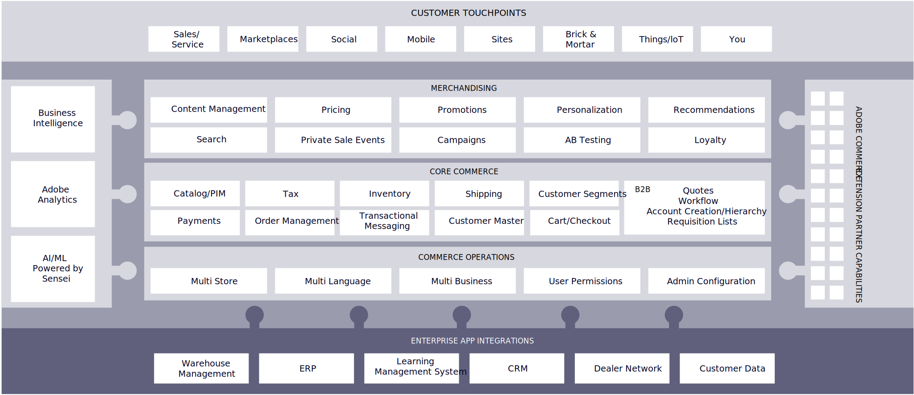

# Adobe Commerce-Funktionen

Adobe Commerce ist eine der vertrauenswürdigsten und zuverlässigsten E-Commerce-Plattformen auf dem Markt. Dieses Vertrauen und diese Zuverlässigkeit haben sich im Wachstum der Unternehmen, die es nutzen, bewährt. Gemäß [Aufnahmegericht](https://hostingtribunal.com/blog/magento-statistics/#gref), sind Marken, die Adobe Commerce als E-Commerce-Plattform nutzen, im Vergleich zu Marken auf anderen Plattformen dreimal schneller.

Die Fähigkeit von Adobe Commerce, mit jeder Komplexität umzugehen, mit der Ihre Marke konfrontiert ist, hat sie zu einer beliebten Wahl gemacht, da Unternehmen ihre Komplexität verbessern. Unabhängig davon, ob Marken auf eine einzelne Site in einer Region ausgerichtet sind oder ob es erforderlich ist, mehrere Sites oder Geschäfte auf der ganzen Welt zu verbinden, verfügt Adobe Commerce über die Infrastruktur, um ein nahtloses und vernetztes Erlebnis zu schaffen. Als Partner nutzen wir dann unser Know-how, um die Website an Ihre individuellen Bedürfnisse anzupassen.

Adobe ist aus Kreativprodukten bekannt, verfügt aber auch über ein bedeutendes digitales Unternehmen, das Content Management, Analysen, Kampagnenorchestrierung, kontobasierte Marketing-Personalisierungsfunktionen und natürlich Commerce bereitstellt.

Aber was macht ein Erlebnis gut und unterscheidet sich von Konkurrenten?

- Es muss reich und ansprechend sein
- Sie sollte von Daten und Kontexten für den Besucher gesteuert werden
- Es muss intelligent sein
- Sie muss nahtlos über Touchpoints hinweg und überall dort, wo Ihre Besucher sind, erfolgen

Um hervorragende Einkaufserlebnisse zu erstellen, benötigen Unternehmen leistungsstarke, moderne Plattformen, die offen, erweiterbar, skalierbar und sicher sind, von modernen Werkzeugen für die agile Entwicklung ganz zu schweigen. Adobe Commerce ist die perfekte Plattform, um all diese Anforderungen zu erfüllen.

Adobe Commerce ist eine voll funktionsfähige, marktbewährte E-Commerce-Plattform, die für umfassende, personalisierte Commerce-Erlebnisse auf allen Kanälen und Geschäftsmodellen konzipiert ist. Adobe Commerce kann in einer größeren Geschäftslandschaft entweder als End-to-End-Commerce-Anwendung oder als Referenzanwendung dienen. Es ist modular und flexibel mit einer umfangreichen API, die in REST und GraphQL entwickelt wurde, und kann mit verschiedenen Köpfen verwendet werden - von WordPress über Drupal bis hin zu Adobe Experience Manager und anderen.

## Funktionskarte

Die Adobe Commerce-Anwendung besteht aus einer Sammlung von Funktionen, die eigenständige Module sind.

