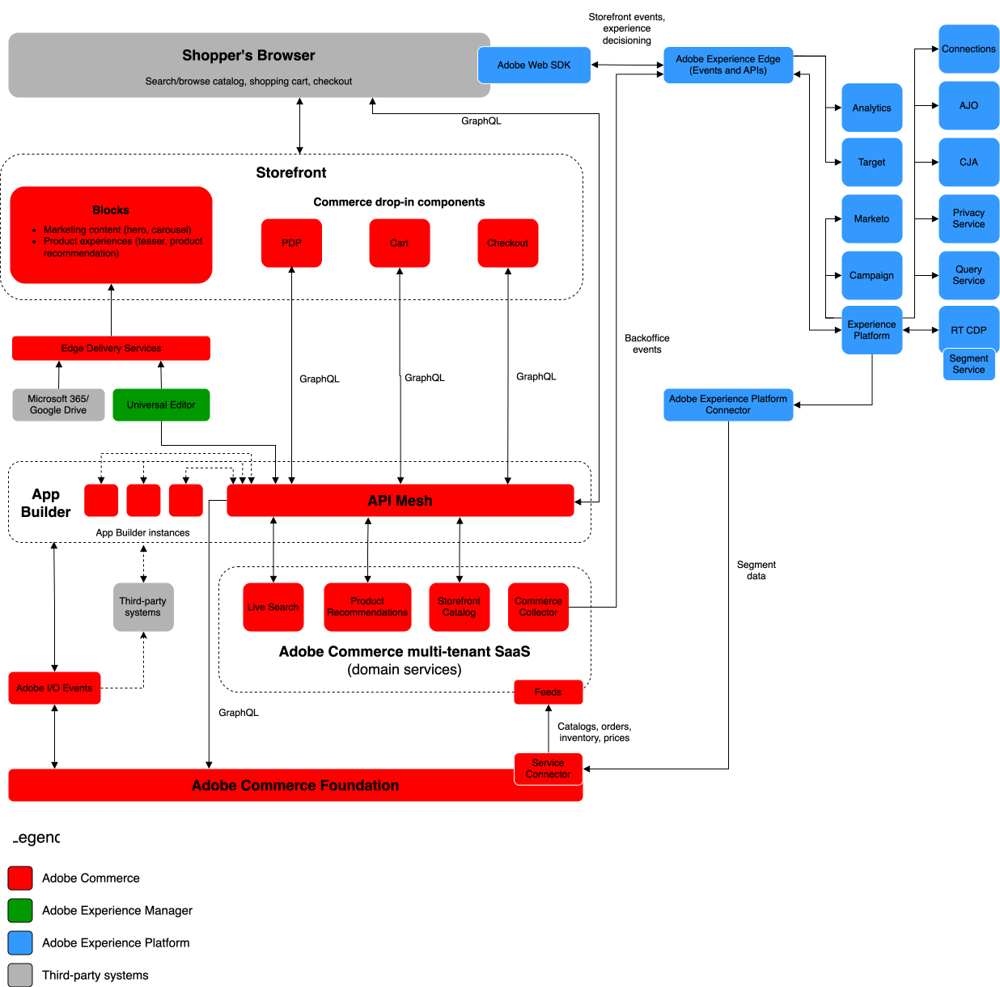

# Adobe Commerce Enterprise-Referenzarchitektur

Adobe Commerce ist die erlebnisorientierte Plattform, die technische Flexibilität und Benutzerfreundlichkeit auf einzigartige Weise kombiniert und dazu dient, außergewöhnliche Erlebnisse zu schaffen, die Geschäftsergebnisse optimieren.

Commerce wurde entwickelt, um die Unternehmensanforderungen an Leistung, Skalierbarkeit und Sicherheit zu erfüllen. Die Anwendung eines modernen Implementierungsansatzes, der die neuesten zusammenstellbaren Commerce-Lösungen von Adobe verwendet, ist für den Erfolg von Unternehmen entscheidend. Auf dieser Seite wird der moderne Commerce-Implementierungsansatz im technischen Detail beschrieben.

Das folgende Architekturdiagramm veranschaulicht den Datenfluss zwischen Adobe Commerce und allen Adobe Experience Cloud-Lösungen.

{zoomable="yes"}

>[!NOTE]
>
>Die im Diagramm dargestellten Datenflüsse auf hoher Ebene sind in den meisten Unternehmensimplementierungen konsistent. Die Schlüsselkomponente, die Implementierungen einzigartig machen kann, ist die Art und Weise, wie Sie Ihren Katalog erstellen (insbesondere für B2B). Sie sollten Ihre Katalogarchitektur sorgfältig den [Commerce-Web-APIs zuordnen](https://developer.adobe.com/commerce/webapi/get-started/).

## Cloud Foundation

[Adobe Commerce auf Cloud](https://experienceleague.adobe.com/de/docs/commerce-cloud-service/user-guide/overview)Infrastruktur bildet die Grundlage Ihrer Commerce-Implementierung. Sie bietet eine [sichere](../../security-and-compliance/shared-responsibility.md) automatisierte Hosting-Plattform mit einem Self-Service-Ansatz für die Erstellung, Bereitstellung, Überwachung und Verwaltung Ihrer Commerce-Anwendung in einer Cloud-nativen Umgebung.

Siehe die folgenden technischen Details zu Cloud Foundation:

- [**Skalierte Architektur**](https://experienceleague.adobe.com/de/docs/commerce-cloud-service/user-guide/architecture/scaled-architecture) - Automatische Kapazitätsanpassung zur Aufrechterhaltung einer stabilen, vorhersehbaren Leistung
- [**Mehrere Umgebungen**](https://experienceleague.adobe.com/de/docs/commerce-cloud-service/user-guide/architecture/pro-architecture) - Vorab mit PHP, MySQL (MariaDB), Redis, RabbitMQ und unterstützten Suchmaschinentechnologien zum Entwickeln, Testen und Bereitstellen Ihrer Site bereitgestellt
- [**Konfigurationsverwaltung**](https://experienceleague.adobe.com/de/docs/commerce-cloud-service/user-guide/configure/overview): Anpassbare Umgebungskonfigurationsdateien und Befehlszeilenschnittstelle (Command Line Interface, CLI) zum Verwalten von Anwendungseinstellungen, Routen, Erstellen und Bereitstellen von Aktionen und Benachrichtigungen.
- [**Git-basierter Workflow**](https://experienceleague.adobe.com/de/docs/commerce-cloud-service/user-guide/architecture/pro-develop-deploy-workflow): Automatisches Erstellen und Bereitstellen nach dem Pushen von Code-Änderungen für eine schnelle Entwicklung und kontinuierliche Bereitstellung
- [**Native Beobachtbarkeit**](https://experienceleague.adobe.com/de/docs/commerce-cloud-service/user-guide/monitor/performance) - Tools, die Protokolldaten aus verschiedenen Quellen kombinieren, um die Leistung Ihrer Site zu verwalten und Probleme zu diagnostizieren
- [**Umfassende API-Abdeckung**](https://developer.adobe.com/commerce/webapi/get-started/)-[GraphQL](https://developer.adobe.com/commerce/webapi/graphql/)- und [REST](https://developer.adobe.com/commerce/webapi/rest)-APIs zur Integration der zentralen Commerce-Anwendung mit Drittanbietersystemen und zur Erweiterung der Commerce-Funktionen

## Integration mit Experience Cloud

Adobe Commerce lässt sich mit allen Experience Cloud-Lösungen integrieren, um [personalisierte Commerce-Erlebnisse in großem Maßstab“ &#x200B;](https://experienceleague.adobe.com/de/docs/commerce-admin/customers/customers-menu/personalize-scale#customers-menu).

[Datenverbindung](https://experienceleague.adobe.com/de/docs/commerce/data-connection/overview) ermöglicht Einblicke in das Kaufverhalten Ihrer Kunden, sodass Sie mit anderen Adobe Digital Experience-Produkten kanalübergreifend personalisierte Einkaufserlebnisse erstellen können.

>[!NOTE]
>
>Weitere Informationen finden Sie in den folgenden Ressourcen:
>
>- [Blueprints für digitale Erlebnisse](https://experienceleague.adobe.com/de/docs/blueprints-learn/architecture/overview) für weitere technische Details.
>- Siehe [Personalisieren des Kundenerlebnisses](https://experienceleague.adobe.com/de/docs/events/the-skill-exchange-recordings/commerce/aug2024/personalization)

## Integration mit Systemen von Drittanbietern

Adobe bietet Entwicklern umfassende Erweiterungspunkte und Tools, um Programme zu erstellen, die die Kernfunktionen von Commerce erweitern und Commerce mit Drittanbietersystemen (wie CRMs, ERPS und PIMS) integrieren. Diese Tools senken Ihre Gesamtbetriebskosten der Plattform wie folgt:

- **Skalierbarkeit** - Anwendungen können getrennt von der Kernsoftware skaliert werden, was eine höhere Effizienz und vereinfachte Upgrades ermöglicht.
- **Isolation**-Eine isolierte Umgebung bedeutet, dass Entwickler ihre Erweiterungen nach eigenem Ermessen aktualisieren oder ändern können, ohne sich auf eine Hauptversion zu verlassen.
- **Technologische Unabhängigkeit**-Entwickler können wählen, welche Technologie-Stacks und Programmiersprachen ihren Bedürfnissen entsprechen.

Adobe bietet die folgenden Entwickler-Tools zum Erstellen von Integrationen und Anpassungen:

- [**API Mesh für Adobe Developer App Builder**](https://developer.adobe.com/graphql-mesh-gateway/) - Koordinieren und kombinieren Sie mehrere API-, GraphQL-, REST- und andere Quellen zu einem einzigen, abfragbaren GraphQL-Endpunkt.
- [**App Builder**](https://developer.adobe.com/app-builder/docs/overview/): Erstellen und implementieren Sie sichere und skalierbare Web-Anwendungen, die die Commerce-Funktionalität erweitern und mit Lösungen von Drittanbietern integrieren.
- [**Ereignisse**](https://developer.adobe.com/commerce/extensibility/events/) - Verwenden Sie benutzerdefinierte Ereignis-Trigger, um mit anderen erweiterbaren Entwicklungs-Tools zu interagieren.
- [**Webhooks**](https://developer.adobe.com/commerce/extensibility/webhooks/) - Verwenden Sie Webhooks, um Interaktionen zwischen Commerce und Drittanbietersystemen automatisch in Triggern zu erfassen.
- [**Admin-Benutzeroberfläche SDK**](https://developer.adobe.com/commerce/extensibility/admin-ui-sdk/) - Passen Sie den Commerce-Admin an und erweitern Sie ihn mit neuen Seiten und Funktionen für Ihre Händler.
- [**Integration Starter Kit**](https://developer.adobe.com/commerce/extensibility/starter-kit/) - Beschleunigen Sie Ihre Backoffice-Integrationen mit Referenzintegrationen, Onboarding-Skripten und einer standardisierten Architektur.

>[!NOTE]
>
>Siehe [Der moderne Ansatz: Effektive Erweiterbarkeit in Adobe Commerce](https://experienceleague.adobe.com/de/docs/events/the-skill-exchange-recordings/commerce/aug2024/extensibility).

## Storefront-Services

Adobe bietet eine breite Palette intelligenter, zusammenstellbarer Merchandising-Services, mit denen Sie Ihre wichtigsten Geschäftsziele unterstützen können. Diese Services bieten auch APIs, die für die skalierte Leistungsoptimierung von entscheidender Bedeutung sind.

- [Live-Suche](https://experienceleague.adobe.com/de/docs/commerce/live-search/overview) - Mit diesem KI-gestützten Suchwerkzeug können Sie Käufern intelligentere, schnellere und relevante Ergebnisse liefern.
- [Produktempfehlungen](https://experienceleague.adobe.com/de/docs/commerce/product-recommendations/overview) - Fügen Sie KI-gestützte Empfehlungen hinzu, die auf dem Kundenverhalten, beliebten Trends, Produktähnlichkeiten und mehr basieren.
- [Catalog Service](https://experienceleague.adobe.com/de/docs/commerce/catalog-service/guide-overview): Bieten Sie Ihren Kunden ein optimiertes Produkterlebnis und steigern Sie gleichzeitig die Leistung, die Skalierbarkeit und die Konversionen.
- [Payment Services](https://experienceleague.adobe.com/de/docs/commerce/payment-services/guide-overview) - Steigern Sie die Kundenzufriedenheit, indem Sie verschiedene Zahlungsmethoden anbieten, einschließlich zinsfreier Zahlungsraten und einer einzigen Ansicht der Zahlungsabwicklung, Bestellungen und Rechnungen.

## Headless-Storefront

Headless-Commerce ist API-First-Commerce. Adobe Commerce ist vollständig Headless mit einer entkoppelten Architektur, die alle Commerce-Services und -Daten über eine GraphQL-API-Ebene bereitstellt. Diese Architektur ermöglicht es Teams, ihre Frontends unabhängig von der Kernanwendung zu entwickeln, und bietet die Agilität, neue Touchpoints schnell mit neuen Technologien zu erstellen und zu testen.

Adobe bietet eine moderne Headless-Storefront-Technologie mit denselben Vorteilen und Funktionen wie [Edge Delivery Services](https://www.aem.live/home), dokumentenbasiertem Authoring, einer Performance-First-Architektur und nativen Vorkonfigurationsexperimenten. Es nutzt die Skalierbarkeit und Leistung von Adobe Commerce [Storefront-](#storefront-services)) sowie die Flexibilität und Bequemlichkeit von [Drop-in-Komponenten](https://experienceleague.adobe.com/developer/commerce/storefront/?lang=de) um Commerce-Funktionen bereitzustellen.

