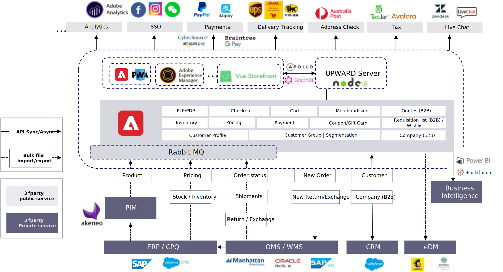

# Typische Integrationspunkte und Datenflüsse

Es gibt zwei Hauptansätze für Integrationen und Datenflüsse, die sehr ähnlich sind, aber einen wichtigen Unterschied aufweisen.

## Monolithisch

Im folgenden Diagramm wird ein monolithischer Ansatz beschrieben, bei dem Adobe Commerce sowohl als Backend-System als auch als Storefront-Anwendung verwendet wird:

## Headless

Im folgenden Diagramm wird ein Headless-Ansatz beschrieben, bei dem Adobe Commerce als Backend-System verwendet wird, das in eine DXP/CMS/benutzerdefinierte Anwendung als Storefront-Anwendung integriert ist:

Der einzige Unterschied zwischen dem monolithischen und Headless-Ansatz besteht in der Storefront-Integration, die sich auf das Benutzererlebnis für Kunden auswirkt. Monolithic verwendet Adobe Commerce-Storefront direkt zur Integration mit Drittanbieterdiensten, während Headless von seiner eigenen Storefront abhängt, um die gleichen Dienste anzupassen und zu integrieren. Einige Dienste wie Bezahlung und Single Sign-on (SSO) benötigen sowohl eine Storefront- als auch eine Adobe Commerce-Anpassung, um den Integrationsfluss abzuschließen.

## Drittanbietersysteme

Einige beliebte Dienste verfügen bereits über großartige Erweiterungen zur Unterstützung von Adobe Commerce- oder beliebten Storefront-Lösungen wie PWA Studio, Adobe Experience Manager und Vue Storefront, die über ihren Erweiterungs-Marketplace oder über zugehörige Drittanbieter-Websites zu finden sind. Selbst wenn es keine Erweiterung gibt, sind die Bemühungen zur Implementierung der Integration zwischen Adobe Commerce und anderen Headless Storefronts ähnlich. Alle Dienste von Drittanbietern verfügen in der Regel über Dokumente, die erklären, wie sie mit ihnen integriert werden können. Diese Dienste sind nur einige Beispiele. verschiedene Länder und Märkte können unterschiedliche Wahlmöglichkeiten haben.

## Enterprise-Integrationen

Bei Integrationen von Unternehmenssystemen, die normalerweise auch als Backend-Integrationen bezeichnet werden, hat dies Auswirkungen auf den Geschäftsdatenfluss. Basierend auf unterschiedlichen Geschäftstypen und Anforderungen können drei verschiedene Integrationsoptionen verwendet werden, die wir bereits eingeführt haben.

Produktbezogene Daten wie SKUs, Inventar und Basispreise stammen in der Regel aus ERPs, während Verkaufspreise in der Regel von jedem Vertriebskanal (z. B. Adobe Commerce) oder CPQ (B2B oder Privatverkäufe) verwaltet werden. Da sich die produktobligatorischen Daten (außer &quot;Bestand&quot;) nicht sehr häufig ändern, empfiehlt es sich, geplante Batch-Aktualisierungen über die REST-API oder den Massendateiimport zu verwenden. Für das Inventar ist es Best Practice, täglich ein vollständiges Update für das Produktinventar durchzuführen, das für andere Vertriebskanäle freigegeben wird, um Überverkäufe zu vermeiden. Zusätzlich können Sie innerhalb von 24 Stunden inkrementelle Änderungen an Ihrem ERP vornehmen.

Produktkatalog, Metadaten und Marketinginhalte können separat von jedem Vertriebskanal (z. B. Adobe Commerce) oder von einem zentralen PIM verwaltet werden. Da Metadaten ebenfalls nicht häufig geändert werden, empfiehlt es sich, geplante Batch-Aktualisierungen über die REST-API oder den Massendateiimport zu verwenden.

Zu den Bestelldaten gehören Auftrags-, Anführungszeichen- (B2B), Versand-, Rückgabe- und Austauschdaten, die normalerweise über ein zentralisiertes OMS- und WMS-System verwaltet werden. Die Bestelldaten sollten so bald wie möglich synchronisiert werden, sodass die REST-API normalerweise die beste Option ist. Für eine bessere Leistung sollten Sie erwägen, die Anzahl der API-Aufrufe zu reduzieren. Ziehen Sie für den Bestellstatus, die Sendungen, die Rückgabe und den Austausch von Daten in Erwägung, die REST-Batch-Aktualisierungs-APIs in Stunden oder Minuten zu planen.

B2B-Daten werden in der Regel über ein zentralisiertes CRM verwaltet. Eine Echtzeit-API wird verwendet, um bestehende Kunden zu überprüfen und neue Kunden zu erstellen. Für B2B kann es erforderlich sein, mehr APIs einzuführen, um verschiedene Mitarbeiter, Gruppen und Preislisten im Unternehmen zwischen Adobe Commerce und Ihrem CRM- oder CPQ-System zu synchronisieren.

Es gibt einige andere Systemintegrationen wie eDM für E-Mail-Marketing und Business Intelligence für die Geschäftsdatenanalyse. Diese werden normalerweise über die REST-API oder den Dateiexport/-import durchgeführt, der normalerweise von vorhandenen Erweiterungen unterstützt wird.
