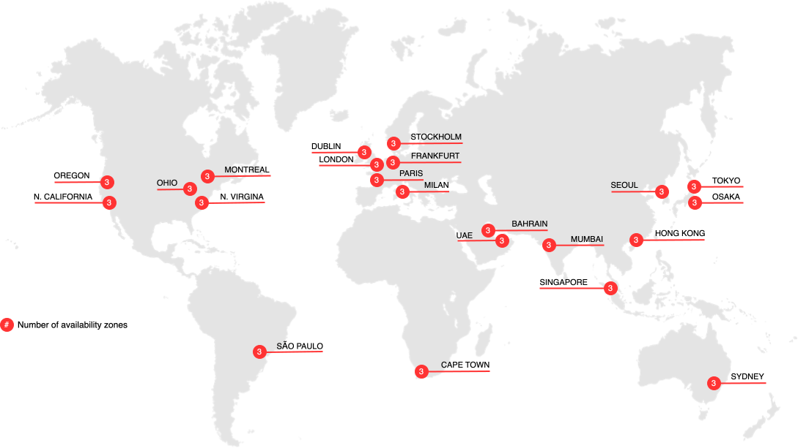

# Cloud-Regionen

Die folgenden Abschnitte enthalten Details zu den verschiedenen AWS- und Azure-Regionen, die für Adobe Commerce in der Cloud-Infrastruktur verfügbar sind.

## AWS-Regionen

{zoomable="yes"}

>[!NOTE]
>
> Nur in China und Russland vor Ort.

## Azure-Regionen

{zoomable="yes"}

>[!NOTE]
>
> Nur in China und Russland vor Ort. Alle Händler, die Integrationsumgebungen erfordern, müssen US-Regionen verwenden.
