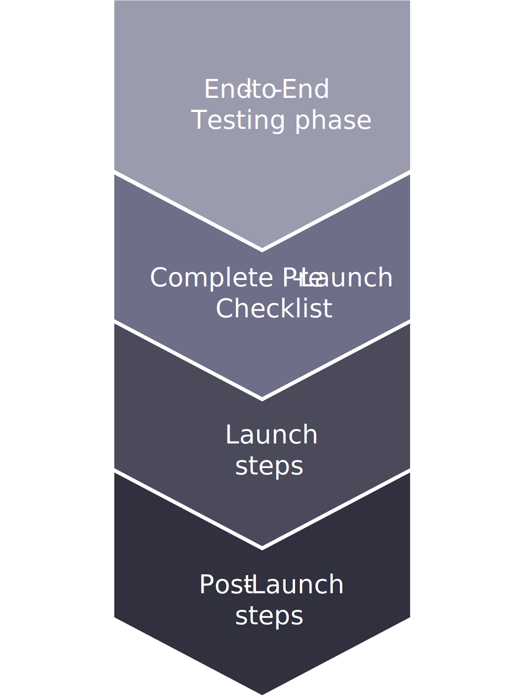

# Schritte nach dem Start

Sobald die Website live ist, werden diese Aktivitäten so bald wie möglich durchgeführt, um sicherzustellen, dass die Website ordnungsgemäß gestartet wurde:

- Aktivieren Sie das Tool für die Zeitüberwachung (New Relic), aktivieren Sie Prüfungen und überwachen Sie die Site, um sicherzustellen, dass alle Dienste und der Zugriff in Grün sind.
- Adobe Commerce-Sicherheitsprüfung regelmäßig aktivieren
- Taggen Sie den Cluster als live und erstellen Sie ein Support-Ticket, um die High SLA-Überwachung zu aktivieren.
- Der CSE (Customer Success Engineer) und TAM (Technical Account Manager) führen nach Abschluss der Umstellung die folgenden Aufgaben aus:
   - Taggen Sie den Cluster als High SLA für Adobe Commerce-Client und erstellen Sie ein Support-Ticket, um ihn zu aktivieren.
   - Aktivieren der Pingdom-Prüfungen auf Domänennamen
   - Überprüfen Sie den Überwachungsstatus und stellen Sie sicher, dass alle Elemente grün sind.
   - Halten Sie die Interessenträger per E-Mail über die Garantiedauer und -parameter am Wochentag auf dem Laufenden.

