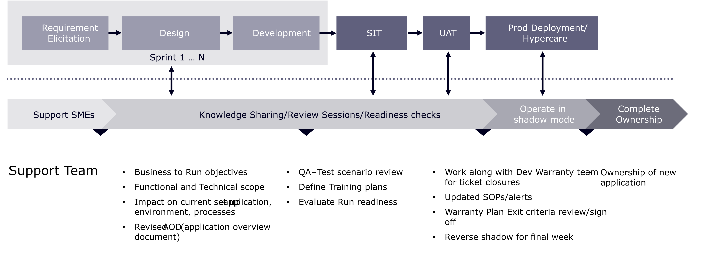

# Übersicht über Wartung und Support

Die Verbraucher haben heute mehr Möglichkeiten als je zuvor. Da es nicht an Marken mangelt, die um Aufmerksamkeit wetteifern, können Sie den Verbrauchern keinen Grund geben, Ihre Konkurrenten zu betrachten. Wie wir gesehen haben, ist Loyalität und Geduld gegenüber Konsumenten dünn. Es braucht nicht viel, bis sie Ihre Marke aufgeben und eine schlechte E-Commerce-Erfahrung ist ein einfacher Weg für sie aufzugeben.

Dies führt zu zwei komplementären Punkten. Erstens bedeutet der Start einer neuen E-Commerce-Website nicht, dass Sie dann weitermachen können. Der Wandel im Marketing und mit den Bedürfnissen der Verbraucher ist zu groß, als dass Marken sich ständig weiterentwickeln müssen, um mithalten zu können. Das bringt uns zu Punkt zwei. Wenn Ihre E-Commerce-Unterstützung nur dazu da ist, etwas zu reparieren, wenn es kaputt geht, dann wird es unmöglich sein, die steigenden Erwartungen der Verbraucher zu erfüllen. Kurz gesagt: Der E-Commerce-Support sollte nicht nur Ihre Website funktionsfähig halten, sondern auch Ihre Marke voranbringen. In diesem Abschnitt erfahren Sie, wie Sie Ihre Marke nach dem Launch Ihrer Site voranbringen.

## Übergangsphase

Die Einrichtung der Produktionsunterstützung während der Übergangsphase eines Projekts ist einer der wichtigsten Erfolgsfaktoren für ein Commerce-Unternehmen. Sobald die Implementierung abgeschlossen ist und die Site live geschaltet wird, muss das Support-Team für die Produktion bereit und in der Lage sein, Support-Aktivitäten zu übernehmen. Üblicherweise wird das Entwicklungsteam während der Übergangsphase heruntergefahren und ein kleineres Team für die Unterstützung aufgebaut.

Der Wissenstransfer erfolgt im Laufe des gesamten Projekts, und parallel zur Bereitstellung erfolgt ein erfolgreicher Transformationsansatz. Darüber hinaus sind Benutzerhandbücher und ein Technologie-Wiki wichtige Werkzeuge, die das Team durch Workshops während der gesamten Projektphasen ermöglichen.

Das folgende Diagramm zeigt die Phasen und Aktivitäten, die in ein erfolgreiches Übergangsergebnis eingeschlossen wären:

>[!NOTE]
>
> Es ist wichtig, eine Checkliste für die Umstellung zu erstellen, die Projektmanagern hilft, die Aufgaben zu erledigen, die für die erfolgreiche Einrichtung des Nachbearbeitungs-Support-Teams erforderlich sind. Dieser Übergang sollte Teil des Gesamtprojektplans sein und die Aufgaben müssen in den Zeitplan aufgenommen werden.

Die Ermittlung des richtigen Support-Modells für Ihr Unternehmen zur weiteren Verbesserung und Optimierung Ihrer Plattform - und der Commerce-Praxis als Ganzes - ist ein wichtiger Schritt zur Aufrechterhaltung der harten Arbeit, die während des Implementierungsprozesses geleistet wurde. Mit einem umfassenden fortlaufenden Support-Plan kann Ihre Commerce-Site mit den Erwartungen Ihrer Kunden Schritt halten und Sie können Ihre Ziele weiterhin erreichen.

Bei der Bereitstellung von Adobe Commerce ist es wichtig, darüber nachzudenken, was in Ihre Wartungs- und Support-Strategie aufgenommen werden soll.
Die Adobe Commerce-Lizenz beinhaltet Support durch Experten. Weitere Informationen zu Expert-Support und Adobe-Support-Plänen finden Sie unter [Adobe-Support-Pläne](https://business.adobe.com/de/customers/consulting-services/premier-support.html).
Zusätzlich zu den Adobe Support-Plänen gibt es Legacy-Support-Bedingungen für Magento. Um zu verstehen, welche Support-Services für Sie gelten, sehen Sie in Ihrem Vertrag nach, welche Support-Vereinbarung Sie haben, oder wenden Sie sich an Ihr Adobe-Account-Team.
