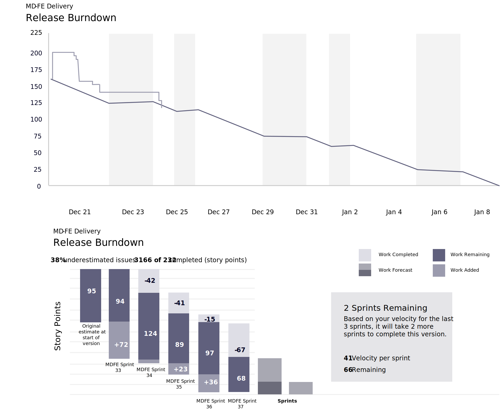

# Projektverwaltung

Die Projektverwaltung ist eine Aufsichtsfunktion, die mit der Leitungsstruktur der Organisation abgestimmt ist und den Projektlebenszyklus umfasst. Es bietet dem Projektmanager und dem Team Struktur, Prozesse, Entscheidungsmodelle und Tools für die Verwaltung und Kontrolle des Projekts und gewährleistet gleichzeitig die erfolgreiche Bereitstellung des Projekts. Die Projektverwaltung ist ein wesentliches Element, insbesondere für komplexe und strategische Projekte.

Das Governance-Modell definiert, dokumentiert und kommuniziert benutzerdefinierte und effektive Vorgehensweisen, um eine umfassende Methode zur Steuerung des Projekts und zur Gewährleistung des Erfolgs auf allen Ebenen regelmäßige Sichtbarkeit zu bieten. Es enthält einen Rahmen für die Entscheidungsfindung, definiert Rollen, Verantwortlichkeiten und Verbindlichkeiten für die Durchführung des Projekts und bestimmt die Wirksamkeit. Die Governance-Struktur erstreckt sich vom Ausführungsteam bis hin zum Executive Management und definiert die Aktivitäten, Berichte, Eskalationen und den Informationsfluss.

Auf verschiedenen Ebenen untersuchen die Teams spezifische Sprint- und Projektmetriken, um den Fortschritt zu verstehen und bei Bedarf Korrekturmaßnahmen zu ergreifen. Diese Metriken auf Sprint-Ebene können die Geschwindigkeit und den Niederschlag jedes Sprints umfassen.

## Einzelheiten zu regulären Sitzungen

- Vierteljährlicher Geschäftsbericht

   - Diskussion der Wachstumseskalationsstrategien

   - Aktuelle Erfolge und Ziele hervorheben

   - Abstimmen der gewünschten Ergebnisse für die nächsten Quartale

- Monatlicher Lenkungsausschuss

   - Projektfortschritt koordinieren und überprüfen

   - Entscheidungsprozesse zu den wichtigsten Auswirkungen (falls vorhanden)

   - Dentsuy stellt sicher, dass Kundenzufriedenheit und Bedenken aufgezeichnet und berücksichtigt werden

- Wöchentlicher Projektausschuss

   - Entscheiden Sie sich für Ziele, Plan, Organisation der Woche

   - Architekturentscheidungen nach Bedarf treffen

   - Überprüfen und bearbeiten Sie Projektstatusberichte.

   - Demo der Plattform und Funktionen

   - Eskalieren von Anforderungen/Problemen/Vorschlägen

- Tägliches Meeting

   - Diskussion und Weiterverfolgung von Aktionselementen, einschließlich aktueller Sprint/Boards/ausstehender Tickets

   - Projektfortschritt überwachen

## Leistungs-KPIs

Neben den Sprint-Metriken ist es auch wichtig, die KPIs für Projekt- und Qualitätsleistung zu messen. Dies trägt nicht nur dazu bei, das Qualitätsniveau im gesamten Plan zu gewährleisten, sondern es hält das Team auf Kurs und verhindert, dass das Projekt von der Schiene aus läuft.

## Storyboard und Velocity

## Sprint- und Release-Burndown

Herausforderungen oder Änderungen treten während der gesamten Dauer eines Projekts auf. Wenn Sie den richtigen Personen in Ihrer Organisation die Möglichkeit geben, die Aufgaben zu verfolgen, zu messen und zu drehen, wenn eine Herausforderung erfüllt wird, können Sie die Wahrscheinlichkeit erhöhen, dass Sie aus dem Projekt herauskommen, nachdem Sie Ihre Ziele erreicht haben und mit dem Ergebnis zufrieden sind.

<table>
<thead>
  <tr>
    <th>Schlüsselleistungsmessung</th>
    <th>Maßeinheit</th>
    <th>Gemeldete Metriken</th>
  </tr>
</thead>
<tbody>
  <tr>
    <td>Testabdeckung</td>
    <td>%</td>
    <td>Anzahl der prüfbaren Anforderungen, die von Testfällen abgedeckt werden VS Gesamtzahl der prüfbaren Grundanforderungen</td>
  </tr>
  <tr>
    <td>Defect Density</td>
    <td>%</td>
    <td>Anzahl der gültigen Defekte VS. Gesamtzahl der ausgeführten Testfälle</td>
  </tr>
  <tr>
    <td>Defektes Leakage an SIT/UAT/Produktion</td>
    <td>%</td>
    <td>In Produktion gemeldete Fehler VS. Fehler in Produktion + Fehler in der Meldung QA+UAT</td>
  </tr>
  <tr>
    <td>Testeffektivität</td>
    <td>%</td>
    <td>Gültige angehobene/gültige Defekte wurden abgelehnt</td>
  </tr>
  <tr>
    <td>Codequalität</td>
    <td># + %</td>
    <td>Komplexität, LoC, Verletzungen, Code-Abdeckung für den Sprint</td>
  </tr>
</tbody>
</table>
