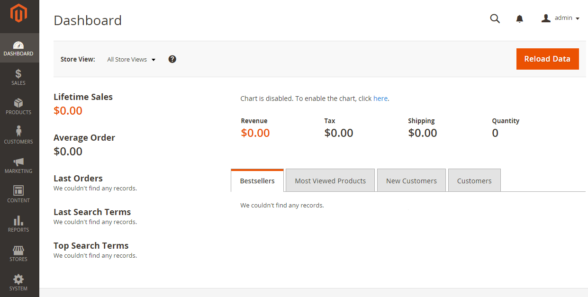

# Überprüfen der Installation

Gehen Sie in einem Webbrowser zur Storefront. Wenn Ihre Installations-Basis-URL beispielsweise `http://www.example.com` ist, geben Sie sie in die Adress- oder Adressleiste Ihres Browsers ein.

Die folgende Abbildung zeigt eine Beispiel-Storefront-Seite. Wenn sie wie folgt angezeigt wird, war Ihre Installation erfolgreich!

## Storefront überprüfen (keine Beispieldaten)

Gehen Sie in einem Webbrowser zur Storefront. Wenn Ihre Installations-Basis-URL beispielsweise `http://www.example.com` ist, geben Sie sie in die Adress- oder Adressleiste Ihres Browsers ein.

Die folgende Abbildung zeigt eine Beispiel-Storefront-Seite. Wenn sie wie folgt angezeigt wird, war Ihre Installation erfolgreich!

Wenn auf der Seite ein `404 (Not Found)` Fehler angezeigt wird oder Stile nicht angezeigt werden, finden Sie weitere Informationen unter [Fehlerbehebung](https://support.magento.com/hc/en-us/articles/360032994352).

## Überprüfen des Administrators

Navigieren Sie in einem Webbrowser zu Admin . Wenn beispielsweise die Installations-Basis-URL `http://www.example.com` und der Admin-URI `admin_au1nT` ist, geben Sie `http://www.example.com/admin_au1nT` in der Adress- oder Speicherortleiste Ihres Browsers ein.

(Der Admin-URI wird durch den Wert des `backend-frontname` Installationsparameters angegeben.)

Melden Sie sich bei Aufforderung als Administrator an.

Die folgende Abbildung zeigt ein Beispiel für eine Admin-Seite. Wenn sie wie folgt angezeigt wird, war Ihre Installation erfolgreich!

Wenn auf der Seite keine Stile angezeigt werden, siehe [Fehlerbehebung](https://support.magento.com/hc/en-us/articles/360032994352).

Wenn Sie einen 404-Fehler (Nicht gefunden) ähnlich dem folgenden erhalten, lesen Sie [PHP-Versionsfehler oder 404 beim Zugriff auf Adobe Commerce im Browser](https://support.magento.com/hc/en-us/articles/360033117152).

`The requested URL /magento2index.php/admin/admin/dashboard/index/key/0c81957145a968b697c32a846598dc2e/ was not found on this server.`
