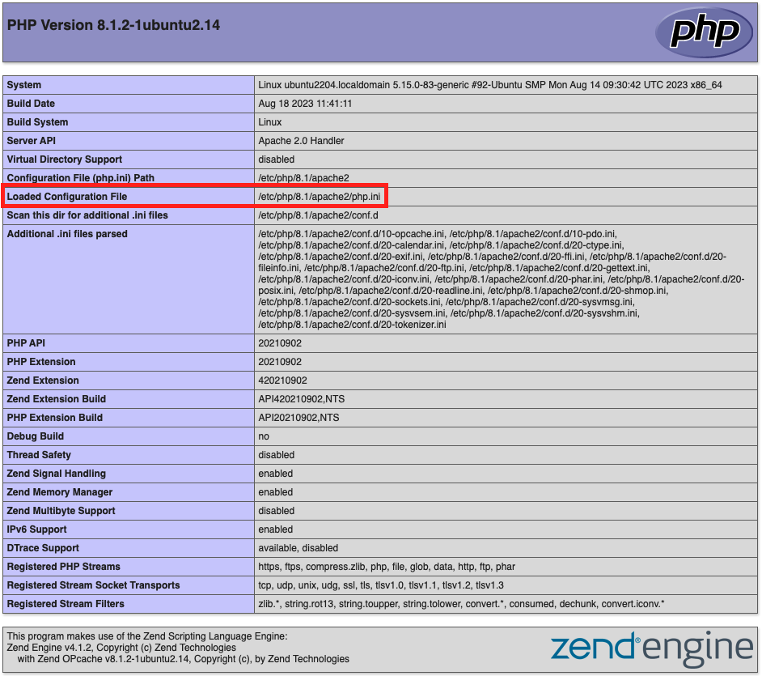

# PHP-Einstellungen

In diesem Thema wird beschrieben, wie Sie die erforderlichen PHP-Optionen festlegen.

>[!NOTE]
>
>Die neueste Version von Adobe Commerce und Magento Open Source erfordert mindestens PHP 8.1. Siehe [Systemanforderungen](../system-requirements.md) für alle unterstützten PHP-Versionen.

## Überprüfen, ob PHP installiert ist

PHP wird standardmäßig auf den meisten Linux-Distributionen installiert. Dieses Thema setzt voraus, dass Sie PHP bereits installiert haben. Um zu überprüfen, ob PHP installiert ist, geben Sie Folgendes in die Befehlszeile ein:

```bash
php -v
```

Wenn PHP installiert ist, wird eine ähnliche Meldung wie die folgende angezeigt:

```terminal
PHP 8.1.2-1ubuntu2.14 (cli) (built: Aug 18 2023 11:41:11) (NTS)
Copyright (c) The PHP Group
Zend Engine v4.1.2, Copyright (c) Zend Technologies
    with Zend OPcache v8.1.2-1ubuntu2.14, Copyright (c), by Zend Technologies
```

Wenn PHP nicht installiert ist (oder ein Upgrade erforderlich ist), installieren Sie es, indem Sie die Anweisungen für Ihre Linux-Distribution befolgen.

## Überprüfen installierter Erweiterungen

Adobe Commerce und Magento Open Source erfordern bestimmte PHP-Erweiterungen. In den folgenden Listen werden die erforderlichen Erweiterungen für jede Commerce-Edition angegeben. Die Listen werden von einer Bereitstellung automatisch generiert, bei der die neueste Version jeder Edition ausgeführt wird.

{{$include /help/_includes/templated/php-extensions.md}}

Überprüfen installierter Erweiterungen:

1. Liste installierter Module.

   ```bash
   php -m
   ```

1. Stellen Sie sicher, dass alle erforderlichen Erweiterungen installiert sind.
1. Fügen Sie alle fehlenden Module mit dem gleichen Workflow hinzu, der für die Installation von PHP verwendet wird.

## Überprüfen der PHP-Einstellungen

>[!WARNING]
>
>Wenn Sie PHP 7.4.20 verwenden, setzen Sie `pcre.jit=0` in `php.ini` -Datei. Dies umgeht ein PHP [Fehler](https://bugs.php.net/bug.php?id=81101) verhindert, dass CSS geladen wird.

- Legen Sie die Systemzeitzone für PHP fest. Andernfalls funktionieren Fehler wie die folgende Anzeige während der Installation und zeitbezogene Vorgänge wie Cron möglicherweise nicht:

```terminal
PHP Warning:  date(): It is not safe to rely on the system's timezone settings. [more messages follow]
```

- Setzen Sie das PHP-Speicherlimit.

  Adobe empfiehlt Folgendes:

   - Kompilieren von Code oder Bereitstellen von statischen Assets, `1G`
   - Debugging, `2G`
   - Test, `~3-4G`

- Erhöhen Sie die Werte für PHP `realpath_cache_size` und `realpath_cache_ttl` zu den empfohlenen Einstellungen:

  ```conf
  realpath_cache_size=10M
  realpath_cache_ttl=7200
  ```

  Diese Einstellungen ermöglichen es PHP-Prozessen, Pfade zu Dateien zwischenzuspeichern, anstatt sie beim Laden der Seite zu suchen. Siehe [Leistungsoptimierung](https://www.php.net/manual/en/ini.core.php) in der PHP-Dokumentation.

- Aktivieren [`opcache.save_comments`](https://www.php.net/manual/en/opcache.configuration.php#ini.opcache.save-comments), was für Adobe Commerce und Magento Open Source 2.1 und höher erforderlich ist.

  Adobe empfiehlt die Aktivierung der [PHP OPcache](https://www.php.net/manual/en/book.opcache.php) aus Leistungsgründen. Der OPcache ist in vielen PHP-Distributionen aktiviert.

  Adobe Commerce und Magento Open Source 2.1 und höher verwenden PHP-Code-Kommentare zur Codegenerierung.

>[!NOTE]
>
>Um Probleme während der Installation und Aktualisierung zu vermeiden, empfiehlt Adobe dringend, dass Sie die gleichen PHP-Einstellungen sowohl auf die PHP-Befehlszeilenkonfiguration als auch auf die PHP-Webserver-Plug-in-Konfiguration anwenden. Weitere Informationen finden Sie im nächsten Abschnitt.

## PHP-Konfigurationsdateien suchen

In diesem Abschnitt wird beschrieben, wie Sie die Konfigurationsdateien finden, die zum Aktualisieren der erforderlichen Einstellungen erforderlich sind.

### Suchen `php.ini` Konfigurationsdatei

Um die Webserverkonfiguration zu finden, führen Sie einen [`phpinfo.php` file](optional-software.md#create-phpinfophp) in Ihrem Webbrowser nach `Loaded Configuration File` wie folgt:



Um die PHP-Befehlszeilenkonfiguration zu finden, geben Sie

```bash
php --ini | grep "Loaded Configuration File"
```

>[!NOTE]
>
>Wenn Sie nur eine `php.ini` -Datei, ändern Sie diese Datei. Wenn Sie zwei `php.ini` Dateien, ändern *both* -Dateien. Andernfalls kann die Leistung unvorhersehbar sein.

### OPcache-Konfigurationseinstellungen suchen

PHP OPcache-Einstellungen befinden sich normalerweise entweder in `php.ini` oder `opcache.ini`. Der Speicherort kann von Ihrem Betriebssystem und Ihrer PHP-Version abhängen. Die OPcache-Konfigurationsdatei verfügt möglicherweise über eine `opcache` -Abschnitt oder Einstellungen wie `opcache.enable`.

Verwenden Sie die folgenden Richtlinien, um sie zu finden:

- Apache-Webserver:

  Für Ubuntu mit Apache befinden sich die OPcache-Einstellungen normalerweise im `php.ini` -Datei.

  Bei CentOS mit Apache oder nginx befinden sich die OPcache-Einstellungen normalerweise in `/etc/php.d/opcache.ini`

  Wenn nicht, suchen Sie mit dem folgenden Befehl:

  ```bash
  sudo find / -name 'opcache.ini'
  ```

- nginx-Webserver mit PHP-FPM: `/etc/php/8.1/fpm/php.ini`

Wenn Sie mehr als eine `opcache.ini`, ändern Sie alle.

## Festlegen von PHP-Optionen

Festlegen von PHP-Optionen:

1. Öffnen Sie eine `php.ini` in einem Texteditor.
1. Suchen Sie die Zeitzone Ihres Servers in der verfügbaren [Zeitzoneneinstellungen](https://www.php.net/manual/en/timezones.php)
1. Suchen Sie die folgende Einstellung und heben Sie die Auskommentierung auf, falls erforderlich:

   ```conf
   date.timezone =
   ```

1. Fügen Sie die Zeitzoneneinstellung hinzu, die Sie in Schritt 2 gefunden haben.

1. Ändern Sie den Wert von `memory_limit` zu einem der am Anfang dieses Abschnitts empfohlenen Werte.

   Beispiel:

   ```conf
   memory_limit=2G
   ```

1. Hinzufügen oder Aktualisieren der `realpath_cache` Konfiguration, um die folgenden Werte zu erfüllen:

   ```conf
   ;
   ; Increase realpath cache size
   ;
   realpath_cache_size = 10M
   
   ;
   ; Increase realpath cache ttl
   ;
   realpath_cache_ttl = 7200
   ```

1. Speichern Sie Ihre Änderungen und beenden Sie den Texteditor.

1. Öffnen Sie die andere `php.ini` (wenn sie unterschiedlich sind) und die gleichen Änderungen daran vornehmen.

## OPcache-Optionen festlegen

Zum Festlegen `opcache.ini` options:

1. Öffnen Sie die OPcache-Konfigurationsdatei in einem Texteditor:

   - `opcache.ini` (CentOS)
   - `php.ini` (Ubuntu)
   - `/etc/php/8.1/fpm/php.ini` (nginx-Webserver (CentOS oder Ubuntu))

1. Suchen `opcache.save_comments` und entfernen Sie bei Bedarf die Kommentar.
1. Stellen Sie sicher, dass der Wert auf `1`.
1. Speichern Sie Ihre Änderungen und beenden Sie den Texteditor.
1. Starten Sie den Webserver neu:

   - Apache, Ubuntu: `service apache2 restart`
   - Apache, CentOS: `service httpd restart`
   - nginx, Ubuntu und CentOS: `service nginx restart`

## Fehlerbehebung

In den folgenden Adobe Commerce-Supportartikeln finden Sie Hilfe zur Fehlerbehebung bei PHP-Problemen:

- [PHP-Versionsfehler oder 404-Fehler beim Zugriff auf Adobe Commerce in einem Browser](https://support.magento.com/hc/en-us/articles/360033117152-PHP-version-error-or-404-error-when-accessing-Magento-in-browser)
- [Fehler bei PHP-Einstellungen](https://support.magento.com/hc/en-us/articles/360034599631-PHP-settings-errors)
- [PHP mcrypt-Erweiterung nicht ordnungsgemäß installiert](https://support.magento.com/hc/en-us/articles/360034280132-PHP-mcrypt-extension-not-installed-properly-)
- [Probleme bei der Überprüfung der PHP-Versionsbereitschaft](https://support.magento.com/hc/en-us/articles/360033546411)
- [Häufige Fehler und Lösungen bei PHP](https://support.magento.com/hc/en-us/articles/360030568432)
