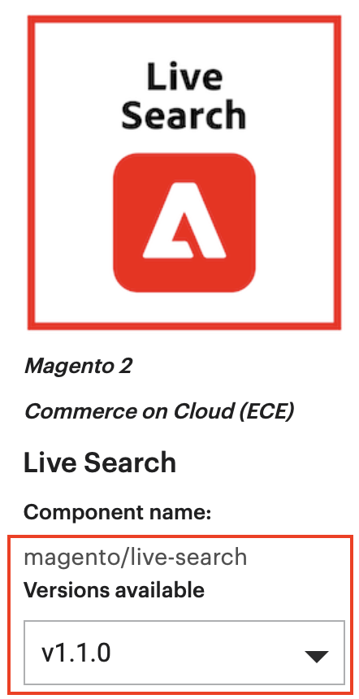

# Installieren einer Erweiterung

Code, der das Adobe Commerce-Verhalten erweitert oder anpasst, wird als Erweiterung bezeichnet. Optional können Sie Erweiterungen für die [Commerce Marketplace](https://marketplace.magento.com) oder einem anderen Verteilungssystem für Erweiterungen.

Zu den Erweiterungen gehören:

- Module (Adobe Commerce-Funktionen erweitern)
- Designs (ändern Sie das Erscheinungsbild Ihrer Storefront und Ihres Administrators)
- Sprachpakete (Storefront und Admin lokalisieren)

>[!TIP]
>
>In diesem Thema wird erläutert, wie Sie mit der Befehlszeile die von Ihnen erworbenen Erweiterungen über die Commerce Marketplace installieren können. Sie können dieselbe Vorgehensweise bei der Installation von _any_ Erweiterung; benötigen Sie lediglich den Namen und die Version des Composers der Erweiterung. Öffnen Sie zum Suchen die `composer.json` -Datei und notieren Sie die Werte für `"name"` und `"version"`.

Vor der Installation sollten Sie Folgendes tun:

1. Sichern Sie Ihre Datenbank.
1. Wartungsmodus aktivieren:

   ```bash
   bin/magento maintenance:enable
   ```

Um eine Erweiterung zu installieren, müssen Sie:

1. Rufen Sie eine Erweiterung von der Commerce Marketplace oder einem anderen Erweiterungsentwickler ab.
1. Wenn Sie eine Erweiterung über das Commerce Marketplace installieren, stellen Sie sicher, dass die Variable `repo.magento.com` Repository vorhanden ist in `composer.json` Datei:

   ```bash
   "repositories": [
       {
           "type": "composer",
           "url": "https://repo.magento.com/"
       }
   ]
   ```

1. Rufen Sie den Namen und die Version des Composers der Erweiterung ab.
1. Aktualisieren Sie die `composer.json` -Datei in Ihrem Projekt mit dem Namen und der Version der Erweiterung.
1. Überprüfen Sie, ob die Erweiterung ordnungsgemäß installiert ist.
1. Aktivieren und konfigurieren Sie die Erweiterung.

## Abrufen des Namens und der Version des Erweiterungs-Composers

Wenn Sie den Namen und die Version des Komponentenprogramms der Erweiterung bereits kennen, überspringen Sie diesen Schritt und fahren Sie mit [Aktualisieren Sie Ihre `composer.json` file](#update-your-composer-file).

So rufen Sie den Composer-Namen und die Version der Erweiterung von der Commerce Marketplace ab:

1. Anmelden bei [Commerce Marketplace](https://marketplace.magento.com) mit dem Benutzernamen und dem Passwort, die Sie zum Kauf der Erweiterung verwendet haben.

1. Klicken Sie oben rechts auf **Ihr Name** > **Mein Profil**.

   

1. Klicks **Meine Käufe**.

   

1. Suchen Sie die zu installierende Erweiterung und klicken Sie auf **Technische Details**.

   

>[!TIP]
>
>Alternativ können Sie den Namen und die Version des Composers finden. _any_ -Erweiterung (unabhängig davon, ob Sie sie auf Commerce Marketplace oder an einer anderen Stelle erworben haben) in der `composer.json` -Datei.

## Aktualisieren der Composer-Datei

Fügen Sie den Namen und die Version der Erweiterung zu Ihrem `composer.json` Datei:

1. Navigieren Sie zu Ihrem Projektverzeichnis und aktualisieren Sie Ihre `composer.json` -Datei.

   ```bash
   composer require <component-name>:<version>
   ```

   Beispiel:

   ```bash
   composer require j2t/module-payplug:2.0.2
   ```

1. Geben Sie Ihre [Authentifizierungsschlüssel](../prerequisites/authentication-keys.md). Ihr öffentlicher Schlüssel ist Ihr Benutzername, Ihr privater Schlüssel ist Ihr Passwort.

1. Warten Sie, bis der Composer die Aktualisierung Ihrer Projektabhängigkeiten abgeschlossen hat, und stellen Sie sicher, dass keine Fehler vorliegen:

   ```terminal
   Updating dependencies (including require-dev)
   Package operations: 1 install, 0 updates, 0 removals
     - Installing j2t/module-payplug (2.0.2): Downloading (100%)
   Writing lock file
   Generating autoload files
   ```

## Erweiterung überprüfen

Um zu überprüfen, ob die Erweiterung ordnungsgemäß installiert wurde, führen Sie den folgenden Befehl aus:

```bash
bin/magento module:status J2t_Payplug
```

Standardmäßig ist die Erweiterung wahrscheinlich deaktiviert:

```terminal
Module is disabled
```

Der Erweiterungsname hat das Format `<VendorName>_<ComponentName>`: Dies ist ein anderes Format als der Name des Composers. Verwenden Sie dieses Format, um die Erweiterung zu aktivieren. Wenn Sie sich nicht sicher sind, welchen Namen die Erweiterung hat, führen Sie Folgendes aus:

```bash
bin/magento module:status
```

Suchen Sie nach der Erweiterung unter &quot;Liste der deaktivierten Module&quot;.

## Aktivieren der Erweiterung

Einige Erweiterungen funktionieren nur dann ordnungsgemäß, wenn Sie zuvor generierte statische Ansichtsdateien löschen. Verwenden Sie die `--clear-static-content` Option zum Löschen von statischen Ansichtsdateien beim Aktivieren einer Erweiterung.

1. Aktivieren Sie die Erweiterung und löschen Sie statische Ansichtsdateien:

   ```bash
   bin/magento module:enable J2t_Payplug --clear-static-content
   ```

   Die folgende Ausgabe sollte angezeigt werden:

   ```terminal
   The following modules have been enabled:
   - J2t_Payplug
   
   To make sure that the enabled modules are properly registered, run 'setup:upgrade'.
   Cache cleared successfully.
   Generated classes cleared successfully. Please run the 'setup:di:compile' command to generate classes.
   Generated static view files cleared successfully.
   ```

1. Registrieren Sie die Erweiterung:

   ```bash
   bin/magento setup:upgrade
   ```

1. Kompilieren Sie Ihr Projekt neu: Im Produktionsmodus erhalten Sie möglicherweise eine Meldung mit der Meldung &quot;Magento-Kompilierungsbefehl erneut ausführen&quot;. Die Anwendung fordert Sie nicht auf, den Befehl &quot;Kompilieren&quot;im Entwicklermodus auszuführen.

   ```bash
   bin/magento setup:di:compile
   ```

1. Stellen Sie sicher, dass die Erweiterung aktiviert ist:

   ```bash
   bin/magento module:status J2t_Payplug
   ```

   Es sollte eine Ausgabe angezeigt werden, die überprüft, ob die Erweiterung nicht mehr deaktiviert ist:

   ```terminal
   Module is enabled
   ```

1. Cache leeren:

   ```bash
   bin/magento cache:clean
   ```

1. Konfigurieren Sie die Erweiterung in Admin nach Bedarf.

>[!TIP]
>
>Wenn beim Laden der Storefront in einen Browser Fehler auftreten, verwenden Sie den folgenden Befehl, um den Cache zu löschen: `bin/magento cache:flush`.

## Aktualisierung einer Erweiterung

So aktualisieren oder aktualisieren Sie ein Modul oder eine Erweiterung:

1. Laden Sie die aktualisierte Datei von Marketplace oder einem anderen Erweiterungsentwickler herunter. Notieren Sie sich den Modulnamen und die Version.

1. Exportieren Sie die Inhalte in den Stammordner der Anwendung.

1. Wenn für das Modul ein Composer-Paket vorhanden ist, führen Sie einen der folgenden Schritte aus.

   Aktualisierung nach Modulname:

   ```bash
   composer update vendor/module-name
   ```

   Aktualisierung pro Version:

   ```bash
   composer require vendor/module-name ^x.x.x
   ```

1. Führen Sie die folgenden Befehle aus, um den Cache zu aktualisieren, bereitzustellen und zu leeren.

   ```bash
   bin/magento setup:upgrade --keep-generated
   ```

   ```bash
   bin/magento setup:static-content:deploy
   ```

   ```bash
   bin/magento cache:clean
   ```
