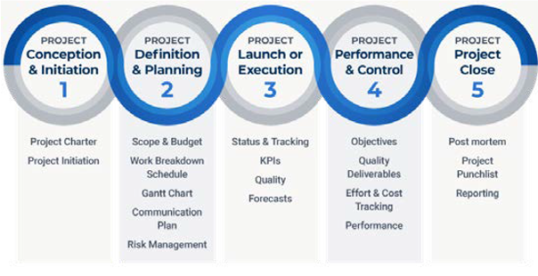

# Projektmanagement

Projektmanagement ist die Anwendung von Wissen, Fähigkeiten, Werkzeugen und Techniken, um Ziele zu erreichen und die Projektanforderungen erfolgreich zu erfüllen.

Im folgenden Diagramm werden die fünf Phasen des Projektmanagements und der Lebenszyklus des Projektmanagements beschrieben:

Der Lebenszyklus des Projektmanagements bietet einen zeitnahen und kontrollierten Bereitstellungsprozess, von dem die Projektbeteiligten profitieren. Der erste Schritt bei der Bereitstellung eines erfolgreichen E-Commerce-Projekts ist das Projektmanagement. Der richtige Ansatz und die richtige Methodik sind erforderlich, damit das Team das Projekt effizient und effizient durchführen kann.

Einige Teams wählen für ihre E-Commerce-Projekte die Scrum-Projektmanagement-Methode. Die unten aufgeführten Scrum-Funktionen helfen bei der Vereinfachung und Verwaltung des Projekts:

- Periodisierung von Aufgaben
- Periodisierung von Rückstandsaufgaben vor und während des Sprints
- Tägliche Team-Standups
- Planen der Sitzung für jeden Sprint
- Sprint-Retrospektiven

Scrum unterstützt Sie bei der Verwaltung von Änderungen während des Projekts, ermöglicht es Teams, schnelle Ergebnisse anzuzeigen, ist flexibel und erhöht die Zusammenarbeit.

## Grundlegender Projektplan

Ein grundlegender E-Commerce-Projektmanagementplan umfasst:

- **Analyse**—In der Anfangsphase eines Projekts muss das Unternehmen eine Analyse durchführen, einschließlich einer Analyse der Märkte und Konkurrenten, um die Stärken und Schwächen des Unternehmens zu verstehen.

- **Voraussetzungen**—Definieren Sie detaillierte Anforderungen, die die Organisation am Ende des Projekts hinsichtlich der Verbesserung vorhandener Fähigkeiten und/oder der Implementierung neuer Funktionen und/oder Integrationen benötigt.

- **Drittanbieter**—In dieser Phase ordnen Sie die erforderlichen Drittanbieterintegrationen (z. B. Zahlung, Versand, Bewertungen und Überprüfungen) zu.

- **Design**—Brainstorm designspezifische Anforderungen für Vorlagen und das Markenbuch des Unternehmens.

- **Migration**—Planen Sie die Schritte für die Migration von Inhalten und Daten.

- **E-Commerce-Plattform**—Analysieren und Fertigstellen der Plattform, die für das Unternehmen zur Erfüllung der Anforderungen erforderlich ist.

## Best Practices

Zu den Best Practices, auf die Unternehmen für das Projektmanagement Bezug nehmen können, gehören:

- Festlegen klarer, präziser und nachverfolgbarer Ziele
- Überwachung der mit Aufgaben und Ressourcen verbrachten Zeit, um Verschwendung zu vermeiden
- Auswählen der richtigen E-Commerce-Tools, die für das Team erforderlich sind, z. B. die E-Commerce-Plattform und die Kommunikationswerkzeuge
- Tests und Iteration sollten ständig durchgeführt werden
- Budget verfolgen
- Kontrollbereich beibehalten

Bei der Entwicklung einer E-Commerce-Site sind viele Aspekte zu beachten. Das Projekt-Management bietet die Struktur, die Sie benötigen, um Projektziele, Zeitpläne und Lieferziele zu verfolgen und die Teammitglieder auf den Fortschritt abzustimmen.
