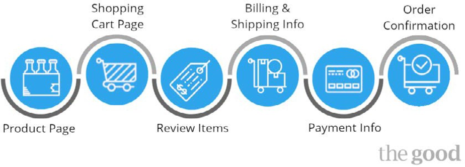

# Auschecken von Flüssen und Prozessen

Der Checkout ist ein wichtiger Bestandteil des Online-Shopping. Hier wird das echte Geld verdient. Einzelhändler konzentrieren sich tendenziell mehr auf das Erscheinungsbild der Website und übersehen den Checkout-Fluss, aber beide Teile sind gleichermaßen wichtig.

Der Checkout-Fluss ähnelt der Ziellinie, in der sich Käufer in Kunden umwandeln, die Transaktionen tätigen. Aber selbst ein kleiner Treffer beim Checkout kann einen enormen negativen Einfluss auf die Konversionsrate und den ROI haben, sodass eine Verbesserung der Konversionsrate sogar geringfügig dazu beitragen kann, den ROI massiv zu steigern. Die Verbesserung von Checkout-Flüssen und -Prozessen beginnt bereits vor der Checkout-Seite.

## Produktseiten

Versuchen Sie, alle Informationen vor dem Seitenumbruch zu bewahren, z. B. Produktdetails, Preise, Produktbilder, Bewertungen und Bewertungen. Alle Faktoren, die erforderlich sind, damit der Kunde eine Entscheidung über den Kauf des Produkts trifft.

Fügen Sie Abschnitte wie &quot;Sie möchten gerne&quot;hinzu, in denen Produkte angezeigt werden, die mit dem Produkt zusammenhängen, das ein Kunde derzeit betrachtet. Dies ist eine Strategie, die dazu dient, den Kunden mehr zu kaufen.

## Optimierter Checkout-Prozess

Versuchen Sie, begrenzte Schritte und weniger Klicks auf die Checkout-Seite zu haben, um den Prozess zu beschleunigen. Beispielsweise muss der Checkout Folgendes umfassen:

- Versand
- Rechnungsstellung
- Zahlung

Durch die Implementierung eines einfachen und bequemen Checkouts wird das Risiko eines Warenkorbabbruchs beseitigt.

## Visueller Checkout-Fluss

Zeigen Sie einen visuellen Checkout-Fluss an, in dem die Käufer die Vorschau der Anzahl der zum Abschließen des Kaufs erforderlichen Schritte anzeigen können.

## Entfernen von Extras

Entfernen Sie zusätzliche Informationen wie den Minibag, die Suche und/oder die Navigationsleiste. Dies hilft dem Kunden, sich auf den Checkout-Prozess zu konzentrieren, anstatt zu einer anderen Seite zu navigieren.

Verwenden Sie saubere und fette CTA-Schaltflächen mit einem einfachen Seitendesign.

## Vertrauen

Kunden, die online einkaufen, machen sich immer Sorgen um die Sicherheit. Um Kunden eine Sicherheit zu bieten, zeigen Sie Folgendes auf der Site an:

- Berechtigungsakkreditierungen wie Norton secured, MacAfee secure und Google Trusted Store
- SSL-Zertifikate
- Logos für Zahlungsmethoden
- Bewertungen und Überprüfungen
- Richtlinien
- Allgemeine Geschäftsbedingungen

## Optionen zum Auschecken

Stellen Sie verschiedene Checkout-Optionen bereit, z. B.:

- Gastbenutzer
- Registrierter Benutzer
- Konto erstellen

Erzwingen Sie für den Benutzer nicht einen Optionstyp.

## Versandoptionen

Einzelhändler sollten unterschiedliche Versandmethoden anbieten, um den Bedürfnissen verschiedener Kunden gerecht zu werden.

Neben den Zahlungsoptionen können Einzelhändler auch Optionen wie [Klicken und sammeln](click-collect.md) bereitstellen.

## Zahlungsdetails

Zahlungsdetails sollten am Ende platziert werden, direkt vor der Bestätigung, dass eine Bestellung aufgegeben wird.

Geben Sie eine einfache Möglichkeit an, Zahlungsdetails wie den Namen auf der Karte und die Kartennummer einzugeben.

Geben Sie dem Benutzer eine Option an, seine Kreditdaten für den nächsten Kauf zu speichern.

## Bestellübersicht

Geben Sie eine detaillierte Bestellübersicht an, bevor der Benutzer den Kauf bestätigt.

## Bestellbestätigung

Zeigen Sie eine Dankesnachricht mit den Bestellbestätigungsdetails an, um dem Kunden die Gewissheit zu geben, dass er eine Bestellung erfolgreich aufgegeben hat.

Einige Händler geben auch Werbemeldungen an, wenn der Benutzer als Gast ausgecheckt hat, um die Anmeldung zu einem registrierten Benutzer zu bewerben.

## E-Mails

Verfolgen Sie die Auftragsbestätigung immer mit einer Bestätigungs-E-Mail, in der alle Bestelldetails und die Tracking-Funktion beschrieben werden.

Die Kasse ist ein wichtiger Faktor, um die Konversionsrate zu erhöhen und damit den ROI zu erhöhen. Es ist notwendig, den Checkout-Prozess zu optimieren, um ein benutzerfreundliches, schnelles und bequemes Checkout-Erlebnis zu bieten. Da es sich nicht um eine Einheitsgröße handelt, ist es für Einzelhändler wichtig, die besten Optionen zu untersuchen, zu analysieren und zu testen.

## B2C vs B2B Checkout

Es gibt einen Unterschied zwischen B2B- und B2C-Checkout-Flüssen und -Prozessen.

### B2C

- Möglichkeit zur Mengenänderung
- Produkt aus Warenkorb löschen
- Einfacher Checkout
- Verschiedene Zahlungsoptionen wie Kreditkarte und E-Wallet
- Gutscheincode zum Checkout hinzufügen

### B2B

- Möglichkeit zur Mengenänderung
- Produkt aus Warenkorb löschen
- Einfacher Checkout
- Verschiedene Zahlungsoptionen wie Bestellung, Banküberweisung oder Scheck
- Einfacher Prozess zur Neuanordnung

