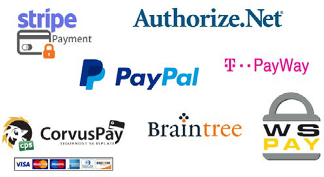

# ZahlungsGateways

Es gab eine Zeit, in der Bargeld die Hauptquelle von Transaktionen war, aber die Online-Welt hat übernommen und Online-Zahlungsmethoden ersetzen alte Zahlungsmethoden. Alles ist jetzt online, was die Dinge einfacher und leichter zugänglich macht, einschließlich Kreditkarten, E-Brieftaschen und Banküberweisungen.

Ein Payment Gateway ist ein Dienstleister, der Zahlungen für E-Commerce-Websites verbindet und verarbeitet. Sie spielen eine wichtige Rolle für das Kundenerlebnis und die Konversionsraten. Komplizierte Zahlungssysteme neigen dazu, Kunden dazu zu bewegen, ihren Warenkorb aufzugeben. Es ist wichtig, Kunden ein einfaches, benutzerfreundliches Zahlungssystem zur Verfügung zu stellen, bei dem sie, selbst wenn eine Zahlungsmethode fehlschlägt, eine alternative Methode haben, um sie zu motivieren, den Kauf abzuschließen.

## Prüfanforderungen

Einzelhändler müssen das beste Zahlungsportal auswählen, das ihren Anforderungen entspricht. Auf dem Markt gibt es viele Zahlungstüren, wie Braintree und Stripe, aber bevor Sie sich für ein Zahlungsportal entscheiden, stellen Sie sich die folgenden Fragen:

- Was ist meine Geschäftsanforderung?
- Ist es in meinem Haushalt?
- Wie stark ist die Sicherheit auf dem Payment Gateway?
- Wird es Auswirkungen auf meine Storefront-UX/Benutzeroberfläche geben?
- Wie gut funktioniert das Payment Gateway?
- Wie funktioniert der Support-Service des Payment Gateways nach dem Kauf?
- Welcher Payment Gateway Provider passt mir am besten?
- Bietet das Zahlungs-Gateway andere Funktionen wie die Berechnung der Steuer, die Verwendung von geografischen Standorten und die Berechnung der Servicegebühr?

Es gibt einige Einschränkungen bei ZahlungsGateways, die Sie kennen müssen, darunter:

- Nicht alle Arten von Karten werden von den Zahlungsströmen akzeptiert.
- Einige Zahlungsoptionen stehen internationalen Käufern möglicherweise nicht zur Verfügung.
- Sicherheitslücken im Payment Gateway. Kunden zögern aus Sicherheitsgründen, Online-Bestellungen zu tätigen.

Wenn ein Unternehmen beschließt, ein Payment Gateway mit seiner Plattform zu integrieren, ist es immer besser zu sehen, wie es auf der Storefront erscheint, welche Erlebnisse es den Kunden bietet und ob es benutzerfreundlich ist. Stellen Sie außerdem sicher, dass die Sicherheit der Zahlung nicht beeinträchtigt werden kann. Ein gutes, sicheres funktionierendes Zahlungsportal bietet ein besseres Kundenerlebnis.

## Überlegungen zu B2B und B2C

B2B- und B2C-Unternehmen verfügen über ähnliche Zahlungssysteme, aber B2B-Unternehmen verfügen über mehr Vorschriften, Vorschriften und Prozesse. B2B-Unternehmen vertreiben im Vergleich zu B2C-Unternehmen in der Regel größere Mengen.

B2C-Kunden kaufen Produkte oder Dienstleistungen für den individuellen Gebrauch. Kunden zahlen in der Regel den gleichen Preis wie andere Kunden und es gibt keine Verhandlungen. B2B-Kunden umfassen verschiedene Interessengruppen, was die Genehmigung komplexer und teurer macht.

B2B-Kunden haben unterschiedliche Bestellungen und Anforderungen, die vom Vertriebsmitarbeiter oder einem Vertriebsmitarbeiter bearbeitet und genehmigt werden müssen, müssen einbezogen werden, wenn ein Kunde online über eine Anfrage zur Einreichung von Vorschlägen (RFP) oder einen Bestellauftrag (PO) einkauft.

B2C-Zahlungen können einmalig sein und sind von geringerem Wert. Kunden fügen Produkte zum Warenkorb hinzu und checken mit einer sicheren Zahlung mit einer Kreditkarte oder einer E-Brieftasche aus.

Aufgrund des hohen Kaufwerts von B2B-Transaktionen bieten B2B-Unternehmen neben den Standardoptionen mehr Zahlungsoptionen an, darunter Schecks, Banküberweisungen und Bestellaufträge.

Die Implementierung der richtigen Zahlungsoptionen hängt von der Art der geschäftlichen und geschäftlichen Anforderungen ab.
