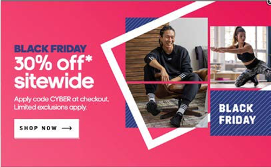

# Promotions

Da der Großteil der Bevölkerung zum Online-Einkauf übergeht, müssen die Einzelhändler bei der Bereitstellung des besten Kundenerlebnisses einen Schritt voraus sein. Einzelhändler müssen darüber nachdenken, wie sie ihre Produkte am besten auf den Markt bringen können. Hier kommt die Marketingstrategie zum Tragen. Im Allgemeinen besteht die Marketingstrategie aus sechs Ps:

- Produkt
- Preis
- Promotion
- Ort
- Personen
- Prozesse

Jede der sechs Ps ist gleichermaßen wichtig, aber für die Vermarktung von Produkten müssen Einzelhändler Promotions als Taktik verwenden, um den Traffic auf der Site zu steigern und höhere Konversionsraten zu erzielen. Promotions helfen, Produkte und Dienstleistungen zu vermarkten, die von der Marke angeboten werden. Es gibt verschiedene Werbestufen, wie z. B. Versand, Produkt und Bestellung.

## Arten von Promotions

Jede dieser Promotionsstufen verfügt über verschiedene Promotions, darunter:

- Giveaways
- Flash-Verkäufe
- Kostenlose Beispiele
- Gesamtkauf X
- Kauf 1 erhalten 1 gratis
- Bonusprodukte
- Mehrkauf
- Cross-Selling
- Bundles
- Produktgruppen
- Coupons
- Werbe-Mails
- Kostenloser Versand
- Rabatt auf den Versand

Die Einzelhändler stehen einem intensiven Wettbewerb gegenüber. Um einen Wettbewerbsvorteil zu erzielen, müssen Einzelhändler Marketingstrategien wie Promotions anwenden. Jeder Einzelhändler muss analysieren, welche Promotions für ihn am besten geeignet sind.
