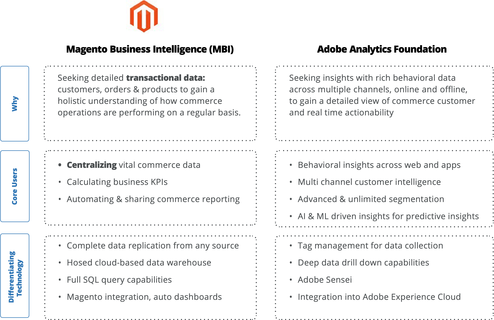

# Berichte und Dashboards

Der E-Commerce eignet sich sowohl für Berichte als auch für Dashboards. Im E-Commerce ist alles online, sodass Einzelhändler die Möglichkeiten verschiedener Tools nutzen können, um Daten zu sammeln und zu analysieren und so ihre Geschäftsprozesse, Teams, Produktangebote und mehr zu verbessern.

Jedes Unternehmen hat unterschiedliche Berichterstattungsanforderungen. Wenn Sie beispielsweise eine bestimmte Promotion verfolgen möchten, können Sie ein bestimmtes Dashboard erstellen, um den Fortschritt der Promotion zu sehen, z. B. wie viele Personen die Promotion verwendet haben, welche Produkte am besten verkauft wurden usw. Sie können auch ein Dashboard verwenden, um tägliche Aktivitäten auf der Site, Traffic, Konversionsrate, Best-Selling-Produkt, am schlechtesten verkauftes Produkt und Rückgaben zu verfolgen.

## Funktionen

Einige andere Funktionen von Berichten und Dashboards:

- Verfolgt den ROI, der Einzelhändlern dabei hilft, Entscheidungen zu treffen und den Fortschritt zu überwachen

- Verfolgen Sie den Vertrieb, um zu verstehen, was am meisten Umsatz generiert.

- Traffic auf der Site in Echtzeit verfolgen und die Informationen visualisieren

- Messen Sie den Erfolg von Site-Funktionen und verbessern Sie sie, um den Kundendienst zu verbessern.

- Überwachung der KPIs jedes Teams

In einem E-Commerce-Geschäft gibt es so viel, dass es schwierig sein kann, den Überblick zu behalten. Hier können Berichte und Dashboards hilfreich sein. Sie konsolidieren alle Daten an einem Ort, um allen einen Überblick über das Unternehmen zu geben. Sie helfen den Einzelhändlern auch, neue Ziele festzulegen, neue Chancen zu erkennen und einen Wettbewerbsvorteil zu erzielen.

## B2B-Optionen

Zu den vier wichtigsten Berichten und Dashboards, die B2B-Unternehmen verwenden, gehören:

- **Firmenprofil** - B2B-Unternehmen müssen ihre Profile ihrer Kundenunternehmen verfolgen, um ihren Kaufverlauf, ihre Zahlungsdetails und den verwendeten Kanal zu verstehen. Dieses Dashboard kann dabei helfen, potenzielle Risiken und Probleme zu identifizieren.

- **Katalog**: Ein Katalogbericht und Dashboard hilft B2B-Unternehmen dabei, die Leistung jedes Produkts im Katalog, in den Promotions und in den Lagerbeständen anzuzeigen, was dazu beiträgt, herauszufinden, welche Promotion am besten funktioniert und welche Produkte gefragt werden. Dies hilft den Unternehmen, sich im Inventar zu behaupten und einen Wettbewerbsvorteil zu erzielen.

- **Anführungszeichen**: Das B2B-Geschäftsmodell arbeitet nach Anführungszeichen und Preisgestaltung. B2B-Unternehmen müssen einen Prozess durchlaufen, bei dem sie ein Angebot analysieren, damit sie es genehmigen oder verhandeln können. Ein Kursbericht und Dashboard helfen Ihnen, Ihre Kurskonversionsrate zu verbessern, indem Sie die Erfolgsrate, die Wettbewerbsraten, die Leistung und die Kundenbindung insgesamt verfolgen.

- **Verkauf**: Auch wenn B2B-Unternehmen online arbeiten können, ist ein Vertriebsmitarbeiter immer noch erforderlich, um die Dinge in Bewegung zu setzen, indem er Angebote identifiziert, die verhandelt werden müssen, Angebote verfolgt, die kurz vor dem Ablauf stehen, Verträge verfolgt, die für die Verlängerung vorgesehen sind, die Leistung des Teams verfolgt und zur Optimierung der laufenden Geschäftsaktivitäten beiträgt.

## Gemeinsam besser

Merchants, die nach einer Möglichkeit suchen, Verhaltensdaten mit Transaktionsdaten aus E-Commerce zu korrelieren, können Adobe Commerce Reporting und Adobe Analytics verwenden, um ein genaueres Verständnis darüber zu erhalten, wie sich Marketing-Aktivitäten auf die E-Commerce-Kernmetriken auswirken.

