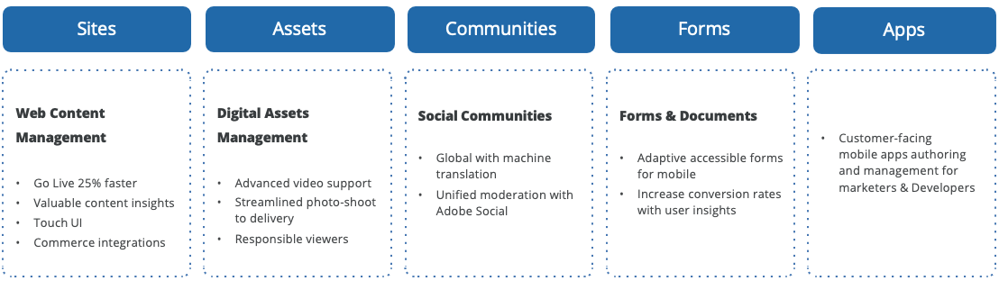

# Inhaltsstrategie

Erfolgreiche E-Commerce-Marketingpläne stammen nicht aus Brainstorming-Sitzungen, Hunches oder geerbten Gewohnheiten. Unternehmen müssen quantitative und qualitative Daten sammeln (einige aus Quellen, die sie bereits besitzen, andere aus erstellten oder gekauften Quellen), um Inhalte zu planen, die Kunden finden und schätzen. Mit Adobe Experience Manager können Sie in der AEM-Authoring-Umgebung verwaltete Inhalte nutzen, um hochgradig ansprechende Kampagnen zu erstellen. Sie können einfach Marketing-Assets veröffentlichen, die Sie in Adobe Experience Manager entwerfen, verwalten und über verschiedene Kanäle hinweg validieren.

## Framework für Inhaltsstrategie

### Vorproduktion

Diese Phase umfasst den Einstieg in Ihren Benutzer, das Verständnis seiner Bedürfnisse, die Entwicklung von Personas sowie eine Überprüfung und Erfassung vorhandener Assets und Positionen. Das Content Management, die Ressourcenplanung und die Planung sind darauf ausgelegt, geeignete Strukturen, Organisation und Ressourcen zu schaffen und zu pflegen.

### Produktion und Ausführung

In dieser Phase wird Inhalt erstellt. Dazu gehören die Erstellung, Bearbeitung, Bearbeitung, Asset-Produktion und Inhaltsoptimierung - Barrierefreiheit, SEO, Tagging und Klassifizierung, Insourcing von Outsourcing in der Produktion, Rolle von Drittanbieter-Tools und -Technologie und Wiederverwendung von Inhalten.

### Postproduktion

Diese Phase umfasst die Überprüfung und Auswertung von Inhalten, Anpassung und Optimierung. Dazu gehören die Auswertung, Optimierung, Tests, Lernen und das Benutzererlebnis.

Schließlich erhalten Sie mit Test, Targeting und Strategie die Möglichkeit, den richtigen Inhalt zu identifizieren, der einem bestimmten Segment von Besuchern mit unterschiedlichen Präferenzen oder Bedürfnissen bereitgestellt werden soll, und anschließend zielgerichtete Erlebnisse für jedes Segment zu erstellen.

## Adobe Experience Manager

Unabhängig davon, ob Sie grundlegende Webinhalte oder Inhalte verwalten, die in sozialen Netzwerken veröffentlicht werden sollen, hilft Adobe Experience Manager bei der Bereitstellung von Kreativ-Assets und anderen Inhalten über alle Kanäle hinweg, auf denen ein Kunde interagieren könnte. Mit AEM können Sie in der AEM-Authoring-Umgebung verwaltete Inhalte nutzen, um hochinteressante Kampagnen zu erstellen. Sie können einfach Marketing-Assets veröffentlichen, die Sie in Adobe Experience Manager entwerfen, verwalten und über verschiedene Kanäle und Plattformen hinweg validieren.

Adobe Experience Manager kombiniert eine Reihe von Funktionen auf Infrastruktur- und Anwendungsebene in einem einzigen integrierten Paket. Die Angebotsinhalte:

- **Sites**—Erstellen und liefern Sie schnell relevante Websites und mobile Apps und aktualisieren Sie den Inhalt jederzeit, ohne die IT-Abteilung zu belasten.
- **Assets**- Einfaches Verwalten von Bildern, Videos und anderen Assets in allen digitalen Kanälen, um personalisierte Kundenerlebnisse bereitzustellen.
- **Communities**—Erstellen Sie blühende Communities und interaktive Unterhaltungen in all Ihren sozialen Eigenschaften, damit Sie neue Lernstufen und Kundenloyalität inspirieren können.
- **Forms**—Integrieren Sie Formulare auf Unternehmensebene in Ihre Websites und mobilen Erlebnisse und vereinfachen Sie die Erstellung von Formularen und den Abschluss von Transaktionen.
- **Apps**- Erstellen und liefern Sie mobile Apps mit einer Lösung, die die Lücke zwischen Marketingexperten und IT schließt, damit Marketing-Experten Inhalte einfach aktualisieren können (auch nach dem Start).

