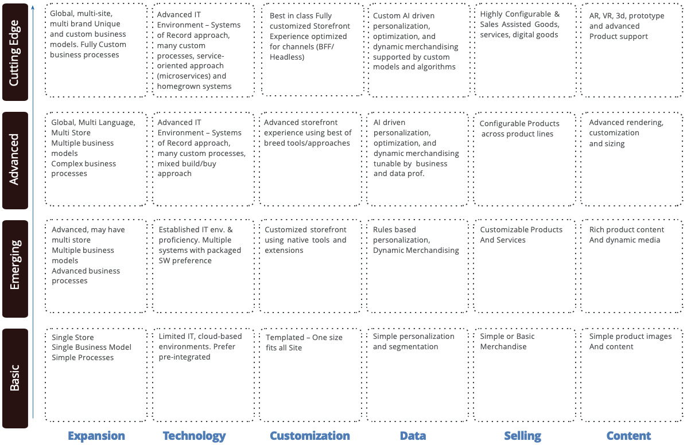

# Laufzeitmodell

Ein Laufzeitmodell ist eine Formel, mit der Unternehmen bestimmen können, auf welcher Stufe sie sich in einem bestimmten Funktionsbereich oder einer bestimmten Strategie befinden. Ein nützliches und präzises Reifungsmodell hilft Unternehmen dabei, mithilfe ihrer E-Commerce-Roadmap zu verstehen, wie sie von einer Phase zur nächsten übergehen können.

Stellen Sie sich ein ausgereiftes Modell als einen robusten Bericht vor, der Ihnen dabei hilft, einen Bereich der Plattform zu verbessern, und als Fahrplan für Fortschritte dient.

Das folgende Diagramm fasst die verschiedenen Bedürfnisse über die Laufzeitstufen hinweg zusammen:

## Laufzeitniveau

Die folgende Tabelle fasst die unterschiedlichen Laufzeitstufen zusammen:

| Variable | B2B |
-----------|----------|
| Crawl | Die Einstiegsstufe für die E-Commerce-Reife umfasst die einfachsten Aufgaben, die von einem einzelnen Marketing-Experten ausgeführt werden können. Das Unternehmen führt in der Regel Fortschritte durch und baut auf den Grundlagen auf, um das Kundenerlebnis weiter zu verbessern. |
| Walk | Auf dieser Ebene beginnen Unternehmen, bisherige Kundendaten aus verschiedenen Quellen zu nutzen, was eine Zusammenarbeit mehrerer Abteilungen erfordert.  Organisationen auf dieser Ebene können das gesamte Potenzial von Kampagnen nutzen, die von Personen verwaltet werden, und über ausgereifte Best Practices, Prozesse und Entwicklungsstreams verfügen. |
| Ausführen | Höchste Reife ermöglicht Kampagnen auf verschiedenen Kanälen mit KI-Unterstützung und nutzt eine prädiktive Lagerverwaltung, um Abwanderungs- und Produktinformationsmanagement-Tools zur Anreicherung von Produkten zu verhindern. Sie wird am besten von Organisationen mit einer weiterentwickelten Datenkultur, Entwicklungskompetenz und Prozessen im Haus- und Offshore-Bereich erreicht. |

{style="table-layout:auto"}

### Crawl

Dies ist die Anfangsphase für jedes Unternehmen, der Ausgangspunkt. In dieser Phase müssen Sie sich auf die Bereitstellung eines präsentierten, leicht zu navigierenden, benutzerfreundlichen und einfachen Checkout-Erlebnisses auf einer E-Commerce-Plattform konzentrieren, die mit grundlegenden Funktionen ausgestattet ist. Sie müssen feststellen, ob Ihr Unternehmen über ein bestehendes Preissystem verfügt oder ob ein Preissystem erstellt werden muss.

Wenn Sie ein Preissystem erstellen müssen, müssen Sie die Payment Gateway Provider auf dem Markt kennen. Insbesondere müssen Sie anhand von Branchenerfahrung, Kosten, Kundendienst und Sicherheit bestimmen, welcher Anbieter Ihren Anforderungen am besten entspricht. Zahlungskanäle verarbeiten Transaktionszahlungen unabhängig von der Website. Wenn Teams sich keine Gedanken über die Speicherung von Zahlungsdetails auf der Website machen müssen, können sie sich auf die Funktionalität der Website konzentrieren.

Nachdem Sie sich für einen Payment Gateway Provider entschieden haben, müssen Sie die erforderlichen Zahlungsmethoden analysieren. Konzentrieren Sie sich auf die Methoden, die bei den Kunden beliebt sind. Da es sich bei einigen Unternehmen um eine neue E-Commerce-Plattform handelt, bieten sie begrenzte Zahlungsmethoden an, da jede Option eine erhebliche Vorausinvestition erfordert. Unternehmen in der Crawl-Phase bieten mindestens Kreditkarten- und Debitkartenzahlungsoptionen an. Sie verteilen sich zu Optionen wie PayPal und Afterpay, nachdem sie feststellen, dass auf der Site Traffic vorhanden ist und der Traffic zu höheren Konversionsraten führt.

Insgesamt sollten Unternehmen in der Crawl-Phase ein gut integriertes E-Commerce-System entwickeln, um es in Gang zu bringen und zu starten, bevor sie sich erweitern und zusätzliche Funktionen hinzufügen.

### Walk

In der Schrittphase beginnen Unternehmen, die Site auf Grundlage bestehender Kunden, Einblicke und Erfahrungen zu entwickeln, die sie mit einer vorhandenen E-Commerce-Site haben. In dieser Phase können Unternehmen mit der Implementierung komplexerer Funktionen beginnen, um ihren Kunden neue Angebote bereitzustellen und so das Kundenerlebnis und die Kundentreue zu steigern.

Unternehmen in der Laufzeitphase verfügen über Funktionen wie Blogs, Videos, Funktionsbereiche, Produktvarianten und Produktkäufe, die auf den Webseiten leicht zugänglich sind. In der Anfangsphase verstehen Unternehmen bereits den Kauftrend ihrer Kunden durch Daten und Feedback, was ihnen ermöglicht, ihre Prozesse und Preise zu verbessern. Unternehmen in der Fußgängerphase befinden sich an einem Ort, an dem sie mehrere Zahlungsmethoden wie Kredit- und Debitkarten, mehr als eine Option für elektronische Geldbörsen und/oder Geschenkkarten implementieren können. Die Bereitstellung mehrerer Zahlungsoptionen gibt den Kunden die Möglichkeit, die Wahl zu treffen, mit der sie sich wohlfühlen. Sie haben auch die Möglichkeit, sich für einen größeren Payment Gateway Provider zu entscheiden, der mehr als eine Zahlungsmethode verwalten kann.

Insgesamt haben Unternehmen in der Laufbahnphase den Vorteil, ihre Website- und Zahlungsmethoden auf der Grundlage von Kundendaten zu verbessern.

### Ausführen

Unternehmen in der Ausführungsphase verfügen über ein vollständiges Verständnis ihrer Kunden und ihres Kaufverhaltens, was ihnen hilft, Ziele zu setzen und ihr Geschäft zu erweitern. In der Anfangsphase können Unternehmen ein Ziel setzen, um komplexe Anforderungen, Marketing, mehrere globale Zahlungsmethoden oder globale Versandverfahren zu erreichen.

Mit einem umfassenden Verständnis der Kunden, Märkte und internen und externen Teams können Unternehmen in der Ausführungsphase benutzerdefinierte Funktionen implementieren, die ihre Site voneinander abgrenzen. Beispielsweise können Sie mehrere Zahlungsmethoden anbieten, Abonnementdienste anbieten oder kostenlose Versandrabatte anbieten.

Unternehmen können komplexe Funktionen einfach implementieren, da sie bereits Marktanteile gewonnen haben und zuversichtlich sind, dass Investitionen in diese Funktionen ihnen helfen, ihren Kundenservice zu verbessern und ihre Kunden zu halten zurück.

## Elemente eines Laufzeitmodells

In diesem Abschnitt werden die Bereiche eines E-Commerce-Laufzeitmodells beschrieben, die Unternehmen im Rahmen ihrer Gesamtstrategie berücksichtigen würden.

### Aktion

Die vorhandenen Marketing-Aktivitäten:

- Web-Ebene der ersten Sitzung
- Personalisierte Empfehlungen auf der Website
- E-Mail zum Warenkorb abgebrochen

### Daten

Datenerfassung und -verwaltung:

Welche Daten verfügbar sind und wie zusammenhängend sie sind. Welche Interaktionen und Attribute werden verfolgt? Wie werden die Daten aus externen Quellen angereichert?

- Datenoptimierung und -anreicherung
- Seitenansichtsverfolgung
- Vollständige Warenkorbinteraktionen
- Aktualisierte Produktrückgaben
- Erweiterte Verfolgung von Sitzung und Kundenverhalten

### Insights

Analysiert, Trends und datengesteuerte Warnhinweise:

- Kampagnenbewertung basierend auf dem Produktgewinn
- Neuigkeit, Häufigkeit, monetäre
- KI-gesteuertes Lead-Scoring
- Erweiterte Berichterstellung und Dashboards

### Methode

Verarbeitet das Geschäft wie folgt:

Probieren Sie nur Ihr Glück mit Ad-hoc-Kampagnen aus oder basieren diese auf dem Kundenverhalten, historischen Käufen und Prognosen?

- Trigger-basierte Kampagnen
- Auf Prognosen basierende Kampagnen, d. h. potenzielle Abwanderung
- Kampagnen basierend auf dem bisherigen Kundenverhalten
- Verwaltung von Produktinformationen

### Governance

Ressourcen, Teamgröße und Prozesse:

Haben Sie die Optimierung und den Wissensaustausch kontinuierlich unterstützt?

- Das Marketing-Team übernimmt Kampagnen mit Unterstützung des E-Commerce-Teams
- Häufige Anwendungsfälle sind dokumentiert
- Unternehmensweite Programme zur Ideenerstellung

### Datenschutz

Sicherheits- und Datenschutzverwaltung:

Nutzen Sie das Kundenerlebnis als Gegenleistung für die personenbezogenen Daten, die sie Ihnen bereitstellen? Streben Sie nur nach den Grundlagen oder konkurrieren Sie in Sachen Privatsphäre und Sicherheit?

- Datenschutzrichtlinien online
- Zugeordnete Datenflussprozesse
- Kunden können ihre verfolgten Daten bearbeiten und erweitern
- Hosting-Optimierungen
