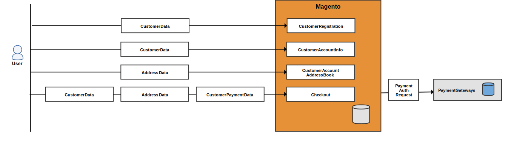

# Referenz zu personenbezogenen Daten des Kunden (Version 2.x)

>[!NOTE]
>
>Dies ist eines von mehreren Themen, die Adobe Commerce-Händler und -Entwickler bei der Vorbereitung auf die Einhaltung von Datenschutzbestimmungen unterstützen. Wenden Sie sich an Ihren Rechtsbeistand, um festzustellen, ob und wie Ihr Unternehmen rechtliche Verpflichtungen einhalten sollte.

Verwenden Sie die folgenden Datenflussdiagramme und Datenbankentitätszuordnungen als Referenz bei der Entwicklung von Compliance-Programmen für Datenschutzbestimmungen wie:

- [DSGVO](gdpr.md)
- [CCPA](ccpa.md)

## Datenflussdiagramme

Die Datenflussdiagramme zeigen die Datentypen, die Kunden und Administratoren in der Storefront und in Admin eingeben und abrufen können.

### Frontend-Dateneingabepunkte

Ein Benutzer kann Kunden-, Adressdaten- und Zahlungsinformationen eingeben, wenn er sich für ein Konto, während eines Checkout und ähnlichen Ereignissen registriert.

### Frontend-Datenzugriffspunkte

Adobe Commerce lädt Kundeninformationen, wenn sich der Kunde anmeldet und mehrere verschiedene Seiten anzeigt oder auscheckt.

### Dateneingabepunkte im Backend

Ein Händler kann Kundeninformationen, Adressdaten und Zahlungsdaten bei der Erstellung eines Kunden oder einer Bestellung durch den Administrator eingeben.

### Backend-Datenzugriffspunkte

Adobe Commerce lädt Kundeninformationen, wenn ein Händler mehrere Raster anzeigt, auf ein Raster klickt, um detaillierte Informationen anzuzeigen, und verschiedene andere Aufgaben ausführt.

## Datenbankentitäten

Adobe Commerce speichert in erster Linie kundenspezifische Informationen in Kunden-, Adressen-, Bestell-, Angebotstabellen und Zahlentabellen. Andere Tabellen enthalten Verweise auf die Kunden-ID.

### Kundendaten

Adobe Commerce kann so konfiguriert werden, dass die folgenden Kundenattribute gespeichert werden:

- Geburtsdatum
- E-Mail
- Vorname
- Geschlecht
- Nachname
- Middle Name/Initial
- Namenpräfix
- Name Suffix

>[!NOTE]
>
>Achten Sie in Übereinstimmung mit den aktuellen Best Practices für Sicherheit und Datenschutz darauf, dass Sie alle potenziellen rechtlichen und sicherheitstechnischen Risiken im Zusammenhang mit der Speicherung des vollständigen Geburtsdatums (Monat, Tag, Jahr) des Kunden sowie anderer persönlicher Identifikatoren wie vollständiger Name kennen, bevor Sie diese Daten erfassen oder verarbeiten.

#### `customer_entity` und &quot;customer_entity&quot;-Verweise

Die folgenden Spalten in der `customer_entity` -Tabelle enthält Kundeninformationen:

| Spalte | Datentyp |
| ------------ | ------------ |
| `email` | varchar(255) |
| `prefix` | varchar(40) |
| `firstname` | varchar(255) |
| `middlename` | varchar(255) |
| `lastname` | varchar(255) |
| `suffix` | varchar(40) |
| `dob` | date |
| `gender` | smallint(5) |

Diese Tabellen verweisen auf `customer_entity` und kann benutzerdefinierte Kundenattribute enthalten:

| Verzeichnis | Spalte | Datentyp |
| -------------------------- | ------- | ------------- |
| `customer_entity_datetime` | `value` | datetime |
| `customer_entity_decimal` | `value` | decimal(12,4) |
| `customer_entity_int` | `value` | int(11) |
| `customer_entity_text` | `value` | text |
| `customer_entity_varchar` | `value` | varchar(255) |

#### `customer_grid_flat` table

Die folgenden Spalten in der `customer_grid_flat` -Tabelle enthält Kundeninformationen:

| Spalte | Datentyp |
| -------------------- | ------------ |
| `name` | text |
| `email` | varchar(255) |
| `dob` | date |
| `gender` | int(11) |
| `shipping_full` | text |
| `billing_full` | text |
| `billing_firstname` | varchar(255) |
| `billing_lastname` | varchar(255) |
| `billing_telephone` | varchar(255) |
| `billing_postcode` | varchar(255) |
| `billing_country_id` | varchar(255) |
| `billing_region` | varchar(255) |
| `billing_city` | varchar(255) |
| `billing_fax` | varchar(255) |
| `billing_vat_id` | varchar(255) |
| `billing_company` | varchar(255) |

### Adressdaten

Adobe Commerce speichert die folgenden Kundenattribute:

- Ort
- Firma
- Land
- Fax
- Vorname
- Nachname
- Middle Name/Initial
- Namenpräfix
- Name Suffix
- Telefonnummer
- Bundesland/Provinz
- Bundesland/Provinz-ID
- Straße
- MwSt. Nummer
- Postleitzahl

#### `customer_address_entity` und `customer_address_entity` Verweise

Die folgenden Spalten in der `customer_address_entity` -Tabelle enthält Kundeninformationen:

| Spalte | Datentyp |
| ------------ | ------------ |
| `city` | varchar(255) |
| `company` | varchar(255) |
| `country_id` | varchar(255) |
| `fax` | varchar(255) |
| `firstname` | varchar(255) |
| `lastname` | varchar(255) |
| `middlename` | varchar(255) |
| `postcode` | varchar(255) |
| `region` | varchar(255) |
| `region_id` | int(10) |
| `street` | text |
| `suffix` | varchar(40) |
| `telephone` | varchar(255) |
| `vat_id` | varchar(255) |

Diese Tabellen verweisen auf `customer_address_entity` und kann benutzerdefinierte Kundenattribute enthalten:

| Verzeichnis | Spalte | Datentyp |
| ---------------------------------- | ------- | ------------- |
| `customer_address_entity_datetime` | `value` | datetime |
| `customer_address_entity_decimal` | `value` | decimal(12,4) |
| `customer_address_entity_int` | `value` | int(11) |
| `customer_address_entity_text` | `value` | text |
| `customer_address_entity_varchar` | `value` | varchar(255) |

### Bestelldaten

Die `sales_order` und zugehörige Tabellen enthalten den Kundennamen, die Abrechnungs- und Versandadressen sowie die zugehörigen Daten.

#### `sales_order` table

Die folgenden Spalten in der `sales_order` -Tabelle enthält Kundeninformationen:

| Spalte | Datentyp |
| --------------------- | ------------ |
| `customer_dob` | datetime |
| `customer_email` | varchar(128) |
| `customer_firstname` | varchar(128) |
| `customer_gender` | int(11) |
| `customer_group_id` | int(11) |
| `customer_id` | int(10) |
| `customer_lastname` | varchar(128) |
| `customer_middlename` | varchar(128) |
| `customer_prefix` | varchar(32) |
| `customer_suffix` | varchar(32) |
| `customer_taxvat` | varchar(32) |
| `quote_address_id` | int(11) |
| `remote_ip` | varchar(32) |
| `x_forwarded_for` | varchar(32) |

#### `sales_order_address` table

Die `sales_order_address` -Tabelle enthält die Adresse des Kunden.

| Spalte | Datentyp |
| --------------------- | ------------ |
| `customer_address_id` | int(11) |
| `quote_address_id` | int(11) |
| `region_id` | int(11) |
| `customer_id` | int(11) |
| `fax` | varchar(255) |
| `region` | varchar(255) |
| `postcode` | varchar(255) |
| `lastname` | varchar(255) |
| `street` | varchar(255) |
| `city` | varchar(255) |
| `email` | varchar(255) |
| `telephone` | varchar(255) |
| `country_id` | varchar(2) |
| `firstname` | varchar(255) |
| `suffix` | varchar(255) |
| `company` | varchar(255) |

#### `sales_order_grid` table

Die folgenden Spalten in der `sales_order_grid` -Tabelle enthält Kundeninformationen:

| Spalte | Datentyp |
| ---------------------- | ------------ |
| `customer_id` | int(10) |
| `shipping_name` | varchar(255) |
| `billing_name` | varchar(255) |
| `billing_address` | varchar(255) |
| `shipping_address` | varchar(255) |
| `shipping_information` | varchar(255) |
| `customer_email` | varchar(255) |
| `customer_name` | varchar(255) |

### Anführungsdaten

Angebote enthalten den Namen, die E-Mail-Adresse, die Adresse und die zugehörigen Informationen eines Kunden.

#### `quote` table

Die folgenden Spalten in der `quote` -Tabelle enthält Kundeninformationen:

| Spalte | Datentyp |
| --------------------- | ------------ |
| `customer_id` | int(10) |
| `customer_email` | varchar(255) |
| `customer_prefix` | varchar(40) |
| `customer_firstname` | varchar(255) |
| `customer_middlename` | varchar(40) |
| `customer_lastname` | varchar(255) |
| `customer_dob` | datetime |
| `remote_ip` | varchar(32) |
| `customer_taxvat` | varchar(255) |
| `customer_gender` | varchar(255) |

#### `quote_address` table

Die folgenden Spalten in der `quote_address` -Tabelle enthält Kundeninformationen:

| Spalte | Datentyp |
| ------------- | ------------ |
| `customer_id` | int(10) |
| `email` | varchar(255) |
| `prefix` | varchar(40) |
| `firstname` | varchar(255) |
| `middlename` | varchar(40) |
| `lastname` | varchar(255) |
| `suffix` | varchar(40) |
| `company` | varchar(255) |
| `street` | varchar(255) |
| `city` | varchar(255) |
| `region` | varchar(255) |
| `region_id` | int(10) |
| `postcode` | varchar(20) |
| `country_id` | varchar(30) |
| `telephone` | varchar(255) |
| `fax` | varchar(255) |

### Zahlungsdaten

Die `sales_order_payment` enthält Kreditkarteninformationen und andere Transaktionsinformationen.

| Spalte | Datentyp |
| ------------------------ | ------------ |
| `cc_exp_month` | varchar(12) |
| `echeck_bank_name` | varchar(128) |
| `cc_last_4` | varchar(100) |
| `cc_owner` | varchar(128) |
| `po_number` | varchar(32) |
| `cc_exp_year` | varchar(4) |
| `echeck_routing_number` | varchar(32) |
| `cc_debug_response_body` | varchar(32) |
| `echeck_account_name` | varchar(32) |
| `cc_number_enc` | varchar(128) |
| `additional_information` | text |

### Einladungsdaten

Adobe Commerce kann so konfiguriert werden, dass Kunden Einladungen an private Verkaufsstellen und Ereignisse senden können.

#### `magento_invitation` table

Die `magento_invitation` -Tabelle enthält die Kunden-ID, E-Mail und Verweiskennung.

| Spalte | Datentyp |
| ------------- | ------------ |
| `customer_id` | int(10) |
| `email` | varchar(255) |
| `referral_id` | int(10) |

#### `magento_invitation_track` table

Die `magento_invitation_track` enthält auch Kundeninformationen.

| Spalte | Datentyp |
| ------------- | --------- |
| `inviter_id` | int(10) |
| `referral_id` | int(10) |

### Verschiedene Tabellen, die auf Kunden verweisen

Die folgenden Tabellen enthalten eine `customer_id` column:

- `catalog_compare_item`
- `catalog_product_frontend_action`
- `downloadable_link_purchased`
- `magento_customerbalance`
- `magento_customersegment_customer`
- `magento_reward`
- `magento_rma`
- `oauth_token`
- `paypal_billing_agreement`
- `persistent_session`
- `product_alert_price`
- `product_stock_alert`
- `report_compared_product_index`
- `report_viewed_product_index`
- `review_detail`
- `salesrule_coupon_usage`
- `salesrule_customer`
- `wishlist`
