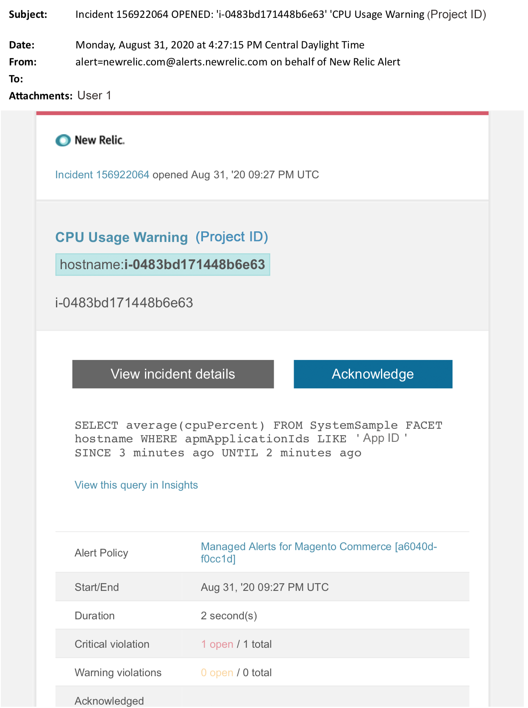

# Verwaltete Warnhinweise für Adobe Commerce: Warnhinweis für CPU

Dieser Artikel enthält Schritte zur Fehlerbehebung, wenn Sie in [!DNL New Relic] einen CPU-Warnhinweis für Adobe Commerce erhalten. Sofortiges Handeln ist erforderlich, um das Problem zu beheben. Je nach ausgewähltem Benachrichtigungskanal für Warnhinweise sieht der Warnhinweis etwa wie folgt aus.

{width="500"}

## Betroffene Produkte und Versionen

Adobe Commerce auf Cloud-Infrastruktur Pro Planarchitektur

## Problem

Sie erhalten einen Warnhinweis in [!DNL New Relic], wenn Sie sich für [Verwaltete Warnhinweise für Adobe Commerce](managed-alerts-for-magento-commerce.md) angemeldet haben und einer oder mehrere der Warnhinweisschwellen überschritten wurden. Diese Warnhinweise wurden von Adobe entwickelt, um Kundinnen und Kunden mithilfe von Einblicken aus Support und Engineering einen Standardsatz zu bieten.

<u> **DO!** </u>

* Bricht jede geplante Bereitstellung ab, bis dieser Warnhinweis gelöscht wird.
* Setzen Sie Ihre Site sofort in den Wartungsmodus, wenn Ihre Site vollständig nicht reagiert. Anweisungen hierzu finden Sie [Aktivieren oder Deaktivieren des &#x200B;](/help/installation/tutorials/maintenance-mode.md)) im Commerce-Installationshandbuch. Fügen Sie Ihre IP-Adresse der Liste der von der Steuer befreiten IP-Adressen hinzu, um sicherzustellen, dass Sie weiterhin zur Fehlerbehebung auf Ihre Website zugreifen können. Anweisungen hierzu finden Sie unter [Verwalten der Liste von ausgenommenen IP](/help/installation/tutorials/maintenance-mode.md#maintain-the-list-of-exempt-ip-addresses)Adressen) im Commerce-Installationshandbuch.

<u>**Tu&#39;s nicht!**</u>

* Starten Sie zusätzliche Marketing-Kampagnen, die zusätzliche Seitenansichten auf Ihre Site bringen können.
* Führen Sie Indexer oder zusätzliche Crons aus, was zu zusätzlichen Belastungen für CPU oder die Festplatte führen kann.
* Führen Sie alle wichtigen administrativen Aufgaben aus (z. B. Commerce-Admin, Datenimporte/-exporte).
* Leeren Sie den Cache.

## Lösung

Führen Sie diese Schritte aus, um die Ursache zu identifizieren und zu beheben.

1. Verwenden Sie [[!DNL New Relic]  Seite „Transaktion“ von APM](https://docs.newrelic.com/docs/apm/applications-menu/monitoring/transactions-page-find-specific-performance-problems) um Transaktionen mit Leistungsproblemen zu identifizieren:
   * Sortieren Sie Transaktionen nach aufsteigenden [!DNL Apdex]. [[!DNL Apdex]](https://docs.newrelic.com/docs/apm/new-relic-apm/apdex/apdex-measure-user-satisfaction) bezieht sich auf die Benutzerzufriedenheit auf die Antwortzeit Ihrer Web-Anwendungen und -Services. [Ein niedriger  [!DNL Apdex] Score](https://experienceleague.adobe.com/de/docs/commerce-knowledge-base/kb/troubleshooting/miscellaneous/troubleshoot-performance-using-new-relic-on-magento-commerce) kann auf einen Engpass hinweisen (eine Transaktion mit einer höheren Antwortzeit). Normalerweise ist es die Datenbank, [!DNL Redis] oder PHP. Anweisungen hierzu finden Sie unter [!DNL New Relic] [Transaktionen mit höchster  [!DNL Apdex]  anzeigen](https://docs.newrelic.com/docs/apm/new-relic-apm/apdex/apdex-measure-user-satisfaction/#apdex-dissat).
   * Sortieren Sie Transaktionen nach dem höchsten Durchsatz, der langsamsten durchschnittlichen Reaktionszeit, dem zeitaufwendigsten Wert und anderen Schwellenwerten. Anweisungen hierzu finden Sie unter [[!DNL New Relic] Suchen spezifischer Leistungsprobleme](https://docs.newrelic.com/docs/apm/applications-menu/monitoring/transactions-page-find-specific-performance-problems).
1. Wenn Sie immer noch versuchen, die Quelle zu identifizieren, verwenden Sie [[!DNL New Relic] APMs Infrastrukturseite](https://docs.newrelic.com/docs/infrastructure/infrastructure-data/infrastructure-ui-pages/infra-hosts-ui-page/) um ressourcenintensive Services zu identifizieren. Anweisungen hierzu finden Sie auf [!DNL New Relic] Seite [Überwachung von Hosts der Infrastruktur: [!UICONTROL Processes tab]](https://docs.newrelic.com/docs/infrastructure/infrastructure-ui-pages/infra-hosts-ui-page/#processes).
1. Wenn Sie die Quelle identifizieren, SSH in die Umgebung, um weiter zu untersuchen. Anweisungen hierzu finden Sie unter [SSH in Ihre Umgebung](https://experienceleague.adobe.com/en/docs/commerce-on-cloud/user-guide/develop/secure-connections#ssh) im Handbuch zu Commerce in Cloud Manager.
1. Wenn Sie immer noch damit kämpfen, die Quelle zu identifizieren:
   * Überprüfen Sie die neuesten Trends, um Probleme mit aktuellen Code-Bereitstellungen oder Konfigurationsänderungen zu identifizieren (z. B. neue Kundengruppen und große Änderungen am Katalog). Es wird empfohlen, die letzten sieben Tage der Aktivität auf Korrelationen in Code-Bereitstellungen oder -Änderungen zu überprüfen.
   * Erwägen Sie, nach flachen Katalogen zu suchen und sie zu deaktivieren. Anweisungen hierzu finden Sie unter [Langsame Leistung, langsame und lang laufende Crons](https://experienceleague.adobe.com/en/docs/commerce-knowledge-base/kb/troubleshooting/miscellaneous/slow-performance-slow-and-long-running-crons) in der Commerce Support Knowledge Base.
   * Wenn Sie einen DDoS-Angriff vermuten, versuchen Sie, Bot-Traffic zu blockieren. Anweisungen hierzu finden Sie unter [Wie Sie bösartigen Traffic für Adobe Commerce auf Fastly-Ebene blockieren](https://experienceleague.adobe.com/de/docs/commerce-knowledge-base/kb/how-to/block-malicious-traffic-for-magento-commerce-on-fastly-level) in der Wissensdatenbank für den Commerce-Support.
1. Wenn das Problem vorübergehend zu sein scheint, führen Sie Schritte zur Risikominderung durch, z. B. eine Vergrößerung oder setzen Sie die Site in den Wartungsmodus. Anweisungen hierzu finden Sie unter [Anfordern temporärer Größenanpassung](https://experienceleague.adobe.com/de/docs/support-resources/adobe-support-tools-guide/adobe-commerce-support/how-to-request-temporary-adobe-commerce-on-cloud-infrastructure-upsize) in der Wissensdatenbank für den Commerce-Support und [Aktivieren oder Deaktivieren &#x200B;](/help/installation/tutorials/maintenance-mode.md) Wartungsmodus) im Commerce-Installationshandbuch. Wenn die Aktualisierung zu einem normalen Betrieb der Site führt, fordern Sie ggf. eine permanente Aktualisierung an (wenden Sie sich an Ihr Adobe-Accountteam) oder versuchen Sie, das Problem in Ihrem dedizierten Staging zu reproduzieren, indem Sie einen Lasttest durchführen und Abfragen optimieren oder Code verwenden, der den Druck auf die Services reduziert. Anweisungen hierzu finden Sie unter [- und Belastungstests &#x200B;](https://experienceleague.adobe.com/en/docs/commerce-on-cloud/user-guide/develop/test/staging-and-production#load-and-stress-testing) Handbuch zu Commerce in Cloud Manager.
