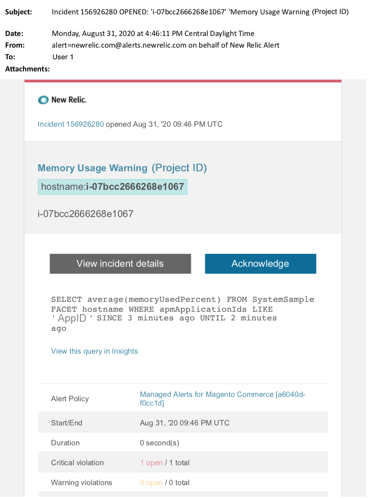

# Verwaltete Warnhinweise für Adobe Commerce: Speicherwarnung

Dieser Artikel enthält Schritte zur Fehlerbehebung für den Fall, dass Sie in [!DNL New Relic] eine Speicherwarnung für Adobe Commerce erhalten. Sofortiges Handeln ist erforderlich, um das Problem zu beheben. Je nach ausgewähltem Benachrichtigungskanal für Warnhinweise sieht der Warnhinweis etwa wie folgt aus.

{width="500"}

## Betroffene Produkte und Versionen

Adobe Commerce auf Cloud-Infrastruktur Pro Planarchitektur

## Problem

Sie erhalten einen Warnhinweis in [!DNL New Relic], wenn Sie sich für [Verwaltete Warnhinweise für Adobe Commerce](managed-alerts-for-magento-commerce.md) angemeldet haben und einer oder mehrere der Warnhinweisschwellen überschritten wurden. Diese Warnhinweise wurden von Adobe Commerce entwickelt, um Kundinnen und Kunden mithilfe von Einblicken aus Support und Engineering einen Standardsatz zu bieten.

<u>**DO!**</u>:

* Es wird empfohlen, alle geplanten Bereitstellungen abzubrechen, bis dieser Warnhinweis gelöscht wird.
* Setzen Sie Ihre Site sofort in den Wartungsmodus, wenn Ihre Site nicht mehr reagiert oder überhaupt nicht mehr reagiert. Anweisungen hierzu finden Sie [Aktivieren oder Deaktivieren des &#x200B;](/help/installation/tutorials/maintenance-mode.md)) im Commerce-Installationshandbuch. Fügen Sie Ihre IP-Adresse der Liste der von der Steuer befreiten IP-Adressen hinzu, um sicherzustellen, dass Sie weiterhin zur Fehlerbehebung auf Ihre Website zugreifen können. Anweisungen hierzu finden Sie unter [Verwalten der Liste von ausgenommenen IP](/help/installation/tutorials/maintenance-mode.md#maintain-the-list-of-exempt-ip-addresses)Adressen) im Commerce-Installationshandbuch.

<u>**Nicht tun!**</u>:

* Starten Sie zusätzliche Marketing-Kampagnen, die zusätzliche Seitenansichten auf Ihre Site bringen können.
* Führen Sie Indexer oder zusätzliche Crons aus, was zu zusätzlichen Belastungen für CPU oder die Festplatte führen kann.
* Führen Sie alle wichtigen administrativen Aufgaben durch (z. B. Admin, Datenimporte/-exporte).
* Leeren Sie den Cache.

## Lösung

Führen Sie diese Schritte aus, um die Ursache zu identifizieren und zu beheben.

1. Verwenden Sie [[!DNL New Relic]  Seite „Infrastruktur“ von APM](https://docs.newrelic.com/docs/infrastructure/infrastructure-ui-pages/infra-hosts-ui-page/), um die speicherintensivsten Prozesse zu identifizieren. Anweisungen hierzu finden Sie auf [[!DNL New Relic]  Seite [Überwachung der Hosts der Infrastruktur: Registerkarte [!UICONTROL Processes]]](https://docs.newrelic.com/docs/infrastructure/infrastructure-ui-pages/infra-hosts-ui-page/#processes). Wenn Services wie [!DNL Redis] oder MySQL die Hauptquelle für den Speicherverbrauch sind, versuchen Sie Folgendes:

   * Vergewissern Sie sich, dass Sie die neueste Version verwenden. Neuere Versionen können manchmal Speicherlecks beheben. Wenn Sie nicht die neueste Version verwenden, sollten Sie ein Upgrade in Erwägung ziehen. Anweisungen hierzu finden Sie unter [Service ändern](https://experienceleague.adobe.com/de/docs/commerce-on-cloud/user-guide/configure/service/services-yaml) im Handbuch zu Commerce in Cloud Manager.
   * Wenn Sie die Ursache für den erhöhten Speicherverbrauch immer noch nicht identifizieren können, überprüfen Sie auf MySQL-Probleme wie lange laufende Abfragen, nicht definierte Primäre Schlüssel und doppelte Indizes. Anweisungen hierzu finden Sie unter [Häufigste Datenbankprobleme in Adobe Commerce in Cloud](https://experienceleague.adobe.com/docs/commerce-operations/implementation-playbook/best-practices/maintenance/resolve-database-performance-issues.html?lang=de) im Playbook für die Commerce-Implementierung.
   * Wenn keine MySQL-Probleme vorliegen, überprüfen Sie diese auf PHP-Probleme. Überprüfen Sie die ausgeführten Prozesse, indem Sie `ps aufx` in der CLI/Terminal ausführen. In der Terminal-Ausgabe werden Cron-Aufträge und -Prozesse angezeigt, die derzeit ausgeführt werden. Prüft die Ausgabe auf die Ausführungszeit der Prozesse. Wenn es eine Cron mit einer langen Ausführungszeit gibt, hängt die Cron möglicherweise. Siehe [Langsame Leistung, langsame und lang laufende Crons](https://experienceleague.adobe.com/en/docs/commerce-knowledge-base/kb/troubleshooting/miscellaneous/slow-performance-slow-and-long-running-crons) und [Cron-Auftrag steckt im Status „Wird ausgeführt“ &#x200B;](https://experienceleague.adobe.com/en/docs/commerce-knowledge-base/kb/troubleshooting/miscellaneous/cron-job-is-stuck-in-running-status) in der Commerce Support Knowledge Base, um die Fehlerbehebungsschritte auszuführen.

1. Wenn Sie immer noch Schwierigkeiten haben, die Ursache des Problems zu identifizieren, verwenden Sie [[!DNL New Relic] APMs Transaktionsseite](https://docs.newrelic.com/docs/apm/applications-menu/monitoring/transactions-page-find-specific-performance-problems) um Transaktionen mit Leistungsproblemen zu identifizieren:

   * Sortieren Sie Transaktionen nach aufsteigenden [!DNL Apdex]. [[!DNL Apdex]](https://docs.newrelic.com/docs/apm/new-relic-apm/apdex/apdex-measure-user-satisfaction) bezieht sich auf die Benutzerzufriedenheit auf die Antwortzeit Ihrer Web-Anwendungen und -Services. Ein [niedriger [!DNL Apdex] Wert](managed-alerts-for-magento-commerce-apdex-warning-alert.md) kann auf einen Engpass hinweisen (eine Transaktion mit einer höheren Antwortzeit). Normalerweise ist es die Datenbank, [!DNL Redis] oder PHP. Anweisungen hierzu finden Sie unter New Relic [Transaktionen mit höchster  [!DNL Apdex]  anzeigen](https://docs.newrelic.com/docs/apm/new-relic-apm/apdex/view-your-apdex-score#apdex-dissat).
   * Sortieren Sie Transaktionen nach dem höchsten Durchsatz, der langsamsten durchschnittlichen Antwortzeit, dem zeitaufwendigsten Wert und anderen Schwellenwerten. Anweisungen hierzu finden Sie unter [[!DNL New Relic] Suchen spezifischer Leistungsprobleme](https://docs.newrelic.com/docs/apm/applications-menu/monitoring/transactions-page-find-specific-performance-problems). Wenn Sie immer noch Schwierigkeiten haben, das Problem zu identifizieren, verwenden Sie [[!DNL New Relic] APMs Infrastrukturseite](https://docs.newrelic.com/docs/infrastructure/infrastructure-ui-pages/infra-hosts-ui-page/).

1. Wenn Sie die Ursache für den erhöhten Speicherverbrauch nicht identifizieren können, überprüfen Sie die neuesten Trends, um Probleme mit aktuellen Code-Bereitstellungen oder Konfigurationsänderungen (z. B. neue Kundengruppen und große Änderungen am Katalog) zu identifizieren. Es wird empfohlen, die letzten sieben Tage der Aktivität auf Korrelationen in Code-Bereitstellungen oder -Änderungen zu überprüfen.

1. Wenn die oben genannten Methoden Ihnen nicht helfen, die Ursache und/oder Lösung innerhalb einer angemessenen Zeit zu finden, fordern Sie eine Vergrößerung an oder setzen Sie die Site in den Wartungsmodus, falls Sie dies noch nicht getan haben. Anweisungen hierzu finden Sie unter [Anfordern temporärer Größenanpassung](https://experienceleague.adobe.com/de/docs/support-resources/adobe-support-tools-guide/adobe-commerce-support/how-to-request-temporary-adobe-commerce-on-cloud-infrastructure-upsize) in der Wissensdatenbank für den Commerce-Support und [Aktivieren oder Deaktivieren &#x200B;](/help/installation/tutorials/maintenance-mode.md) Wartungsmodus) im Commerce-Installationshandbuch.

1. Wenn die Aktualisierung zu einem normalen Betrieb der Site führt, sollten Sie eine permanente Aktualisierung anfordern (wenden Sie sich an Ihr Adobe-Accountteam) oder versuchen Sie, das Problem in Ihrem dedizierten Staging zu reproduzieren, indem Sie einen Lasttest durchführen und Abfragen optimieren oder Code verwenden, der den Druck auf die Services reduziert. Siehe [Belastungs- und Belastungstests](https://experienceleague.adobe.com/de/docs/commerce-on-cloud/user-guide/develop/test/staging-and-production#load-and-stress-testing) im Handbuch zu Commerce in Cloud Manager.
