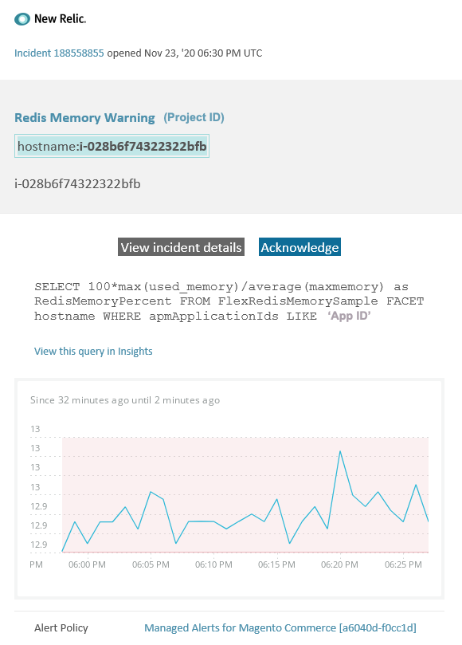

# Verwaltete Warnhinweise auf Adobe Commerce: Warnhinweis bezüglich [!DNL Redis] Arbeitsspeichers

Dieser Artikel enthält Schritte zur Fehlerbehebung für den Fall, dass Sie in [!DNL New Relic] einen [!DNL Redis] Warnhinweis für Adobe Commerce erhalten. Sofortiges Handeln ist erforderlich, um das Problem zu lösen. Der Warnhinweis sieht je nach ausgewähltem Benachrichtigungskanal wie folgt aus:



## Betroffene Produkte und Versionen

Alle Versionen von Adobe Commerce auf Cloud-Infrastruktur Pro planen Architektur.

## Problem

Sie erhalten einen Warnhinweis in [!DNL New Relic], wenn Sie sich für [Verwaltete Warnhinweise für Adobe Commerce](managed-alerts-for-magento-commerce.md) angemeldet haben und einer oder mehrere der Warnhinweisschwellen überschritten wurden. Diese Warnhinweise wurden von Adobe entwickelt, um Händlern mithilfe von Einblicken aus Support und Engineering einen Standardsatz von Warnhinweisen bereitzustellen.

**<u>Do!</u>**

* Es wird empfohlen, alle geplanten Bereitstellungen abzubrechen, bis dieser Warnhinweis gelöscht wird.
* Wenn Ihre Site nicht mehr reagiert oder nicht mehr reagiert, setzen Sie Ihre Site sofort in den Wartungsmodus. Anweisungen hierzu finden Sie [Aktivieren oder Deaktivieren des &#x200B;](/help/installation/tutorials/maintenance-mode.md)) im Commerce-Installationshandbuch.
* Fügen Sie Ihre IP-Adresse der Liste der von der Steuer befreiten IP-Adressen hinzu, um sicherzustellen, dass Sie weiterhin zur Fehlerbehebung auf Ihre Website zugreifen können. Anweisungen hierzu finden Sie unter [Verwalten der Liste von ausgenommenen IP](/help/installation/tutorials/maintenance-mode.md#maintain-the-list-of-exempt-ip-addresses)Adressen) im Commerce-Installationshandbuch.

**<u>Tu&#39;s nicht!</u>**

* Starten Sie zusätzliche Marketing-Kampagnen, die zusätzliche Seitenansichten auf Ihre Site bringen können.
* Führen Sie Indexer oder zusätzliche Crons aus, was zu zusätzlichen Belastungen für CPU oder die Festplatte führen kann.
* Führen Sie alle wichtigen administrativen Aufgaben durch (d. h. wichtige Aktionen im Commerce-Admin, z. B. Datenimporte/-exporte, Leeren von Medien, Speichern von Kategorien mit einer großen Anzahl zugewiesener Produkte und Massenaktualisierungen).
* Leeren Sie den Cache.

## Lösung

Führen Sie diese Schritte aus, um die Ursache zu identifizieren und zu beheben.

1. Überprüfen Sie, ob [!DNL Redis] verwendete Speicher zunimmt oder abnimmt, indem Sie zur Seite [one.newrelic.com](https://login.newrelic.com/login) > **Infrastruktur** > **Services von Drittanbietern** wechseln und das [!DNL Redis]-Dashboard auswählen. Wenn er stabil ist oder zunimmt, [&#x200B; Sie ein Support-Ticket](https://experienceleague.adobe.com/en/docs/support-resources/adobe-support-tools-guide/adobe-commerce-support/adobe-commerce-help-center-user-guide#support-case), um den Cluster vergrößern zu lassen, oder erhöhen Sie das `maxmemory` auf die nächste Ebene.
1. Wenn Sie die Ursache für den erhöhten [!DNL Redis]-Speicherverbrauch nicht identifizieren können, überprüfen Sie die neuesten Trends, um Probleme mit aktuellen Code-Bereitstellungen oder Konfigurationsänderungen (z. B. neue Kundengruppen und große Änderungen am Katalog) zu identifizieren. Es wird empfohlen, die letzten sieben Tage der Aktivität auf Korrelationen in Code-Bereitstellungen oder -Änderungen zu überprüfen.
1. Überprüfen Sie, ob sich Drittanbietererweiterungen falsch verhalten:
   * Versuchen Sie, eine Korrelation mit den kürzlich installierten Erweiterungen von Drittanbietern und dem Zeitpunkt, zu dem das Problem begann, zu finden.
   * Überprüfen Sie Erweiterungen, die sich möglicherweise auf den Adobe Commerce-Cache auswirken und dazu führen können, dass der Cache schnell wächst. Dies betrifft beispielsweise benutzerdefinierte Layout-Blöcke, das Überschreiben der Cache-Funktionalität und das Speichern großer Datenmengen im Cache.
1. Wenn Ihnen die obigen Schritte nicht dabei helfen, die Ursache des Problems zu identifizieren oder zu beheben, sollten Sie den L2-Cache aktivieren, um den Netzwerk-Traffic zwischen der App und [!DNL Redis] zu reduzieren. Allgemeine Informationen zum L2-Cache finden Sie unter [L2-Caching in der Adobe Commerce-Anwendung](/help/configuration/cache/level-two-cache.md) im Commerce-Konfigurationshandbuch. Um den L2-Cache für die Cloud-Infrastruktur zu aktivieren, versuchen Sie Folgendes:
   * Aktualisieren Sie die ECE-Tools, wenn diese unter Version 2002.1.2 liegen.
   * Konfigurieren Sie den L2-Cache mithilfe [Variable REDIS\_BACKEND verwenden](https://experienceleague.adobe.com/de/docs/commerce-on-cloud/user-guide/configure/env/stage/variables-deploy#redis_backend) und aktualisieren Sie `.magento.env.yaml` Datei:

   ```yaml
   stage:
      deploy:
          REDIS_BACKEND: '\Magento\Framework\Cache\Backend\RemoteSynchronizedCache'
   ```
