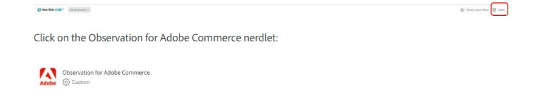

# Zugriff auf das [!DNL Observation for Adobe Commerce] Nerdlet

Um das [!DNL New Relic Observation for Adobe Commerce]-Nerdlet zu verwenden, stellen Sie sicher, dass Sie Zugriff auf [!DNL New Relic] haben.

[New Relic-Kontoverwaltung](https://experienceleague.adobe.com/de/docs/commerce-on-cloud/user-guide/monitor/new-relic/account-management)

Wählen Sie dann auf der [!DNL New Relic]-Startseite den Menüpunkt Apps aus.

