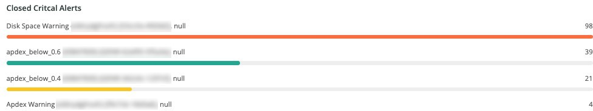

# Registerkarte [!UICONTROL Alerts]

Die Registerkarte [!UICONTROL Alerts] bietet eine Reihe von Warnungen, einschließlich kritischer Warnungen zum Öffnen und Schließen.

## [!UICONTROL Open Alert Details]

Der Frame **[!UICONTROL Open Alert Details]** zeigt die Anzahl der offenen kritischen Warnhinweise über den ausgewählten Zeitraum hinweg. Die Warnhinweise umfassen von Adobe erstellte Warnhinweise sowie alle vom Partner oder Händler erstellten Warnhinweise.

## [!UICONTROL Closed Critical Alerts]

Der Frame **[!UICONTROL Closed Critical Alerts]** zeigt die Anzahl der geschlossenen kritischen Warnhinweise über den ausgewählten Zeitraum hinweg. Die Warnhinweise umfassen von Adobe erstellte Warnhinweise sowie alle vom Partner oder Händler erstellten Warnhinweise.

## [!UICONTROL Critical Alert Details]

Der Frame &quot;**[!UICONTROL Critical Alert Details]**&quot;zeigt die Anzahl der Details des kritischen Warnhinweises über den ausgewählten Zeitraum hinweg, einschließlich Zeitstempel, Bedingungsname und ob das Warnhinweisereignis geöffnet oder geschlossen ist.

## [!UICONTROL Infrastructure Alert Details]

Der Frame **[!UICONTROL Infrastructure Alert Details]** zeigt Anwendungen, Hosts und andere Infrastrukturereignisse über den ausgewählten Zeitraum hinweg.
