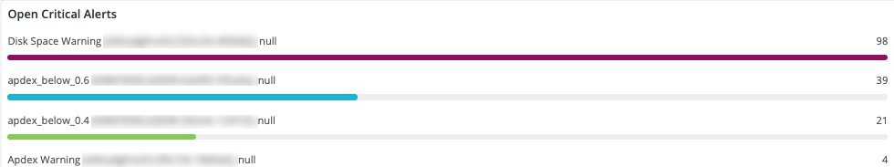
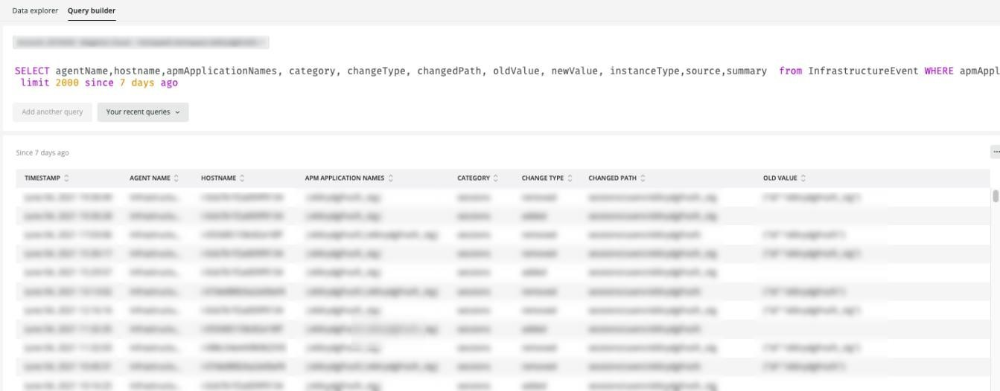

# Die Registerkarte [!UICONTROL Alerts]

Die Registerkarte [!UICONTROL Alerts] bietet eine Reihe von Warnhinweisen, darunter kritische Warnhinweise zum Öffnen und Schließen.

## [!UICONTROL Open Alert Details]

Der **[!UICONTROL Open Alert Details]** zeigt die Anzahl der offenen kritischen Warnhinweise im ausgewählten Zeitraum an. Die Warnhinweise umfassen von Adobe erstellte Warnhinweise sowie alle vom Partner oder Händler erstellten.

## [!UICONTROL Closed Critical Alerts]

Der **[!UICONTROL Closed Critical Alerts]** zeigt die Anzahl der geschlossenen kritischen Warnhinweise im ausgewählten Zeitraum an. Die Warnhinweise umfassen von Adobe erstellte Warnhinweise sowie alle vom Partner oder Händler erstellten.

## [!UICONTROL Critical Alert Details]

Der **[!UICONTROL Critical Alert Details]** zeigt die Anzahl der kritischen Warnhinweisdetails im ausgewählten Zeitrahmen an, einschließlich Zeitstempel, Bedingungsname und ob das Warnhinweisereignis geöffnet oder geschlossen ist.

## [!UICONTROL Infrastructure Alert Details]

Der **[!UICONTROL Infrastructure Alert Details]** zeigt Programme, Hosts und andere Infrastrukturereignisse über den ausgewählten Zeitraum an.
