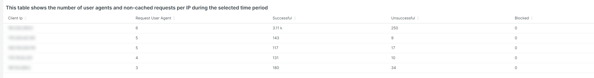

# Die Registerkarte [!UICONTROL bots]

Auf dieser Registerkarte finden Sie Informationen, die erklären, wie Sie feststellen können, ob und welche [!DNL bots] Site-Probleme verursachen.

## Allgemeine Übersicht über [!DNL bots]:

* Ein [!DNL bot] ist eine Software, die sich wiederholende automatisierte Aufgaben ausführt. Mit künstlicher Intelligenz und der Evolution des maschinellen Lernens verändern sich die Aufgaben, Methoden und Interaktionen von [!DNL bots]. Es gibt *gute* [!DNL bots], die Websites nutzen, indem sie durchsuchen und zu Internet-Suchmaschinen hinzufügen. Dies führt dazu, dass Internetnutzer durch Suchmaschinenergebnisse zur Website geleitet werden. Ein *Gut*-[!DNL bot] respektiert in der Regel die Grenzen, die dem [!DNL bot] durch eine `robots.txt`-Datei oder Einstellungen in einer Suchmaschinenkonsole zugewiesen werden. Grenzen können den Zugriff auf die Site oder Teile der Site einschränken.
* Böswillige [!DNL bots] ignorieren die `robots.txt`-Datei oder sie können eine gute [!DNL bot] über das Feld „Benutzeragenten anfragen“ der HTTP-Anfragedaten spoofen. Einige Dinge, die böswillige [!DNL bots] tun:
   * Laden Sie eine Site, um berechtigten Benutzern den Zugriff auf die Site zu verweigern.
   * Inhalte ohne Genehmigung abfangen und wiederverwenden.
   * Registrieren Sie gefälschte Konten, um E-Mail-Dienste oder -Adressen zu überfluten oder zu anderen Websites umzuleiten ([!DNL SPAM bots]).
   * Erstellen gefälschter Ansichten ([!DNL Viewbots]).
   * Kaufen Sie Produkte oder Tickets ([!DNL Focused bots]).
* Verwalten von [!DNL bots]
   * [!DNL Observation for Adobe Commerce] hat Aussicht auf [!DNL bot] Traffic:
      * Es zeigt die Gesamtzahl der nicht zwischengespeicherten [!DNL bot] an, die die Last anzeigt, die ein [!DNL bot] zu einer Site hinzufügt, sowie den Zeitpunkt, zu dem diese Last auftritt.
      * Es zeigt die [!DNL bots], die Fehler erzeugen. Wenn ein [!DNL bot] eine Last hinzufügt, die zu Site-Problemen führt, weist diese [!DNL bot] oder IP-Adresse in der Regel die höchste Fehlerhäufigkeit auf.
      * Es zeigt [!DNL bot] (Werte für Benutzeragenten-Felder der Anfrage) und IP-Adressen an, die verwaltet werden sollen über:
         * [!DNL Fastly] (Ratenbegrenzung oder [!DNL VCLs], die IP-Adressen, Bereiche oder [!DNL bots] nach Namenswert blockieren).
         * Hinzufügen guter [!DNL bot] zum `robots.txt field`, um die Zugriffsrate auf die Site einzuschränken oder zu beschränken.
         * Verwalten von [!DNL Bing] oder [!DNL Google bots] über die Suchmaschinenkonsole

## [!UICONTROL Experimental Potential Malicious Bots frame]

Der **[!UICONTROL Experimental Potential Malicious Bots frame]** Frame umfasst 12 separate, komplexe Abfragen. Es erkennt böswillige IP-Anfragensignaturen und aggregiert dann die Ergebnisse, summiert und sortiert sie nach Anzahl in absteigender Reihenfolge. Die Abfragen enthalten eine Vielzahl von Datensignaturen von CVE-Exploits und anderen böswilligen Anfragen. Auch wenn die Exploits durch Sicherheitskorrekturen/Patches blockiert werden und keine Bedrohung für die Site darstellen, muss die Anfrage dennoch von der Website verarbeitet werden. Die Anzahl der Anfragen kann in kurzer Zeit erheblich zunehmen. In diesem Frame werden nicht alle Anforderungen von der IP-Adresse angezeigt, sondern Anfragen mit Signalen, die darauf hinweisen, dass die Anfrage verdächtig war.

Stellen Sie sicher, dass der Traffic verdächtig ist und nicht von einer [!DNL Content Distributed Network] (CDN)-Adresse stammt, die möglicherweise auch gültige Anfragen sendet. Wenn die Anfragen von einer CDN-IP-Adresse stammen, wenden Sie sich bitte an diesen Dienstleister, um Unterstützung bei der Blockierung des verdächtigen Traffics über das Netzwerk zu erhalten. Informationen zum Blockieren der Adresse oder der Anfrage-URL finden Sie unter [Blockieren von bösartigem Traffic für Adobe Commerce auf  [!DNL Fastly] -Ebene](https://experienceleague.adobe.com/docs/commerce-knowledge-base/kb/how-to/block-malicious-traffic-for-magento-commerce-on-fastly-level.html?lang=de) in der Wissensdatenbank für den Adobe Commerce-Support.

## [!UICONTROL Rate of HTTP request per second (top 25) during requested time period]

Der **[!UICONTROL Rate of HTTP request per second (top 25) during requested time period]** zeigt die höchsten Anforderungen pro Sekunde an IP-Adressen während des ausgewählten Zeitraums an. Wenn diese Adressen auch in der obigen Tabelle aufgeführt sind, stellen Sie sicher, dass es sich nicht um CDN-Adressen und böswillige Adressen handelt, und blockieren Sie sie über [!DNL Fastly].

## [!UICONTROL Total Bot traffic by bot name]:

Die **[!UICONTROL Total Bot traffic by bot name during selected time period]** Tabelle enthält die aggregierte Anzahl nicht zwischengespeicherter Anfragen, bei denen das [!UICONTROL request_user_agent] eine Zeichenfolge mit [!DNL bots] im Wert aufweist. Dies kann, muss aber nicht der benannte [!DNL bot] sein, da der Wert des [!UICONTROL request_user_agent] Feldes gefälscht werden kann. Der Wert unter der Spalte [!UICONTROL Count] ist der wichtigste.

## [!UICONTROL Total Bot Traffic by Bot name/IP address]

Die Tabelle **[!UICONTROL Total Bot Traffic by Bot name/IP address during selected time period How to block bot traffic on Fastly level OR manage bots through your robots.txt file Best practices for Adobe Commerce robots.txt]** zeigt dieselben Daten wie die vorherige Tabelle, fügt jedoch IP-Adressen hinzu, die die Anfragen im Namen der benannten [!DNL bot] stellen. Als böswillige [!DNL bots]-Spoofing-[!DNL bots] sollten die IP-Adressen über Websites, die missbräuchliche IP-Adressen identifizieren, oder über *whois*-Services oder [!DNL DNS lookups] verifiziert werden. Beispielsweise veröffentlicht [!DNL Google] seine [[!DNL googlebot] IP-Adressen](https://developers.google.com/search/apis/ipranges/googlebot.json) und [!DNL Microsoft] verfügt über ein Verifizierungs-Tool für [[!DNL Bingbots]](https://www.bing.com/webmasters/help/Verify-Bingbot-2195837f).

## [!UICONTROL Graph - Bots with HTTP status errors]

Das **[!UICONTROL Graph - Bots with HTTP status errors during selected time period How to block bot traffic on Fastly level OR manage bots through your robots.txt file Best practices for Adobe Commerce robots.txt]** Diagramm zeigt Fehler bei [!DNL bots] an, die sich im Feld für den Anforderungsbenutzeragenten selbst deklarieren. Dies bedeutet nicht unbedingt, dass der Fehler durch das Volumen des [!DNL bot] oder anderen Traffics verursacht wird. Die Fehler können darin bestehen, dass der [!DNL bot] Informationen anfordert, die nicht vorhanden sind, oder dass die Anfrage ein anderes Problem enthält.

Wenn es während der Instabilität oder des Ausfalls einer Website eine Spitze von Fehlern bei IP-Adressen gibt, könnten sie verdächtig sein, wenn es sich um das Problem der Website handelt.

## [!UICONTROL Table - IPs that do not identify as bots]

Die **[!UICONTROL Table - IPs that do not identify as bots with HTTP status errors during selected time period How to block bot traffic on Fastly level OR manage bots through your robots.txt file Best practices for Adobe Commerce robots.txt]** Tabelle zeigt IP-Anfragen mit Nicht-200-HTTP-Status-Codes an, die sich NICHT selbst als im Feld „Benutzeragenten für Anfragen“ [!DNL bots] identifizieren. Bei diesen IP-Adressen kann es sich um bösartige IP-Adressen handeln, insbesondere wenn die Anzahl für den ausgewählten Zeitraum hoch ist.

Wenn die Anzahl der Nicht-200-HTTP-Status-Codes niedrig ist und die IP-Adressbereiche nicht ähnlich sind, tragen die Adressen möglicherweise nicht zu den Problemen der Site bei.

## [!UICONTROL Table – Cache Status 'ERROR']

Wenn IP-Adressen eine hohe Fehlerhäufigkeit erzeugen, fragen Sie, was sie tun? In der **[!UICONTROL Table – Cache Status 'ERROR' detail table (what are these IPs doing?) How to block bot traffic on Fastly level OR manage bots through your robots.txt file Best practices for Adobe Commerce robots.txt]** Tabelle wird die angeforderte URL zusammen mit dem HTTP-Statuswert für Anfragen mit einem Cache-Status-[!UICONTROL ERROR] angezeigt. Die Häufigkeit wird durch die URL facettiert, sodass die Anzahl niedrig sein kann. Beachten Sie, dass die IP-Adresse während des ausgewählten Zeitraums möglicherweise Tausende von Anfragen stellt. Dies ist eine Ansicht für bis zu 2000 Anfragen während des Zeitrahmens (das Limit für die Datensatzanzeige).

## [!UICONTROL Show 5XX status distribution]

Der **[!UICONTROL Show 5XX status distribution across IP addresses (top 200 addresses) How to block bot traffic on Fastly level OR manage bots through your robots.txt file Best practices for Adobe Commerce robots.txt]** Rahmen ist leistungsstark. Es werden die IP-Adressen angezeigt, die während des ausgewählten Zeitraums 5XX-HTTP-Status-Codes aufweisen. Wenn eine IP-Adresse eine große Anzahl von Anfragen stellt und die Website so stark betroffen ist, dass sie den Traffic nicht mehr verarbeiten kann, weisen die IP-Adressen mit der höchsten Anfragehäufigkeit normalerweise die höchste Fehlerquote auf. 5XX-HTTP-Status-Codes zeigen normalerweise eine Website an, die Schwierigkeiten hat, auf Anfragen zu reagieren.

Je breiter der Balken ist, desto größer ist der Prozentsatz der Fehler, die die IP-Adresse in Bezug auf die Gesamtzahl der 5xx-Fehler in diesem Zeitraum hat. Hinweis: Eine IP-Adresse kann mehrere Segmente im Diagramm enthalten, wenn sie mehrere HTTP-Status-Codes aufweist (Beispiel 502- und 503-HTTP-Status).

Die typische Verteilung wird in Richtung der rechten Seite des Balkens angezeigt, wo die IP-Adressen gleich breit sind oder es würde einige breite Balken mit sehr niedrigen Zahlen geben.

Wenn Sie den Mauszeiger über das Balkensegment bewegen, wird die Anzahl der angezeigten Fehler während des ausgewählten Zeitraums angezeigt.

## [!UICONTROL IP cache status (MISS, PASS, ERROR) and HTTP status]

Dieser **[!UICONTROL IP cache status (MISS, PASS, ERROR) and HTTP status during selected time period How to block bot traffic on Fastly level OR manage bots through your robots.txt file Best practices for Adobe Commerce robots.txt]** zeigt die Anzahl der HTTPS-Status-Codes und die nicht zwischengespeicherten Anfragen nach IP im ausgewählten Zeitraum an. Dies zeigt die proportionale Auslastung jeder IP-Adresse und das Gesamtvolumen an. Es werden die IP-Adressen mit den meisten Anfragen angezeigt.

## [!UICONTROL Fastly Cache Summary for selected time period]

Wenn Sie auf das [!UICONTROL Error] im folgenden Diagramm klicken, können Sie die letzten beiden Diagramme miteinander vergleichen. Auf diese Weise lässt sich erkennen, wo die Auslastung zu Standortproblemen beiträgt.

## [!UICONTROL Graph - IPs that do not identify as bots]

Im **[!UICONTROL Graph - IPs that do not identify as bots without error during selected time period How to block bot traffic on Fastly level OR manage bots through your robots.txt file Best practices for Adobe Commerce robots.txt]** Frame werden das Feld für den Anforderungs-Benutzeragenten, die IP-Adresse und der Status-Code für Anfragen angezeigt, bei denen im Feld für den Anforderungs-Benutzeragenten kein [!DNL bot] angegeben ist. In diesem Frame können hochfrequente Anfragen von jeder IP-Adresse angezeigt werden. Achten Sie jedoch auf hochfrequente Anfragen, insbesondere in einem Zeitraum, in dem die Site möglicherweise Probleme aufweist.

## [!UICONTROL Graph - Suspicious Non-Bot traffic]

Das **[!UICONTROL Graph - Suspicious Non-Bot traffic during selected time period]** Diagramm sucht nach dem Wert für den Anforderungs-Benutzeragenten von „go-http-client“, wird jedoch auf andere verdächtige Werte für den Anforderungs-Benutzeragenten erweitert. Dieser Wert des Anforderungs-Benutzeragenten wird von Sites für die Verbindung mit -Services verwendet und kann gültig sein, wird aber auch von böswilligen [!DNL bots] verwendet.

## [!UICONTROL Graph - Bot traffic by Bot name]

Der **[!UICONTROL Graph - Bot traffic by Bot name during selected time period]** zeigt dieselben Daten wie der gesamte Bot-Traffic nach [!DNL Bot] Namen während des ausgewählten Zeitraums in der Tabelle oben auf der Registerkarte an. Die Daten werden über die Zeitleiste angezeigt, damit Sie sehen können, wann die Anfragen des [!DNL bots] erfolgen und wie sie verteilt sind.

## [!UICONTROL Graph - Top 250 Bot Names and IP addresses]

Im **[!UICONTROL Graph - Top 250 Bot Names and IP addresses during selected time period How to block bot traffic on Fastly level OR manage bots through your robots.txt file Best practices for Adobe Commerce robots.txt]** werden dieselben Daten angezeigt wie in der Tabelle Traffic-[!DNL Bot] insgesamt nach Bot-Namen/IP-Adresse während des ausgewählten Zeitraums oben in der Registerkarte. Die Daten werden über die Zeitleiste angezeigt und nach IP-Adresse facettiert. Dies zeigt an, wann die Anfragen des [!DNL bots] erfolgen, welche IP-Adresse Anfragen stellt, und wie die Anfragen verteilt sind.

## [!UICONTROL Blocked Bot name / IP addresses (in Fastly)]

Im **[!UICONTROL Blocked Bot name / IP addresses (in Fastly) during selected time period. This graph displays bot traffic and IPs that were returned a 403 Forbidden HTTP Status code]** werden der Bot-Name und die blockierten IP-Adressen angezeigt. In diesem Diagramm können Sie sehen, wie in [!DNL Fastly] Zukunft alle Anfragen blockiert werden.

## [!UICONTROL Blocked non-Bot name / IP addresses (in Fastly)]

Der **[!UICONTROL Blocked non-Bot name / IP addresses (in Fastly) during selected time period graph displays non-bot traffic and IPs that were returned a 403 Forbidden HTTP Status code]** Rahmen zeigt IP-Adressen an, die sich nicht als [!DNL bot] identifizieren, die durch [!DNL Fastly] blockiert wurden.

## [!UICONTROL This table shows the number of user agents per IP address, number of successful, unsuccessful and blocked requests:]

Bösartige [!DNL bots] verfälschen andere [!DNL bots] häufig durch den Wert des [!UICONTROL Request User Agent]. Diese Tabelle zeigt, wie viele eindeutige Werte die IP-Adresse in diesem Feld hat. Je höher der Wert im Feld [!UICONTROL Request User Agent] ist, desto verdächtiger ist die IP-Adresse.

## [!UICONTROL IP with non-200 status errors]

Der **[!UICONTROL IP with non-200 status errors – without 403 status]** zeigt die Verteilung von IP-Adressen mit anderen HTTP-Status-Codes als 200 über den ausgewählten Zeitraum an. Wenn für eine einzelne IP-Adresse oder eine Gruppe von IP-Adressen höhere Werte angezeigt werden, müssen diese weiter untersucht werden.

## [!UICONTROL IP with 403 status codes:]

Der **[!UICONTROL IP with 403 status codes]** Frame zeigt nicht zwischengespeicherte Anfragen ohne [!UICONTROL cache_status=ERROR] mit dem HTTP-Status 403 an. Dies kann darauf hinweisen, dass der Ursprungs-Server die Quelle des 403 (nicht autorisiert) ist und nicht ein Block von [!DNL Fastly].

## [!UICONTROL Top 5 with non-200 status codes]

Die **[!UICONTROL Top 5 with non-200 status codes showing cache_status]** zeigt auf IP-/Status-Ebene die Zählungen der einzelnen mit dem [!UICONTROL cache_status] Wert an.

## [!UICONTROL Pageview Latency will show as spikes]

Der **[!UICONTROL Pageview Latency will show as spikes on this graph:]** Frame zeigt die Seitenladezeit/API-Reaktionslatenz an, die mit dem [!DNL bot] Traffic übereinstimmen kann.
