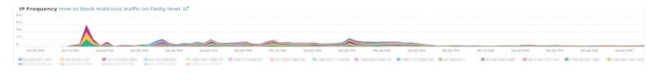

# Die [!UICONTROL CDN] tab

Diese Registerkarte enthält Informationen, die sich auf die [!DNL content delivery network (CDN)]. Im Fall von Adobe Commerce Cloud ist dies die [!DNL Fastly] -Dienst.

## [!UICONTROL HIT rate]

Die **[!UICONTROL HIT rate]** frame zeigt die Anzahl zwischenspeicherbarer Anforderungen an, die zu [!UICONTROL HITS] im letzten Moment. Dies weist auf eine erfolgreiche Zwischenspeicherung hin. Der Pfeil rechts zeigt den Prozentsatz über oder unter der gleichen Zeit vor einer Woche an.

## [!UICONTROL HIT Processing]

Diese **[!UICONTROL HIT processing]** zeigt die Anzahl zwischenspeicherbarer Anforderungen an, die zu [!UICONTROL HITS] in der Woche.

## [!UICONTROL MISS rate]

Diese **[!UICONTROL MISS rate]** zeigt die Anzahl an Fehlern zwischenspeicherbarer Anforderungen in der letzten Minute an. Ein Fehler tritt auf, wenn die Anfrage nicht zwischengespeichert wird und die Anfrage an den Herkunftsserver übergeben werden muss, um den Inhalt bereitzustellen. Der Wert rechts ist der Vergleich der Steigerung/Verringerung mit der Anzahl der Minuten pro Minute, die eine Woche zuvor vergangen sind.

## [!UICONTROL MISS time]

## [!UICONTROL HIT Ratio]

## [!UICONTROL Error Percentage]

Die **[!UICONTROL Error Percentage]** zeigt den Wert des ERROR-Prozentsatzes der Anforderungen an und zeigt den relativen Anstieg/Rückgang im Vergleich zur gleichen Zeit wie eine Woche zuvor an.

## [!UICONTROL Total Requests]

## [!UICONTROL ERROR rate]

## [!UICONTROL Fastly Cache Average Response for selected time period in seconds]

Dieser Frame zeigt die Dauer der zwischenspeicherbaren Anforderungen in Sekunden, d. h. wenn ein `cache_response` ist [!UICONTROL MISS], zeigt sie den Durchschnitt für ausgelassene zwischengespeicherte Antworten während der ausgewählten Zeit an.

## [!UICONTROL Fastly Cache Average Response for selected time period in seconds, faceted by POP]

*POP* in diesem Kontext bezieht sich auf einen POP (Point of Presence), der so konfiguriert ist, dass er als Pool für die Cache-Speicherung fungiert. Siehe [Anlaufstellen](https://developer.fastly.com/learning/concepts/pop/).

## [!UICONTROL Total Bandwidth (All POPs) during the selected timeframe, compared with 1 week ago (% increase/decrease)]

## [!UICONTROL Requests – Since selected timeframe compared with one week ago]

Dieser Frame ähnelt dem Zusammenfassungsfeld für [!UICONTROL Total Requests] oben, zeigt jedoch die Anzahl der Anfragen der letzten Wochen an. Dies sind alle Anforderungen, nicht nur zwischenspeicherbare Anforderungen (wobei `is_cacheable` ist wahr).

## [!UICONTROL Response Count]

## [!UICONTROL Bandwidth by POP]

## [!UICONTROL Top 5 URLs (5xx or 3xx status codes)]

Die **[!UICONTROL Top 5 URLs]** -Ansicht zeigt die fünf wichtigsten URLs an, bei denen Fehlerantworten mit 5xx- oder 3xx-Fehler auftreten. Aufgrund der Platzbeschränkungen müssen Sie den Mauszeiger über die URL bewegen, um den spezifischen Fehlercode anzuzeigen, der mit dieser URL verknüpft ist. (Beispiel im roten Feld der obigen Abbildung).

## [!UICONTROL Top 25 URLs (200 status)]

Die **[!UICONTROL Top 25 URLs]** frame zeigt die URLs an, die während des ausgewählten Zeitrahmens den Status 200 nach Anzahl zurückgegeben haben.

## [!UICONTROL Duration by Response Status]

Die **[!UICONTROL Duration by Response Status]** -Diagramm zeigt die Fehlerantworten nach Anzahl während des ausgewählten Zeitrahmens, facettiert nach Fehlerstatus-Code.

## [!UICONTROL Duration by Response Status, top 25 urls]

Die **[!UICONTROL Duration by Response Status, top 25 URLs]** -Diagramm zeigt die 25 wichtigsten URLs nach der Dauer der Antwort in Sekunden an. Möglicherweise müssen Sie den Mauszeiger über die URL bewegen, um den gesamten Pfad anzuzeigen. Um auch alle URLs außer einer zu entfernen, klicken Sie auf diese URL. Sie können dann weitere URLs hinzufügen, indem Sie diese einzeln anklicken. Wenn Sie einzelne URLs entfernen möchten, können Sie die Taste gedrückt halten und auf jede URL klicken, um sie aus dem Diagramm zu entfernen.

## [!UICONTROL Duration by Response Status, top 25 non-200 status]

Die **[!UICONTROL Duration by Response Status, top 25 non-200 status]** -Diagramm ähnelt dem letzten mit dem Unterschied, dass der Fokus auf Statuscodes, die nicht unter 200 fallen, oder Fehlerstatus-Codes liegt. Daraufhin werden der Fehlercode und dann die URL angezeigt. Möglicherweise müssen Sie den Mauszeiger über die URL bewegen, um den gesamten Pfad anzuzeigen. Um auch alle URLs außer einer zu entfernen, klicken Sie auf diese URL. Sie können dann weitere URLs hinzufügen, indem Sie diese einzeln anklicken. Wenn Sie einzelne URLs entfernen möchten, können Sie die Taste gedrückt halten und auf jede URL klicken, um sie aus dem Diagramm zu entfernen.

## [!UICONTROL Error Count by POP timeline]

Die **[!UICONTROL Error Count by POP timeline]** -Diagramm zeigt die Anzahl der Fehlerstatus entlang der ausgewählten Zeitleiste des Zeitrahmens, facettiert durch den Fehlercode.

## [!UICONTROL Duration by Response status, top 25 client IP, non-200 status]

Die **[!UICONTROL Duration by Response status, top 25 client IP, non 200 status]** -Diagramm zeigt die IP-Adressen nach der durchschnittlichen Dauer des ausgewählten Zeitraums an, in dem Status-Fehlercodes aufgetreten sind.

## [!UICONTROL IP Frequency]

Die **[!UICONTROL IP Frequency]** frame zählt die Status (&#39;MISS&#39; und &#39;PASS&#39;) für jede IP aus der [!DNL Fastly] Protokolle. Webanfragen mit diesen Status erreichen den Herkunftsserver und fügen dem Server Ladevorgänge hinzu. Er zeigt die zwanzig häufigsten Adressen in der Häufigkeit. Dieser Frame kann verwendet werden, um IP-Angriffe oder Quellen hoher Belastung auf einer Website zu erkennen. Dieses Diagramm ist auch auf der Registerkarte &quot;Zusammenfassung&quot;vorhanden und wird hier platziert, um einen einfachen Vergleich mit weiteren Details zum [!DNL Fastly] auf dieser Registerkarte angezeigte Protokollinformationen.
