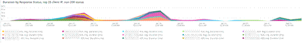

# Registerkarte [!UICONTROL CDN]

Diese Registerkarte enthält Informationen, die sich auf den [!DNL content delivery network (CDN)] konzentrieren. Im Fall von Adobe Commerce Cloud ist dies der [!DNL Fastly] -Dienst.

## [!UICONTROL HIT rate]

Der Frame **[!UICONTROL HIT rate]** zeigt die Anzahl der zwischenspeicherbaren Anforderungen an, die in der letzten Minute zu [!UICONTROL HITS] führten. Dies weist auf eine erfolgreiche Zwischenspeicherung hin. Der Pfeil rechts zeigt den Prozentsatz über oder unter der gleichen Zeit vor einer Woche an.

## [!UICONTROL HIT Processing]

Dieses Feld &quot;**[!UICONTROL HIT processing]**&quot; zeigt die Anzahl der zwischenspeicherbaren Anforderungen, die während der Woche zu &quot;[!UICONTROL HITS]&quot; führten.

## [!UICONTROL MISS rate]

Dieses Feld &quot;**[!UICONTROL MISS rate]**&quot; zeigt die Anzahl der Fehlschläge zwischenspeicherbarer Anforderungen in der letzten Minute an. Ein Fehler tritt auf, wenn die Anfrage nicht zwischengespeichert wird und die Anfrage an den Herkunftsserver übergeben werden muss, um den Inhalt bereitzustellen. Der Wert rechts ist der Vergleich der Steigerung/Verringerung mit der Anzahl der Minuten pro Minute, die eine Woche zuvor vergangen sind.

## [!UICONTROL MISS time]

## [!UICONTROL HIT Ratio]

## [!UICONTROL Error Percentage]

Das Feld &quot;**[!UICONTROL Error Percentage]**&quot; zeigt den Wert des ERROR-Prozentsatzes der Anforderungen an und zeigt den relativen Anstieg/Rückgang im Vergleich zur gleichen Zeit wie eine Woche zuvor an.

## [!UICONTROL Total Requests]

## [!UICONTROL ERROR rate]

## [!UICONTROL Fastly Cache Average Response for selected time period in seconds]

Dieser Frame zeigt die Dauer der zwischenspeicherbaren Anforderungen in Sekunden an. Wenn also `cache_response` den Wert [!UICONTROL MISS] aufweist, wird der Durchschnitt der ausgelassenen zwischengespeicherten Antworten für die ausgewählte Zeit angezeigt.

## [!UICONTROL Fastly Cache Average Response for selected time period in seconds, faceted by POP]

*POP* bezieht sich in diesem Zusammenhang auf einen Point of Presence (POP), der so konfiguriert ist, dass er als Pool für die Cache-Speicherung funktioniert. Siehe [Points of presence](https://developer.fastly.com/learning/concepts/pop/).

## [!UICONTROL Total Bandwidth (All POPs) during the selected timeframe, compared with 1 week ago (% increase/decrease)]

## [!UICONTROL Requests – Since selected timeframe compared with one week ago]

Dieser Rahmen ähnelt dem Zusammenfassungsfeld für [!UICONTROL Total Requests] oben, zeigt jedoch die Anforderungszahlen der vorherigen Wochen an. Dies sind alle Anforderungen, nicht nur zwischenspeicherbare Anforderungen (wobei `is_cacheable` wahr ist).

## [!UICONTROL Response Count]

## [!UICONTROL Bandwidth by POP]

## [!UICONTROL Top 5 URLs (5xx or 3xx status codes)]

Die Ansicht &quot;**[!UICONTROL Top 5 URLs]**&quot;zeigt die fünf wichtigsten URLs an, bei denen Fehlerantworten mit 5xx- oder 3xx-Werten auftreten. Aufgrund der Platzbeschränkungen müssen Sie den Mauszeiger über die URL bewegen, um den spezifischen Fehlercode anzuzeigen, der mit dieser URL verknüpft ist. (Beispiel im roten Feld der obigen Abbildung).

## [!UICONTROL Top 25 URLs (200 status)]

Der Frame &quot;**[!UICONTROL Top 25 URLs]**&quot;zeigt die URLs an, die während des ausgewählten Zeitraums einen 200-Status nach Anzahl zurückgegeben haben.

## [!UICONTROL Duration by Response Status]

Das Diagramm **[!UICONTROL Duration by Response Status]** zeigt die Fehlerantworten nach Anzahl während des ausgewählten Zeitraums, facettiert nach dem Fehlerstatus-Code.

## [!UICONTROL Duration by Response Status, top 25 urls]

Das Diagramm **[!UICONTROL Duration by Response Status, top 25 URLs]** zeigt die 25 wichtigsten URLs nach der Dauer der Antwort in Sekunden. Möglicherweise müssen Sie den Mauszeiger über die URL bewegen, um den gesamten Pfad anzuzeigen. Um auch alle URLs außer einer zu entfernen, klicken Sie auf diese URL. Sie können dann weitere URLs hinzufügen, indem Sie diese einzeln anklicken. Wenn Sie einzelne URLs entfernen möchten, können Sie die Taste gedrückt halten und auf jede URL klicken, um sie aus dem Diagramm zu entfernen.

## [!UICONTROL Duration by Response Status, top 25 non-200 status]

Das Diagramm **[!UICONTROL Duration by Response Status, top 25 non-200 status]** ähnelt dem letzten mit dem Unterschied, dass der Fokus auf Statuscodes, die nicht 200 sind, oder Fehlerstatus-Codes liegt. Daraufhin werden der Fehlercode und dann die URL angezeigt. Möglicherweise müssen Sie den Mauszeiger über die URL bewegen, um den gesamten Pfad anzuzeigen. Um auch alle URLs außer einer zu entfernen, klicken Sie auf diese URL. Sie können dann weitere URLs hinzufügen, indem Sie diese einzeln anklicken. Wenn Sie einzelne URLs entfernen möchten, können Sie die Taste gedrückt halten und auf jede URL klicken, um sie aus dem Diagramm zu entfernen.

## [!UICONTROL Error Count by POP timeline]

Das Diagramm **[!UICONTROL Error Count by POP timeline]** zeigt die Anzahl der Fehlerstatus entlang der ausgewählten Zeitleiste des Zeitrahmens, facettiert durch den Fehlercode.

## [!UICONTROL Duration by Response status, top 25 client IP, non-200 status]

Das Diagramm **[!UICONTROL Duration by Response status, top 25 client IP, non 200 status]** zeigt die IP-Adressen nach der durchschnittlichen Dauer des ausgewählten Zeitraums an, in dem Status-Fehlercodes aufgetreten sind.

## [!UICONTROL IP Frequency]

Der Frame **[!UICONTROL IP Frequency]** zählt die Status (&#39;MISS&#39; und &#39;PASS&#39;) für jede IP-Adresse aus den [!DNL Fastly] -Protokollen. Webanfragen mit diesen Status erreichen den Herkunftsserver und fügen dem Server Ladevorgänge hinzu. Er zeigt die zwanzig häufigsten Adressen in der Häufigkeit. Dieser Frame kann verwendet werden, um IP-Angriffe oder Quellen hoher Belastung auf einer Website zu erkennen. Dieses Diagramm ist auch auf der Registerkarte &quot;Zusammenfassung&quot;vorhanden und wird hier platziert, um einen einfachen Vergleich mit weiteren Details zu den [!DNL Fastly]-Protokollinformationen zu ermöglichen, die auf dieser Registerkarte angezeigt werden.
