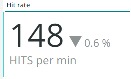
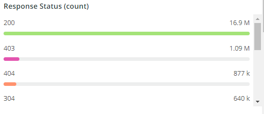

# Die Registerkarte [!UICONTROL CDN]

Diese Registerkarte enthält Informationen, die sich auf die [!DNL content delivery network (CDN)] beziehen. Im Fall von Adobe Commerce Cloud ist dies der [!DNL Fastly].

## [!UICONTROL HIT rate]

Der **[!UICONTROL HIT rate]** zeigt die Anzahl der zwischenspeicherbaren Anfragen an, die zu einer [!UICONTROL HITS] in der letzten Minute geführt haben. Dies zeigt an, dass das Caching erfolgreich war. Der Pfeil rechts zeigt den Prozentsatz über oder unter der gleichen Zeit vor einer Woche an.

## [!UICONTROL HIT Processing]

In diesem **[!UICONTROL HIT processing]** wird die Anzahl der zwischenspeicherbaren Anfragen angezeigt, die während der Woche zu [!UICONTROL HITS] geführt haben.

## [!UICONTROL MISS rate]

In diesem **[!UICONTROL MISS rate]** wird die Anzahl der Fehlschläge von zwischenspeicherbaren Anfragen in der letzten Minute angezeigt. Ein Fehler tritt auf, wenn die Anfrage nicht zwischengespeichert wird und die Anfrage an den Ursprungs-Server übergeben werden muss, um den Inhalt bereitzustellen. Der Wert rechts ist der Vergleich der Zunahme/Abnahme mit der Anzahl der Minuten pro Minute eine Woche davor.

## [!UICONTROL MISS time]

## [!UICONTROL HIT Ratio]

## [!UICONTROL Error Percentage]

Im Feld **[!UICONTROL Error Percentage]** wird der Wert des Prozentsatzes FEHLER der Anfragen angezeigt. Außerdem wird der relative Anstieg/Rückgang im Vergleich zur gleichen Vorwoche angezeigt.

## [!UICONTROL Total Requests]

## [!UICONTROL ERROR rate]

## [!UICONTROL Fastly Cache Average Response for selected time period in seconds]

Dieser Frame zeigt die Dauer in Sekunden der zwischenspeicherbaren Anfragen an. Wenn ein `cache_response` also ein [!UICONTROL MISS] ist, wird der Durchschnitt für ausgelassene zwischengespeicherte Antworten für die ausgewählte Zeit angezeigt.

## [!UICONTROL Fastly Cache Average Response for selected time period in seconds, faceted by POP]

*POP* bezieht sich in diesem Zusammenhang auf einen Point of Presence (POP), der als Pool für die Cache-Speicherung konfiguriert ist. Siehe [Points of Presence](https://developer.fastly.com/learning/concepts/pop/).

## [!UICONTROL Total Bandwidth (All POPs) during the selected timeframe, compared with 1 week ago (% increase/decrease)]

## [!UICONTROL Requests – Since selected timeframe compared with one week ago]

Dieser Frame ähnelt dem Zusammenfassungsfeld für [!UICONTROL Total Requests] oben, zeigt jedoch die Anzahl der Anfragen der Vorwochen an. Hierbei handelt es sich um Anfragen, nicht nur um zwischenspeicherbare Anfragen (bei denen `is_cacheable` wahr ist).

## [!UICONTROL Response Count]

## [!UICONTROL Bandwidth by POP]

## [!UICONTROL Top 5 URLs (5xx or 3xx status codes)]

Die **[!UICONTROL Top 5 URLs]** Ansicht zeigt die fünf häufigsten URLs mit 5xx- oder 3xx-Fehlerantworten. Aufgrund der beschränkten Platzierung müssen Sie den Mauszeiger über die URL bewegen, um den spezifischen Fehler-Code anzuzeigen, der mit dieser URL verknüpft ist. (Beispiel im roten Feld der Abbildung oben).

## [!UICONTROL Top 25 URLs (200 status)]

Der **[!UICONTROL Top 25 URLs]** zeigt die URLs an, die im ausgewählten Zeitraum einen Status von 200 zurückgegeben haben.

## [!UICONTROL Duration by Response Status]

Das **[!UICONTROL Duration by Response Status]** zeigt die Fehlerantworten nach Anzahl im ausgewählten Zeitraum an, facettiert nach Fehlerstatus-Code.

## [!UICONTROL Duration by Response Status, top 25 urls]

Das **[!UICONTROL Duration by Response Status, top 25 URLs]** Diagramm zeigt die 25 häufigsten URLs nach der Dauer der Antwort in Sekunden an. Möglicherweise müssen Sie den Mauszeiger über die URL bewegen, um den gesamten Pfad anzuzeigen. Um alle URLs bis auf eine zu entfernen, klicken Sie auf diese URL. Sie können dann weitere URLs wieder hinzufügen, indem Sie einzeln darauf klicken. Wenn Sie einzelne URLs entfernen möchten, können Sie die -Taste gedrückt halten und auf jede URL klicken, um sie aus dem Diagramm zu entfernen.

## [!UICONTROL Duration by Response Status, top 25 non-200 status]

Das **[!UICONTROL Duration by Response Status, top 25 non-200 status]** Diagramm ähnelt dem letzten, mit dem Unterschied, dass der Fokus auf Nicht-200-Status-Codes oder Fehlerstatus-Codes liegt. Daraufhin werden der Fehlercode und dann die URL angezeigt. Möglicherweise müssen Sie den Mauszeiger über die URL bewegen, um den gesamten Pfad anzuzeigen. Um alle URLs bis auf eine zu entfernen, klicken Sie auf diese URL. Sie können dann weitere URLs wieder hinzufügen, indem Sie einzeln darauf klicken. Wenn Sie einzelne URLs entfernen möchten, können Sie die -Taste gedrückt halten und auf jede URL klicken, um sie aus dem Diagramm zu entfernen.

## [!UICONTROL Error Count by POP timeline]

Das **[!UICONTROL Error Count by POP timeline]** Diagramm zeigt die Anzahl der Fehlerstatus entlang der ausgewählten Zeitleiste an, facettiert durch den Fehler-Code.

## [!UICONTROL Duration by Response status, top 25 client IP, non-200 status]

Das **[!UICONTROL Duration by Response status, top 25 client IP, non 200 status]** Diagramm zeigt die IP-Adressen nach der durchschnittlichen Dauer im ausgewählten Zeitraum an, in dem Statusfehler-Codes aufgetreten sind.

## [!UICONTROL IP Frequency]

Der **[!UICONTROL IP Frequency]** Frame zählt die Status („MISS“ und „PASS„) für jede IP aus den [!DNL Fastly]. Webanforderungen mit diesen Status erreichen den Ursprungs-Server und laden den Server. Es zeigt die zwanzig Top-Adressen in der Häufigkeit. Dieser Frame kann verwendet werden, um IP-Angriffe oder Quellen hoher Auslastung auf einer Website zu erkennen. Dieses Diagramm ist auch auf der Registerkarte Zusammenfassung vorhanden und wird hier platziert, um einen einfachen Vergleich mit weiteren Details zu den auf dieser Registerkarte angezeigten [!DNL Fastly]-Protokollinformationen zu ermöglichen.
