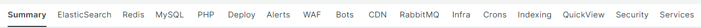

# Auswählen der [!UICONTROL focus] Registerkarten

Die Leistungsfähigkeit von [!DNL Observation for Adobe Commerce] resultiert aus der Ausrichtung einer großen Anzahl unterschiedlicher Datenansichten auf derselben Zeitleiste. [!DNL Observation for Adobe Commerce] können [!DNL New Relic] Agenten ein erfasstes Datenbeispiel und eine visuelle Ansicht von System- und Anwendungsprotokollen präsentieren. Wenn Sie über die Behebung komplexer Probleme nachdenken, geht es immer um die Halbierung von Daten. Beim Betrachten eines Problems in einer Timeline lautet die erste Frage: „Wann ist dies passiert?“ Unmittelbar Besorgnis erregend ist alles, was vor jenem Augenblick geschah. Wenn Sie den genauen Zeitpunkt kennen, zu dem das Problem in der Zeitleiste aufgetreten ist, können Sie eine Zeitleiste unmittelbar vor dem Problem auswählen. Sie kennen möglicherweise nur dann die Details des Problems, wenn Ihre Site langsam oder nicht mehr verfügbar ist. Zu den potenziellen Verdächtigen von Adobe Commerce gehören Komponentendienste, Ressourcenebenen und die Anzahl der ausgeführten Prozesse.

Auf den **[!UICONTROL focus]** Registerkarten werden Informationen angezeigt, die Ihnen dabei helfen können, sich auf Bereiche zu konzentrieren, die Ihr Problem verursachen oder zu seinem Problem beitragen. Sie können [!DNL Observation for Adobe Commerce] auch kontinuierlich Datensignale hinzufügen. Datensignale können [!DNL New Relic] erfasste Daten oder Zählungen kritischer Phasen oder Fehlermeldungen aus Protokollen sein. Da Fehlermeldungen als mit Site-Problemen korreliert identifiziert werden, können sie zu den [!DNL Observation for Adobe Commerce] Abfragen hinzugefügt werden, um die Anzeige kritischer Informationen zu verbessern.

