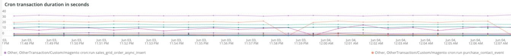
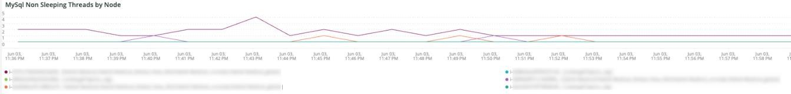
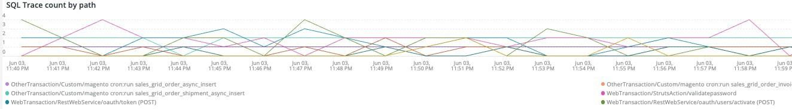
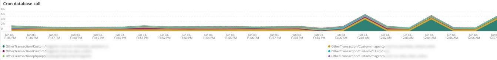
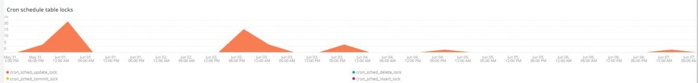
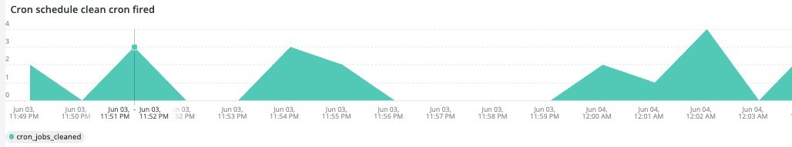
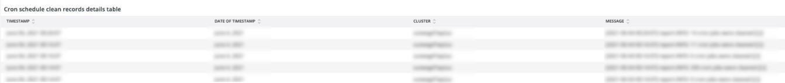
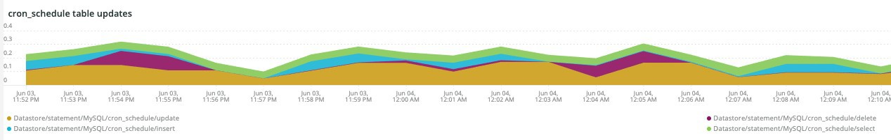
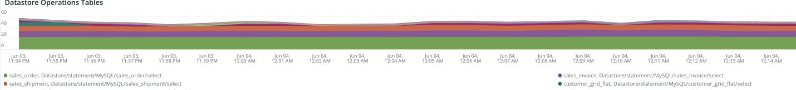

# Die Registerkarte [!DNL Cron]

Diese Registerkarte dient dazu, Probleme und Ursachen [!DNL cron] Probleme schnell zu isolieren.

## [!UICONTROL Cron transaction duration in seconds]

Der **[!UICONTROL Cron transaction duration in seconds]** zeigt [!DNL crons] Transaktionsdauer in Sekunden an. Dadurch werden Transaktionen mit langen Laufzeiten angezeigt. Ein tieferer Einblick in APM zeigt weitere Details dazu, welche Abfrage die Transaktion/der Vorgang möglicherweise ausführt.

## [!UICONTROL MySQL Non-Sleeping Threads by Node]

Der **[!UICONTROL MySQL Non-Sleeping Threads by Node]** zeigt die MySQL Nicht-Sleeping-Threads nach Knoten für den ausgewählten Zeitraum an.

## [!UICONTROL SQL Trace count by path]

Der **[!UICONTROL SQL Trace count by path]** betrachtet die Anzahl der MySQL-Traces nach Pfad, was dazu beitragen kann, SQL-Anweisungen über einen ausgewählten Zeitraum hinweg zu verfolgen.

## [!UICONTROL Cron database call]

Der **[!UICONTROL Cron database call]** zeigt die Anzahl der [!DNL crons] an, die über einen ausgewählten Zeitraum in die Datenbank aufgenommen wurden.

## [!UICONTROL Cron schedule table locks]

Der **[!UICONTROL Cron schedule table locks]** zeigt [!DNL cron] Zeitplantabellen-Sperren für einen ausgewählten Zeitraum an.

## [!UICONTROL Cron schedule clean cron fired]

Der **[!UICONTROL Cron schedule clean cron fired]** zeigt die Anzahl der [!DNL crons] an, die in einem ausgewählten Zeitraum bereinigt wurden. Wenn in diesem Frame keine Daten angezeigt werden, kann dies auf ein Problem mit [!DNL crons] ordnungsgemäßen Ausführung hinweisen. Wenn der [!DNL cron] Auftragsplan nicht bereinigt wurde, wird [!DNL crons] nicht optimal ausgeführt und kann länger dauern.

## [!UICONTROL Cron schedule clean records details table]

Die **[!UICONTROL Cron schedule clean records details table]** Tabelle enthält Details zum Vorgang zum Löschen von Datensätzen aus der `cron_schedule` Tabelle über einen ausgewählten Zeitraum.

## [!UICONTROL cron_schedule table updates]

Der **[!UICONTROL cron_schedule table updates]** zeigt die Anzahl [!DNL cron] geplanten Tabellenaktualisierungen über einen ausgewählten Zeitraum an. Eine hohe Aktivität beim Löschen oder Aktualisieren dieser Tabelle kann auf ein Problem mit [!DNL crons] hinweisen. Aktualisieren [!DNL crons] diese Tabelle außerdem bei ihrer Ausführung und Fertigstellung. Wenn es also keine Aktivität in dieser Tabelle gibt und [!DNL crons] konfiguriert sind, könnte es ein Problem mit [!DNL crons] geben.

## [!UICONTROL Datastore Operations Tables]

Der **[!UICONTROL Datastore Operations Tables]** untersucht Datenbanktabellenvorgänge, einschließlich `SELECT`, `DELETE` und `UPDATE` für einen ausgewählten Zeitraum. Dieser Rahmen zeigt die Datenbanktabellen mit der höchsten Vorgangsfrequenz an.
