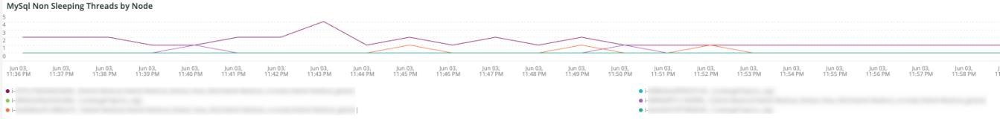

# Die [!UICONTROL Cron] tab

Dieser Tab ist ein Versuch, Probleme und Ursachen von Cron-Problemen schnell zu isolieren.

## [!UICONTROL Cron transaction duration in seconds]

Die **[!UICONTROL Cron transaction duration in seconds]** frame zeigt die Transaktionsdauer der Crons in Sekunden an. Dadurch werden Transaktionen angezeigt, die über lange Laufzeiten verfügen. Durch einen tieferen Einblick in APM werden weitere Details zur Abfrage angezeigt, die die Transaktion/der Vorgang ausführen kann.

## [!UICONTROL MySql Non-Sleeping Threads by Node]

Die **[!UICONTROL MySql Non-Sleeping Threads by Node]** frame zeigt die MySql Non-Sleeping-Threads nach Knoten über den ausgewählten Zeitraum an.

## [!UICONTROL SQL Trace count by path]

Die **[!UICONTROL SQL Trace count by path]** frame betrachtet die Anzahl der MySql-Trace nach Pfad, was dazu beitragen kann, SQL-Anweisungen über einen ausgewählten Zeitraum hinweg zu verfolgen.

## [!UICONTROL Cron database call]

Die **[!UICONTROL Cron database call]** frame untersucht die Anzahl der Crons, die während eines ausgewählten Zeitraums die Datenbank aufrufen.

## [!UICONTROL Cron schedule table locks]

Die **[!UICONTROL Cron schedule table locks]** frame betrachtet die Sperrung der Cron-Zeitplan-Tabelle über einen ausgewählten Zeitrahmen.

## [!UICONTROL Cron schedule clean cron fired]

Die **[!UICONTROL Cron schedule clean cron fired]** frame untersucht die Anzahl der in einem ausgewählten Zeitraum bereinigten Kronen. Wenn in diesem Frame keine Daten angezeigt werden, kann dies auf ein Problem bei der ordnungsgemäßen Ausführung der Kronen hinweisen. Wenn der Cron-Auftragsplan nicht bereinigt wird, werden die Crons nicht optimal ausgeführt und die Ausführung kann länger dauern.

## [!UICONTROL Cron schedule clean records details table]

Die **[!UICONTROL Cron schedule clean records details table]** -Tabelle enthält Details zum Auftrag zum Bereinigen von Datensätzen aus der `cron_schedule` -Tabelle über einen ausgewählten Zeitraum hinweg.

## [!UICONTROL cron_schedule table updates]

Die **[!UICONTROL cron_schedule table updates]** frame untersucht die Anzahl der geplanten Cron-Tabellenaktualisierungen über einen ausgewählten Zeitraum. Eine hohe Aktivität beim Löschen oder Aktualisieren dieser Tabelle kann auf ein Problem mit Kronen hinweisen. Außerdem aktualisieren Kronen diese Tabelle, wenn sie ausgeführt und abgeschlossen werden. Wenn also keine Aktivität auf dieser Tabelle vorhanden und Kronen konfiguriert sind, kann es zu Problemen mit Kronen kommen.

## [!UICONTROL Datastore Operations Tables]

Die **[!UICONTROL Datastore Operations Tables]** betrachtet Datenbanktabellenvorgänge, einschließlich `SELECT`, `DELETE`und `UPDATE` über einen ausgewählten Zeitraum hinweg. Dieser Rahmen zeigt die Datenbanktabellen mit der höchsten Betriebsfrequenz an.
