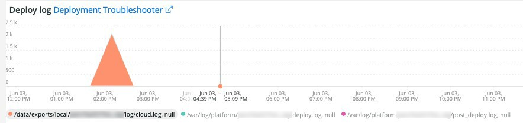
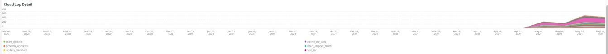
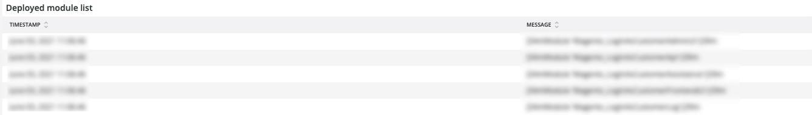

# Die [!UICONTROL Deploy] tab

Auf dieser Registerkarte wird versucht, Probleme und Ursachen von Bereitstellungsproblemen schnell zu isolieren.

## [!UICONTROL Deploy log Deployment Troubleshooter]

Die **[!UICONTROL Deploy log Deployment Troubleshooter]** frame zeigt die Anzahl der Bereitstellungsprotokollereignisse, die während des ausgewählten Zeitraums aufgetreten sind. Ziel ist es, einen Überblick über die Implementierungsaktivität zu erhalten und die Komplexität der Implementierung anhand der Anzahl zu ermitteln. Je mehr Nachrichten protokolliert werden, desto komplexer ist die Bereitstellung in der Regel.

## [!UICONTROL Deploy State]

Die **[!UICONTROL Deploy State]** frame zeigt die Bereitstellungsereignisse an, die während des ausgewählten Zeitrahmens aufgetreten sind. Der Parser für diesen Frame sucht nach diesen spezifischen Signalen:

* &#39;%NOTICE: Starten Sie generate command%&#39;) as &#39;start_gen&#39;
* &#39;%git apply /app/vendor/magento/ece-tools/patches%&#39;) als &#39;apply_patches&#39;
* &#39;%Set flag: .static_content_deploy%&#39;) als &#39;SCD&#39;
* &#39;%NOTICE: Generieren von Befehl completed%&#39;) als &#39;gen_compl&#39;
* &#39;%NOTICE: Starten der Bereitstellung.%&#39;) als &#39;start_deploy&#39;
* &#39;%NOTICE: Implementierung abgeschlossen%&#39;) als &#39;deploy_compl&#39;
* &#39;%NOTICE: Starten nach der Bereitstellung.%&#39;) als &#39;start_pdeploy&#39;
* &#39;%NOTICE: Nach der Bereitstellung ist abgeschlossen%&#39;) als &quot;pdeploy&quot;
* &#39;%deploy-complete%&#39;) als &#39;cl_deploy_compl&#39;

## [!UICONTROL Deploy Log Detail]

Die **[!UICONTROL Deploy Log Detail]** frame zeigt die Details der Protokollmeldungszusammenfassung, die während des ausgewählten Zeitraums aufgetreten sind. Der Frame wird für die folgenden Zeichenfolgen in den Bereitstellungsprotokollen analysiert:

* &#39;%NOTICE: Starten der Bereitstellung.%&#39;) als &#39;start_dlay&#39;
* &#39;%INFO: Startszenarios: scenario/deploy.xml%&#39;) as &#39;start_scenario&#39;
* &#39;%NOTICE: Starten von pre-deploy%&#39;) als &#39;start_predlay&#39;
* &quot;% INFO: Zurücksetzen der Patch-Protokolldatei%&#39;) als &#39;rstr_ptch_log&#39;
* &#39;%INFO: Aktualisieren der Cache-Konfiguration.%&#39;) als &#39;updt_cach_config&#39;
* &#39;%INFO: Redis slave connection%&#39;) als &#39;redis_sec_conn_set&#39; festlegen
* &#39;%INFO: Die Bereitstellung statischer Inhalte wurde während des Build-Hooks (Bereinigung des alten Inhalts%&#39;) als&#39;scd_build_hk&#39; durchgeführt.
* &#39;%INFO: Löschen von pub/static%&#39;) als &#39;clr_pub_static&#39;
* &#39;%NFO: Löschen des Umleitungs-Cache:%&#39;) als &#39;clr_redis_cach&#39;
* &#39;%INFO: Löschen von var/cache directory%&#39;) als &#39;clr_var_cach&#39;
* &#39;% NOTICE: Aktivieren des Wartungsmodus%&#39;) als &#39;enable_maint_mode&#39;
* &#39;%INFO: Cron%&#39;) als &#39;disable_cron&#39; deaktivieren
* &#39;%INFO: Versuchen Sie, laufende Cron-Aufträge und Verbraucher-Prozesse%&#39;) als &#39;kill_cron_try&#39; zu beenden.
* &#39;%INFO: Es wurden keine laufenden Magento-Cron- und Verbraucherprozesse gefunden.%&#39;) als &#39;no_cron_fnd&#39;,
* %NOTICE: Validieren der Konfiguration%&#39;) als &#39;validate_config&#39;
* &#39;%Die folgenden Admin-Daten sind erforderlich, um einen Admin-Benutzer während der ersten Installation zu erstellen%&#39;) als &#39;no_admin&#39;
* &#39;%empfohlene PHP-Version, die die Beschränkung% erfüllt) als &#39;php_ver_constraint&#39;
* &#39;%WARNING: Fehlerbehebung der Konfiguration mit den angegebenen Vorschlägen:%&#39;) als &#39;fix_config_sugg&#39;
* &#39;%WARNING: [2003] Der Wert der Ordnerverschachtelungsebene für Fehlerberichte wurde nicht konfiguriert.%&#39;) as&#39;nest_err_reporting&#39;
* &#39;%NOTICE: Ende der Validierung%&#39;) als &#39;end_validation&#39;
* &#39;%NOTICE: Start der Aktualisierung.%&#39;) als &#39;start_update&#39;
* &#39;%INFO: Aktualisieren von env.php.%&#39;) als &#39;update_php_env&#39;
* &#39;%INFO: Aktualisieren der DB-Verbindungskonfiguration von env.php.%&#39;) als &#39;update_php_env_db&#39;
* &#39;%INFO: Aktualisieren von env.php AMQP configuration%&#39;) als &#39;update_php_env_amqp&#39;
* &#39;%INFO: Setzen Sie die Suchmaschine auf: elasticsearch7%&#39;) als &quot;set_elastizy7&quot;
* &quot;%elasticsearch 6.5.4 hat EOL%&quot;) als &#39;elastizy_ver_EOL&#39; übertroffen.
* &#39;%INFO: Setzen Sie die Suchmaschine auf: elasticsearch6%&#39;) als &quot;set_elastizy6&quot;
* &#39;%INFO: Aktualisieren sicherer und unsicherer URLs%&#39;) als &#39;update_urls&#39;
* &#39;%INFO: Ausführen des Setup-Upgrades.%&#39;) als &#39;setup_upgrade_run&#39;
* &#39;%INFO: Hook nach der Bereitstellung aktiviert. Cron-Aktivierungs-, Cache-Reinigungs- und Vorwärmungsprozesse werden verschoben%&#39;) als &#39;post_hook_enabled&#39;
* &#39;%NOTICE: Der Wartungsmodus ist deaktiviert.%&#39;) als &#39;maint_mode_disabled&#39;
* &#39;%INFO: Szenario(e) beendet%&#39;) als &#39;scenario_finished&#39;
* &#39;%WARNING: Befehlswartung: Aktivieren Sie die Option Abgeschlossen mit einem Fehler. Erstellen einer Wartungseflag-Datei%&#39;) als&#39;enable_maintenance_fail&#39;
* &#39;%MySQL Server has been away%&#39;) as &#39;MySQL_has_away&#39;

## [!UICONTROL Post Deploy Log Detail]

Die **[!UICONTROL Post Deploy Log Detail]** frame zeigt die Protokolldetails nach der Bereitstellung an, die während des ausgewählten Zeitrahmens aufgetreten sind. Dieser Frame konzentriert sich auf bestimmte Protokollmeldungen, die die folgenden Zeichenfolgen enthalten:

* &#39;%Wartungsmodus deaktiviert%&#39;) als &#39;disabled_maint_mode&#39;
* &#39;%INFO: Startszenarios: scenario/post-deploy.xml%&#39;) als &#39;start_pstdlay_scenario&#39;
* &#39;% NOTICE: Validieren der Konfiguration%&#39;) als &#39;val_config&#39;
* &#39;% NOTICE: Ende der Validierung%&#39;) als &#39;end_val_config&#39;
* &#39;%INFO: cron%&#39;) als &#39;cron_enabled&#39; aktivieren
* &quot;% INFO: Erstellen Sie eine Sicherungskopie wichtiger Dateien.%&#39;) als &#39;file_backup&#39;
* &#39;%INFO: Backup% wurde erfolgreich als &#39;file_backup_success&#39; erstellt.
* &#39;%INFO: Starten der Seitenerwärmung (in %) als &#39;pg_wärup_start&#39;
* &#39;%INFO: Aufwärmte Seite:%&#39;) als &#39;wärmed_up_pg&#39;
* &#39;%ERROR: Aufwärmen fehlgeschlagen:%&#39;) als &#39;warm_up_pg_err&#39;
* &quot;% INFO: Szenario(e) beendet%&#39;) als &#39;scenario_finished&#39;

## [!UICONTROL Cloud Log Detail]

Die **[!UICONTROL Cloud Log Detail]** frame zeigt die Cloud-Protokolldetails an, die während des ausgewählten Zeitrahmens aufgetreten sind. Die folgenden Zeichenfolgen werden geparst und mit der nachfolgenden Bezeichnung &quot;AS&quot;zurückgegeben:

* &#39;%DEBUG: /bin/bash -c &quot;set -o pipefail&quot;; php ./bin/magento setup:upgrade%&#39;) als &#39;start_update&#39;
* &#39;%Schemaerstellung/-aktualisierungen:%&#39;) als &#39;schema_updates&#39;
* &#39;%Nichts zu importieren.%&#39;) als &#39;mod_import_finish&#39;
* &#39;%NOTICE: Ende der Aktualisierung.%&#39;) as &#39;update_finished&#39;
* &#39;%DEBUG: Laufender Schritt: deploy-static-content%&#39;) als &#39;scd_run&#39;
* &#39;% NOTICE: Überspringen der Bereitstellung statischer Inhalte. SCD On Demand ist aktiviert.%&quot;) als &quot;scd_ondemand&quot;
* &#39;%INFO: Löschen%&#39;) as&#39;clr_dirs&#39;
* &#39;%DEBUG: Schritt &quot;deploy-static-content&quot; finished%&quot;) als &quot;scd_finished&quot;
* &#39;%NOTICE: Überspringen der statischen Inhaltskomprimierung. SCD On Demand ist aktiviert.%&#39;) als &#39;scd_compression_run&#39;,
* &#39;%INFO: Löschen von var/cache directory%&#39;) als &#39;clr_var_cach&#39;
* &#39;%DEBUG: Schritt &quot;compress-static-content&quot; finished%&quot;) als &quot;scd_compression_finished&quot;
* &#39;%DEBUG: Laufender Schritt: deploy-complete%&#39;) als &#39;deploy_finished&#39;
* &#39;%INFO: Hook nach der Bereitstellung aktiviert. Cron-Aktivierungs-, Cache-Bereinigungs- und Vorwärmvorgänge werden auf die Phase nach der Bereitstellung verschoben.%&#39;) als &#39;Post_deploy_hook_enabled&#39;
* &#39;%NOTICE: Der Wartungsmodus ist deaktiviert.%&#39;) als &#39;maint_mode_disabled&#39;
* &#39;%INFO: Szenario(e) beendet%&#39;) als &#39;scenario_finished&#39;
* &#39;%post-deploy.xml%&#39;) als &#39;post_deploy_start&#39;
* &#39;%NOTICE: Validieren der Konfiguration%&#39;) als &#39;validate_config&#39;
* &#39;%WARNING: [2003] Der Wert der Ordnerverschachtelungsebene für Fehlerberichte wurde nicht konfiguriert.%&#39;) as&#39;nest_err_reporting&#39;
* &#39;%NOTICE: Ende der Validierung%&#39;) als &#39;end_validation&#39;
* &#39;%INFO: cron%&#39;) als &#39;enable_cron&#39; aktivieren
* &#39;%INFO: Erstellen Sie eine Sicherung wichtiger Dateien (%) als &#39;create_backup&#39;.
* &#39;%DEBUG: Schritt &quot;Backup&quot; abgeschlossen%&quot;) als &quot;backup_finished&quot;
* &#39;%INFO: Starten der Seitenerwärmung (in %) als &quot;warm_start&quot;
* &#39;%ERROR: Aufwärmen fehlgeschlagen:%&#39;) als &#39;warm_up_fail&#39;
* &#39;%DEBUG: Schritt &quot;Aufwärmen&quot;beendet%&quot;) als &quot;Warmup_finished&quot;
* &#39;% DEBUG: Schritt &quot;Time-to-First-Byte&quot;(beendet%) als &quot;ttfb_finished&quot;
* &#39;%INFO: Szenario(e) beendet%&#39;) als &#39;post_deploy_finished&#39;
* &#39;%DEBUG: Laufender Schritt: pre-build%&#39;) als &#39;run_pre-build&#39;
* &#39;%DEBUG: Flag .static_content_deploy wurde bereits gelöscht%&#39;) als &#39;scd_flag_del&#39;
* &#39;%DEBUG: Schritt &quot;pre-build&quot; finished%&quot;) als &quot;pre-build_completed&quot;
* &#39;%NOTICE: Anwenden von Patches%&#39;) als &#39;apply_patches&#39;
* &#39;%has used%&#39;) as &#39;patches_apply&#39;
* &#39;%DEBUG: Schritt &quot;apply-patches&quot; finished%&quot;) als &quot;apply_patches_complete&quot;
* &#39;%Bereitstellung mit Schnellstrategie%&#39;) als &#39;quick_strategy_deploy&#39;
* &#39;% NOTICE: Ausführen der ID-Kompilierung%&#39;) als &#39;di_compliation_start&#39;
* &#39;%NOTICE: Ende der laufenden ID-Kompilierung%&#39;) als &#39;di_compliation_finished&#39;
* &#39;%NOTICE: Erstellen von neuem statischen Inhalt%&#39;) als &#39;gen_frsh_static_content&#39;
* &#39;%magento setup:static-content:deploy%&#39;) as &#39;scd_execute&#39;
* &#39;%NOTICE: Ende der Generierung von neuem statischen Inhalt%&#39;) als &#39;gen_frsh_static_cont_finished&#39;
* &#39;%INFO: Startszenarios: scenario/build/transfer.xml%&#39;) as &#39;start_transferxml&#39;
* &#39;%INFO: Versuch, laufende Cron-Aufträge (%) als &#39;kill_crons&#39; zu beenden
* &#39;%INFO: Löschen des Umleitungs-Cache:%&#39;) als &#39;clear_reds_cache&#39;
* &#39;%INFO: Überprüfen, ob db vorhanden ist und hastables%&#39;) als &#39;db_check&#39;
* &#39;%WARNING: [2010] Der Elasticsearch-Dienst wird auf der Infrastrukturebene installiert, jedoch nicht als Suchmaschine verwendet.%&#39;) as&#39;es_not_used&#39;
* &#39;%NOTICE: Start der Aktualisierung.%&#39;) als &#39;starting_update&#39;
* &#39;%INFO: Setzen Sie die Suchmaschine auf: mysql%&#39;) als &#39;mysql_search&#39;
* &#39;%SQLSTATE[HY000] [2006] MySQL Server ist weg%&#39;) als &#39;mysql_go&#39;

## [!UICONTROL Count of modules imported during deploy]

Die **[!UICONTROL Count of modules imported during deploy]** frame zeigt die Anzahl der Module an, die während der Bereitstellung über den ausgewählten Zeitraum importiert wurden.

## [!UICONTROL Deployed module list]

Die **[!UICONTROL Deployed module list]** frame zeigt bereitgestellte Module über den ausgewählten Zeitrahmen hinweg an.

