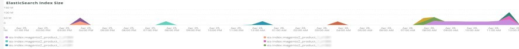

# Die [!UICONTROL Elasticsearch] tab

## [!UICONTROL Cluster Status Summary]:

Im ausgewählten Zeitraum wird die **[!UICONTROL Cluster Status Summary]** Rahmen zeigt den Farbstatus an, den die [!DNL Elasticsearch] Cluster durchlaufen. In diesem Beispiel befand sich der Cluster während des ausgewählten Zeitrahmens einmal im Grün-Status und während des ausgewählten Zeitrahmens einmal im Gelb-Status.

## [!UICONTROL Active Primary Shards]

Die **[!UICONTROL Active Primary Shards]** frame zeigt die unterschiedlichen Zahlen in Abhängigkeit von der Anzahl der aktiven primären Shards für die [!DNL Elasticsearch] Dienst.

Von [!DNL Elasticsearch]: Der endgültige Leitfaden [2.x]:

&quot;In [Dynamisch aktualisierbare Indizes](https://www.elastic.co/guide/en/elasticsearch/guide/2.x/dynamic-indices.html), erklärten wir, dass ein Shard ein Lucene-Index ist und dass ein [!DNL Elasticsearch] index ist eine Sammlung von Shards. Ihre Anwendung spricht mit einem Index und [!DNL Elasticsearch] leitet Ihre Anforderungen an die entsprechenden Shards weiter. Ein Schatten ist die Maßeinheit. Der kleinste Index, den Sie haben können, ist ein Index mit einem einzigen Shard. Dies mag für Ihre Bedürfnisse mehr als ausreichen - ein einzelner Schatten kann viele Daten enthalten - aber es beschränkt Ihre Skalierbarkeit.&quot;

Wenn ein Index erstellt wird, werden mehrere Shards mit diesem Index erstellt. Standardmäßig werden jedem neuen Index fünf primäre Shards zugewiesen, was bedeutet, dass ein Index auf fünf Knoten verteilt werden kann (ein Shard pro Knoten). Es gibt auch Replik Shards. Diese dienen hauptsächlich dem Failover. Replikat-Shards können Leseanforderungen erfüllen.

## [!UICONTROL Active Shards in Cluster]

Die **[!UICONTROL Active Shards in Cluster]** frame zeigt die Gesamtzahl der primären und replikatösen Shards in einem [!DNL Elasticsearch] Cluster.

## [!UICONTROL Index health - this will show the index name and color status]

Dieser Rahmen zeigt den Indexnamen und die Anzahl der Indexfarbstatus. Wenn Sie die Tabelle nach unten scrollen, sehen Sie denselben Indexnamen mit den Status Gelb und Rot . Die Zahl, die auf den 27 Indexnamen folgt, entspricht der Anzahl der Statusfarbe. Wenn es null ist, gab es während der ausgewählten Zeitrahmen keine Instanzen des Index, der sich in diesem Farbstatus befanden.

## [!UICONTROL Elasticsearch Status by node information]

Die **[!UICONTROL Elasticsearch Status by node information]** -Frame zeigt die [!DNL Elasticsearch] Clusterstatus nach Farbe und Knoten. Auf diese Weise können Sie angeben, welcher Knoten im [!DNL Elasticsearch] Der Cluster gibt den Status während des ausgewählten Zeitrahmens zurück.

## [!UICONTROL Elasticsearch index information]

Die **[!UICONTROL Elasticsearch index information]** -Tabelle zeigt den Indexnamen, den Knoten, auf dem sie sich befindet, die Anzahl der indizierten Dokumente, die Indexkonsistenz und die Indexgröße in MB zu einem bestimmten Zeitpunkt.

## [!UICONTROL Elasticsearch process CPU %]

Die **[!UICONTROL Elasticsearch process CPU %]** frame zeigt den Prozess-CPU-Prozentsatz nach [!DNL Elasticsearch] über den ausgewählten Zeitraum hinweg verarbeitet werden.

## [!UICONTROL Elasticsearch Memory garbage collection]

[!DNL Elasticsearch] ist ein Java-Prozess. Wenn der zugewiesene Speicher niedrig ist, wird die Speicherbereinigung gestartet, um den Speicher freizugeben. Wenn die Speicherbereinigung häufig erfolgt, ist dies ein Hinweis darauf, dass es zu viele Indizes oder Shards für den zugewiesenen Speicher geben kann. Es kann eine Möglichkeit geben, Indizes und Shards zu bereinigen oder [!DNL Elasticsearch] kann mehr Speicher benötigen.

## [!UICONTROL Elasticsearch Index information]

Wenn Indizes erstellt und aktualisiert werden, kann sich der Index-Zustand ändern.

## [!UICONTROL Elasticsearch Index Size]

Die **[!UICONTROL Elasticsearch Index Size]** frame zeigt den Indexnamen und die Größe des ausgewählten Zeitrahmens an. Es kann auf Probleme bei der Indizierung einer Site hinweisen.

## [!UICONTROL Elasticsearch Errors]

Die **[!UICONTROL Elasticsearch Errors]** Frame zeigt Fehler an mit [!DNL Elasticsearch] Wenn alle Shards fehlschlagen, wenn Parameterprobleme bei Suchvorgängen auftreten, Versionsfehler auftreten und alle Knoten nicht verfügbar sind, wird beispielsweise der Status Gelb zu Rot geändert.

## [!UICONTROL Elasticsearch Unassigned Shards]:

Nicht zugewiesene Shards führen dazu, dass ein Cluster vom Status Grün in Gelb wechselt.
