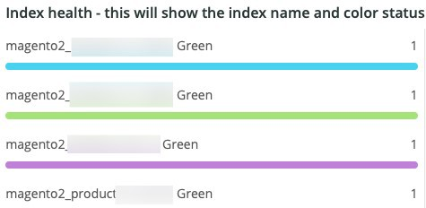

# Die Registerkarte [!UICONTROL Elasticsearch]

## [!UICONTROL Cluster Status Summary]:

Im ausgewählten Zeitraum zeigt der **[!UICONTROL Cluster Status Summary]** die Farbstatus an, die der [!DNL Elasticsearch] Cluster durchlaufen hat. In diesem Beispiel war der Cluster während des ausgewählten Zeitraums einmal im grünen Status und während des ausgewählten Zeitraums einmal im gelben Status.

## [!UICONTROL Active Primary Shards]

Der **[!UICONTROL Active Primary Shards]** zeigt die unterschiedlichen Zahlen in Abhängigkeit von der Anzahl der aktiven primären Shards für den [!DNL Elasticsearch]-Service des ausgewählten Kontos an.

Ab [!DNL Elasticsearch]: Das endgültige Handbuch [2.x]:

„In [Dynamisch aktualisierbare Indizes](https://www.elastic.co/guide/en/elasticsearch/guide/2.x/dynamic-indices.html) haben wir erläutert, dass ein Shard ein Lucene-Index ist und dass ein [!DNL Elasticsearch]-Index eine Sammlung von Shards ist. Ihre Anwendung spricht mit einem Index und leitet Ihre Anfragen [!DNL Elasticsearch] an die entsprechenden Shards weiter. Ein Scherbe ist die Maßeinheit. Der kleinste Index, den Sie haben können, ist einer mit einer einzelnen Shard. Dies mag mehr als ausreichend sein für Ihre Anforderungen - eine einzelne Shard kann eine Menge Daten speichern - aber es beschränkt Ihre Skalierbarkeit.“

Wenn ein Index erstellt wird, werden mehrere Shards mit diesem Index erstellt. Standardmäßig werden jedem neuen Index fünf primäre Shards zugewiesen, d. h. ein Index kann auf fünf Knoten verteilt werden (eine Shard pro Knoten). Es gibt auch Replikat-Shards. Diese dienen in erster Linie dem Failover. Replikat-Shards können Leseanforderungen bereitstellen.

## [!UICONTROL Active Shards in Cluster]

Der **[!UICONTROL Active Shards in Cluster]** zeigt die Gesamtzahl der primären und Replikat-Shards in einem [!DNL Elasticsearch] Cluster an.

## [!UICONTROL Index health - this will show the index name and color status]

Dieser Frame zeigt den Indexnamen und die Anzahl der Indexfarbstatus an. Wenn Sie die Tabelle nach unten scrollen, sehen Sie denselben Indexnamen mit gelben und roten Farbstatus. Die Zahl, die auf den 27 Indexnamen folgt, ist die Anzahl der Statusfarbe. Wenn er null ist, gab es während der ausgewählten Zeiträume keine Instanzen des Index, die sich in diesem Farbstatus befanden.

## [!UICONTROL Elasticsearch Status by node information]

Der **[!UICONTROL Elasticsearch Status by node information]** zeigt den [!DNL Elasticsearch] Cluster-Status nach Farbe und Knoten an. Dies hilft bei der Angabe, welcher Knoten im [!DNL Elasticsearch] Cluster während des ausgewählten Zeitraums welchen Status zurückgibt.

## [!UICONTROL Elasticsearch index information]

Die **[!UICONTROL Elasticsearch index information]** Tabelle zeigt den Indexnamen, den Knoten, auf dem er sich befindet, die Anzahl der indizierten Dokumente, den Indexzustand und die Indexgröße in MB zu einem bestimmten Zeitpunkt an.

## [!UICONTROL Elasticsearch process CPU %]

Der **[!UICONTROL Elasticsearch process CPU %]** zeigt den CPU-Prozentsatz des Prozesses durch den [!DNL Elasticsearch] im ausgewählten Zeitraum an.

## [!UICONTROL Elasticsearch Memory garbage collection]

[!DNL Elasticsearch] ist ein Java-Prozess. Wenn nicht genügend zugewiesener Speicher vorhanden ist, wird die Speicherbereinigung initiiert, um Speicher freizugeben. Wenn häufige Speicherbereinigung erfolgt, ist dies ein Hinweis darauf, dass möglicherweise zu viele Indizes oder Shards für den zugewiesenen Speicher vorhanden sind. Es kann eine Gelegenheit geben, die Indizes und Shards zu bereinigen, oder [!DNL Elasticsearch] benötigen möglicherweise mehr Speicher.

## [!UICONTROL Elasticsearch Index information]

Wenn Indizes erstellt und aktualisiert werden, kann sich der Zustand des Index ändern.

## [!UICONTROL Elasticsearch Index Size]

Der **[!UICONTROL Elasticsearch Index Size]** zeigt den Indexnamen und die Indexgröße für den ausgewählten Zeitraum an. Dies kann auf Probleme bei der Indizierung einer Site hinweisen.

## [!UICONTROL Elasticsearch Errors]

Der **[!UICONTROL Elasticsearch Errors]** zeigt Fehler an, [!DNL Elasticsearch] beispielsweise nicht mehr genügend Platz vorhanden sind, vom Status Gelb zu Rot wechseln, wenn alle Shards fehlschlagen, Parameterprobleme bei Suchvorgängen auftreten, Versionsfehler auftreten und alle Knoten nicht verfügbar sind.

## [!UICONTROL Elasticsearch Unassigned Shards]:

Nicht zugewiesene Shards führen dazu, dass ein Cluster vom grünen Status in den gelben Status wechselt.
