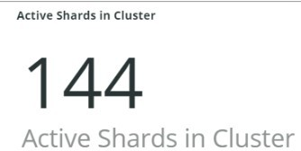
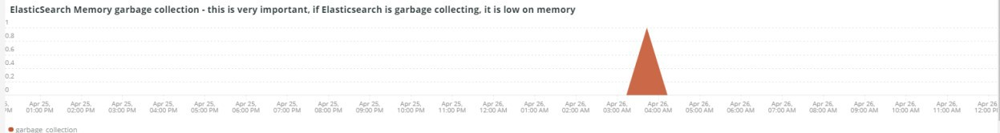

# Registerkarte [!UICONTROL Elasticsearch]

## [!UICONTROL Cluster Status Summary]:

Im ausgewählten Zeitraum zeigt der Frame **[!UICONTROL Cluster Status Summary]** die Farbstatus an, die der [!DNL Elasticsearch]-Cluster durchlaufen hat. In diesem Beispiel befand sich der Cluster während des ausgewählten Zeitrahmens einmal im Grün-Status und während des ausgewählten Zeitrahmens einmal im Gelb-Status.

## [!UICONTROL Active Primary Shards]

Der Frame **[!UICONTROL Active Primary Shards]** zeigt die unterschiedlichen Zahlen in Abhängigkeit von der Anzahl der aktiven primären Shards für den [!DNL Elasticsearch] -Dienst des ausgewählten Kontos an.

Von [!DNL Elasticsearch]: Der endgültige Guide [2.x]:

&quot;In [Dynamisch aktualisierbare Indizes](https://www.elastic.co/guide/en/elasticsearch/guide/2.x/dynamic-indices.html) haben wir erklärt, dass ein Shard ein Lucene-Index ist und dass ein [!DNL Elasticsearch]-Index eine Sammlung von Shards ist. Ihre Anwendung spricht mit einem Index und [!DNL Elasticsearch] leitet Ihre Anforderungen an die entsprechenden Shards weiter. Ein Schatten ist die Maßeinheit. Der kleinste Index, den Sie haben können, ist ein Index mit einem einzigen Shard. Dies mag für Ihre Bedürfnisse mehr als ausreichen - ein einzelner Schatten kann viele Daten enthalten - aber es beschränkt Ihre Skalierbarkeit.&quot;

Wenn ein Index erstellt wird, werden mehrere Shards mit diesem Index erstellt. Standardmäßig werden jedem neuen Index fünf primäre Shards zugewiesen, was bedeutet, dass ein Index auf fünf Knoten verteilt werden kann (ein Shard pro Knoten). Es gibt auch Replik Shards. Diese dienen hauptsächlich dem Failover. Replikat-Shards können Leseanforderungen erfüllen.

## [!UICONTROL Active Shards in Cluster]

Der Frame &quot;**[!UICONTROL Active Shards in Cluster]**&quot;zeigt die Gesamtzahl der primären und Replikatshards in einem [!DNL Elasticsearch]-Cluster an.

## [!UICONTROL Index health - this will show the index name and color status]

Dieser Rahmen zeigt den Indexnamen und die Anzahl der Indexfarbstatus. Wenn Sie die Tabelle nach unten scrollen, sehen Sie denselben Indexnamen mit den Status Gelb und Rot . Die Zahl, die auf den 27 Indexnamen folgt, entspricht der Anzahl der Statusfarbe. Wenn es null ist, gab es während der ausgewählten Zeitrahmen keine Instanzen des Index, der sich in diesem Farbstatus befanden.

## [!UICONTROL Elasticsearch Status by node information]

Der Frame **[!UICONTROL Elasticsearch Status by node information]** zeigt den Status des [!DNL Elasticsearch] Clusters nach Farbe und Knoten an. Auf diese Weise können Sie angeben, welcher Knoten im [!DNL Elasticsearch]-Cluster den Status während des ausgewählten Zeitrahmens zurückgibt.

## [!UICONTROL Elasticsearch index information]

Die Tabelle &quot;**[!UICONTROL Elasticsearch index information]**&quot; zeigt den Indexnamen, den Knoten, in dem sie sich befindet, die Anzahl der indizierten Dokumente, die Indexkonsistenz und die Indexgröße in MB zu einem bestimmten Zeitpunkt.

## [!UICONTROL Elasticsearch process CPU %]

Der Frame **[!UICONTROL Elasticsearch process CPU %]** zeigt den Prozess-CPU-Prozentsatz nach dem Prozess [!DNL Elasticsearch] über den ausgewählten Zeitraum an.

## [!UICONTROL Elasticsearch Memory garbage collection]

[!DNL Elasticsearch] ist ein Java-Prozess. Wenn der zugewiesene Speicher niedrig ist, wird die Speicherbereinigung gestartet, um den Speicher freizugeben. Wenn die Speicherbereinigung häufig erfolgt, ist dies ein Hinweis darauf, dass es zu viele Indizes oder Shards für den zugewiesenen Speicher geben kann. Es kann eine Möglichkeit geben, Indizes und Shards zu bereinigen, oder [!DNL Elasticsearch] benötigt möglicherweise mehr Speicher.

## [!UICONTROL Elasticsearch Index information]

Wenn Indizes erstellt und aktualisiert werden, kann sich der Index-Zustand ändern.

## [!UICONTROL Elasticsearch Index Size]

Der Frame **[!UICONTROL Elasticsearch Index Size]** gibt den Indexnamen und die Größe über den ausgewählten Zeitraum hinweg an. Es kann auf Probleme bei der Indizierung einer Site hinweisen.

## [!UICONTROL Elasticsearch Errors]

Der Frame &quot;**[!UICONTROL Elasticsearch Errors]**&quot;zeigt Fehler mit &quot;[!DNL Elasticsearch]&quot;an, z. B. den Leerraum zu überschreiten, von Gelb zu Rot zu wechseln, wenn alle Shards fehlschlagen, wenn Parameterprobleme mit Suchvorgängen auftreten, Versionsfehler auftreten und alle Knoten nicht verfügbar sind.

## [!UICONTROL Elasticsearch Unassigned Shards]:

Nicht zugewiesene Shards führen dazu, dass ein Cluster vom Status Grün in Gelb wechselt.
