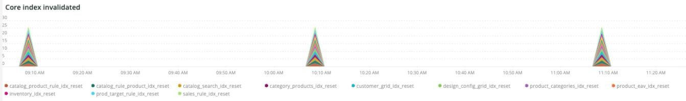
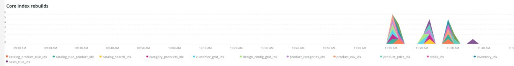
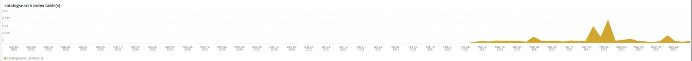
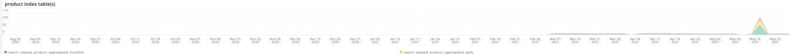

# Die Registerkarte [!UICONTROL Indexing]

Auf der Registerkarte **[!UICONTROL Indexing]** wird versucht, Probleme mit der Indizierung zu erklären und mögliche Ursachen zu identifizieren.

## [!UICONTROL Core index invalidated]

Der **[!UICONTROL Core index invalidated]**-Frame untersucht die Indizierungsinvalidierung über einen ausgewählten Zeitraum. Wenn die Indizierung gleichzeitig mit anderen ressourcenintensiven [!DNL crons] erfolgt, bedeutet dies eine hohe Belastung für die Site-Ressourcen.

* `%Catalog Product Rule indexer has been invalidated%`) als `catalog_product_rule_idx_reset`
* `%Catalog Rule Product indexer has been invalidated%`) als `catalog_rule_product_idx_reset`
* `%Catalog Search indexer has been invalidated%`) als `catalog_search_idx_reset`
* `%Category Products indexer has been invalidated%`) als `category_products_idx_reset`
* `%Customer Grid indexer has been invalidated%`) als `customer_grid_idx_reset`
* `%Design Config Grid indexer has been invalidated%`) als `design_config_grid_idx_`
* `%Product Categories indexer has been invalidated%`) als `product_categories_idx_reset`
* `%Product EAV indexer has been invalidated%`) als `product_eav_idx_reset`
* `%Product Price indexer has been invalidated%`) als `product_price_idx_reset`
* `%Stock indexer has been invalidated%`) als `stock_idx_reset`
* `%Inventory indexer has been invalidated%`) als `inventory_idx_reset`
* `%Inventory indexer has been invalidated%`) als `inventory_idx_reset`
* `%Sales Rule indexer has been invalidated%`) als `sales_rule_idx_reset`

## [!UICONTROL Core index rebuilds]

Der **[!UICONTROL Core index rebuilds]** betrachtet die Neuerstellung des Kernindex über einen ausgewählten Zeitraum. Im Folgenden finden Sie die Zeichenfolgen, die aus den Protokollen analysiert werden, um den Abschluss der Neuerstellung des Index anzuzeigen.

* `%Catalog Product Rule index has been rebuilt%`) als `catalog_product_rule_idx`
* `%Catalog Rule Product index has been rebuilt%`) als `catalog_rule_product_idx`
* `%Catalog Search index has been rebuilt%`) als `catalog_search_idx`
* `%Category Products index has been rebuilt successfully%`) als `category_products_idx`
* `%Customer Grid index has been rebuilt%`) als `customer_grid_idx`
* `%Design Config Grid index has been rebuilt%`) als `design_config_grid_idx`
* `%Product Categories index has been rebuilt%`) als `product_categories_idx`
* `%Product EAV index has been rebuilt%`) als `product_eav_idx`
* `%Product Price index has been rebuilt%`) als `product_price_idx`
* `%Stock index has been rebuilt%`) als `stock_idx`
* `%Inventory index has been rebuilt successfully%`) als `inventory_idx`
* `%Product/Target Rule index has been rebuilt successfully%`) als `prod_target_rule_idx`
* `%Sales Rule index has been rebuilt successfully%`) als `sales_rule_idx`

## [!UICONTROL catalogsearch index table(s)]

Der **[!UICONTROL catalogsearch index table(s)]** zeigt Katalogsuchindex-Tabellen für einen ausgewählten Zeitraum an. Bei dieser Abfrage wird die Dauer aller Datenspeichervorgänge für Tabellen mit `%catalogsearch%` im Tabellennamen untersucht.

## [!UICONTROL product index table(s)]

Der **[!UICONTROL product index table(s)]** betrachtet die Produktindextabellen in einem ausgewählten Zeitraum. Bei dieser Abfrage wird die Dauer aller Datenspeichervorgänge für Tabellen mit `%product%` im Tabellennamen untersucht.
