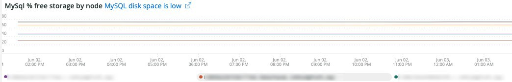

# Die Registerkarte [!UICONTROL MySQL]

## [!UICONTROL MySQL% free storage by node]

Viele Probleme werden dadurch verursacht, dass MySQL in dem MySQL zugeordneten Speicher nicht genügend Speicherplatz hat (`datadir` MySQL-Konfigurationseinstellung ist standardmäßig `/data/mysql`) oder dass der `tmpdir` nicht mehr genügend Speicherplatz hat. Der `tmpdir` (MySQL-Einstellung) ist `/tmp`. Der **[!UICONTROL MySQL% free storage by node]** zeigt die `/, /tmp` (sofern als separate Halterung definiert) und den `/data/mysql` Prozentsatz des freien Speichers an. Ab MySQL Version 5.7 (MariaDB Version 10.2) werden unkomprimierte `tmp`-Tabellen in einen `tmp` Tablespace im `/data/mysql` in der Datei (ibtmp1) geschrieben. Diese Datei wird standardmäßig ohne Einschränkung automatisch erweitert. Da es sich um einen Tablespace handelt, wird er nicht kleiner und wird beim Neustart von MySQL auf 12 MB zurückgesetzt.

## [!UICONTROL MySQL Connections by Node]

Der **[!UICONTROL MySQL Connections by Node]** zeigt Zeiträume von Datenbankknotenausfällen oder große Verbindungsvolumina an.

## [!UICONTROL MySQL Node Summary]

Die **[!UICONTROL MySQL Node Summary]** Tabelle zeigt Details zum Datenbankknoten an, z. B. die Softwareversion und den Instanztyp (Größe).

## [!UICONTROL Galera Number of Nodes in cluster]

Der **[!UICONTROL Galera Number of Nodes in cluster]** zeigt Informationen aus den MySQL-Protokollen an. Wenn Knoten beitreten und einen Cluster verlassen, werden nur die Nachrichten für den ausgewählten Zeitraum angezeigt. Wenn ein Knoten den Cluster vor Ablauf des Zeitraums verlässt, ist innerhalb dieses Zeitraums keine Meldung vorhanden. Wenn Sie vermuten, dass der Datenbank ein Knoten ausgeht, erweitern Sie den Zeitrahmen auf einen größeren Zeitraum, um zu sehen, ob zusätzliche Informationen angezeigt werden. Wenn während des Zeitraums Informationen vorhanden sind, die auf weniger als alle Knoten im [!DNL Galera] Cluster hinweisen, erweitern Sie den Zeitrahmen, um zu sehen, ob Sie bestimmen können, wann der Knoten den Cluster verlassen hat.

## [!UICONTROL MySQL shutdowns and starts]

Der **[!UICONTROL MySQL shutdowns and starts]** Frame erkennt, wenn ein Knoten heruntergefahren wird. Die [!DNL Galera] Knoten werden entfernt und werden automatisch aus dem [!DNL Galera] Knoten entfernt. Dies führt normalerweise zu einem Neustart des MySQL-Service.

## [!UICONTROL Galera log]

Der **[!UICONTROL Galera log]** zeigt die Anzahl bestimmter Signale aus den MySQL-Protokollen bezüglich [!DNL Galera] Knoten, deren Status und der Statusänderungen des [!DNL Galera]-Clusters an.

* &#39;%1047 WSREP hat den Knoten noch nicht für die Anwendungsverwendung vorbereitet (%) als &#39;node_not_prep_for_use&#39;
* &#39;%\[ERROR\] WSREP: Lesen von: wsrep_sst_xtrabackup-v2%&#39;) als &#39;xtrabackup_read_fail&#39; fehlgeschlagen
* &#39;%\[ERROR\] WSREP: Prozess abgeschlossen mit Fehler: wsrep_sst_xtrabackup-v2 %&#39;) als &#39;xtrabackup_compl_w_err&#39;
* &#39;%\[ERROR\] WSREP: rbr write fail%&#39;) als &#39;rbr_write_fail&#39;
* &#39;%self-leave%&#39;) als &#39;susp_node&#39;
* &#39;%members = 3/3 (verbunden/insgesamt)%&#39;) as&#39;3of3&#39;
* &#39;%members = 2/3 (added/total)%&#39;) as&#39;2of3&#39;
* &#39;%members = 2/2%&#39;) als &#39;2of2&#39;
* &#39;%members = 1/2%&#39;) als &#39;1of2&#39;
* &#39;%members = 1/3%&#39;) als &#39;1of3&#39;
* &#39;%members = 1/1%&#39;) als &#39;1of1&#39;
* &#39;%\[Hinweis\] /usr/sbin/mysqld (mysqld 10.%&#39;) als &#39;SQL_RESTART&#39;
* &#39;%Quorum: Kein Knoten mit vollständigem Status:%&#39;) als &#39;no_node_count&#39;
* %WSREP: Mitglied 0%) als &#39;mem_0&#39;
* &#39;%WSREP: Mitglied 1.0%&#39;) als &#39;mem_1&#39;
* &#39;%WSREP: Mitglied 2%&#39;) als &#39;mem2&#39;
* &#39;%WSREP: Mit Gruppe synchronisiert, für Verbindungen bereit%&#39;) als &#39;bereit&#39;
* &#39;%/usr/sbin/mysqld, Version:%&#39;) als &#39;mysql_restart_mysql.slow&#39;
* &#39;%\[Note\] WSREP: Neue Cluster-Ansicht: globaler Status:%&#39;) als &#39;galera_cluster_view_change&#39;

## [!UICONTROL Galera Log by Host]

Der **[!UICONTROL Galera Log by Host]** ist mit dem **[!UICONTROL Galera log]** identisch, nur dass er zur Fehlerbehebung nach Knoten unterteilt ist.

## [!UICONTROL Database performance]

Der **[!UICONTROL Database performance]** zeigt die Datenbankleistung während bestimmter Anforderungen an. Sie können jede Metrik anzeigen, indem Sie in den farbigen Symbolen unter dem Diagramm darauf klicken. Viele der unter &quot;[&#x200B; der MySQL-Datenbankleistung mit New Relic&quot; &#x200B;](https://newrelic.com/blog/how-to-relic/how-to-monitor-mysql) Metriken finden Sie in diesem Frame.

* average(query.queriesPerSecond)
* average(query.slowQueriesPerSecond)
* average(db.createdTmpDiskTablesPerSecond)
* average(db.createdTmpFilesPerSecond)
* average(db.tablesLocksWaitedPerSecond)
* average(db.innodb.rowLockTimeAvg)
* average(db.innodb.rowLockWaitsPerSecond)

## [!UICONTROL Transaction Database Call Count]

Der **[!UICONTROL Transaction Database Call Count]** zeigt die Anzahl der Datenbankaufrufe an, die von jeder Transaktionsfacette durchgeführt werden. Dies scheint zeilenfokussiert zu sein und nicht auf Anweisungen.

## [!UICONTROL Cron_schedule table updates]

Der **[!UICONTROL Cron_schedule table updates]** zeigt die maximale Dauer von Datenbankaktualisierungen an der Tabelle cron_schedule für den ausgewählten Zeitraum an.

## [!UICONTROL Slow Query Traces]

Der **[!UICONTROL Slow Query Traces]** zeigt die Tabelle und den Anfragetyp an, in denen langsame Abfrageabläufe vorhanden sind. Für Abfragetransaktionen, die länger als fünf Sekunden dauern, wird eine langsame Abfrageablaufverfolgung erstellt. Wichtig für diesen Frame sind die Aktualisierungsabfragen. Wenn eine Tabelle durch `UPDATE`-, `DELETE`- und `INSERT`-Anweisungen aktualisiert wird, können Tabellen über einen bestimmten Zeitraum gesperrt werden.

Auch `SELECT` Anweisungen können Zeilen sperren, wenn sie mit FOR UPDATE verwendet werden.

## [!UICONTROL Datastore Operations tables]

## [!UICONTROL Cron table change]

Der **[!UICONTROL Cron table change]**-Frame sucht nach Fehlermeldungen des Typs „Keine Sperre für Cron-Auftrag:“, zusammen mit einem bestimmten PHP-Speicherfehler und Sperren in Verbindung mit der `cron_schedule`. Wenn die `cron_schedule`-Tabelle gesperrt ist (z. B. durch eine `DELETE` Abfrage, die für sie ausgeführt wird), blockiert sie die Ausführung anderer Crons.

## [!UICONTROL Deadlocks]

Der **[!UICONTROL Deadlocks]**-Frame betrachtet die folgenden aus den MySQL-Protokollen geparsten Zeichenfolgen:

* &#39;%PHP Schwerwiegender Fehler: Zulässige Speichergröße von%&#39;) als php_mem_error
* &#39;%GET LOCK; versuchen Sie, die Transaktion neu zu starten. Abfrage war: DELETE FROM \`cron_schedule%&#39;) as cron_sched_lock_del
* &#39;%-Sperre für Cron-Auftrag: indexer_reindex_all_invalid%&#39;) als &#39;lock_indexer_reindex_all_invalid%&#39;
* &#39;%-Sperre für Cron-Auftrag: cron_schedule%&#39;) als &#39;lock_cron_schedule&#39;
* &#39;%-Sperre für Cron-Auftrag:%&#39;) als &#39;total_cron_lock&#39;
* &#39;%Allgemeiner Fehler: 1205 Sperrwartezeitlimit überschritten%&#39;) als &#39;sql_1205_lock&#39;
* &#39;%ERROR 1213 (40001): Deadlock beim Abrufen von lock%&#39;) als &#39;sql_1213_lock&#39; gefunden
* &#39;%SQLSTATE[40001]: Serialisierungsfehler: 1213 Deadlock found%&#39;) als &#39;sql_1213_lock2&#39;
* &#39;%-Sperre für Cron-Auftrag: indexer_update_all_views%&#39;) als &#39;lock_indexer_update_all_views&#39;
* &#39;%-Sperre für Cron-Auftrag: sales_grid_order_bill_async_insert%&#39;) als &#39;lock_sales_grid_order_bill_async_insert&#39;,
* &#39;%-Sperre für Cron-Auftrag: staging_remove_updates%&#39;) als &#39;lock_staging_remove_updates&#39; festgelegt
* &#39;%-Sperre für Cron-Auftrag: sales_grid_order_shipping_async_insert%&#39;) als &#39;lock_sales_grid_order_shipping_async_insert&#39;
* &#39;%-Sperre für Cron-Auftrag: Amazon_Payments_PROCESS_QUEUED_REFUNDS%&#39;) als &#39;LOCK_AMAZON_PAYMENTS_PROCESS_QUEUED_REFUNDS&#39;
* &#39;%-Sperre für Cron-Auftrag: sales_send_order_shipping_emails%&#39;) als &#39;lock_sales_send_order_shipping_emails&#39;
* &#39;%-Sperre für Cron-Auftrag: staging_synchronize_entities_period%&#39;) als &#39;lock_staging_synchronize_entities_period&#39;
* &#39;%-Sperre für Cron-Auftrag: indexer_clean_all_changelogs%&#39;) als &#39;lock_indexer_clean_all_changelogs&#39;
* &#39;%-Sperre für Cron-Auftrag: magento_targetRule_index_reindex%&#39;) als &#39;lock_magento_targetRule_index_reindex&#39;
* &#39;%-Sperre für Cron-Auftrag: newsletter_send_all%&#39;) als &#39;lock_newsletter_send_all&#39;
* &#39;%-Sperre für Cron-Auftrag: newsletter_send_all%&#39;) als &#39;lock_newsletter_send_all&#39;
* &#39;%-Sperre für Cron-Auftrag: sales_send_order_emails%&#39;) als &#39;lock_sales_send_order_emails&#39;
* &#39;%-Sperre für Cron-Auftrag: sales_send_order_creditmemo_emails%&#39;) als &#39;lock_sales_send_order_creditmemo_emails&#39;
* &#39;%-Sperre für Cron-Auftrag: sales_grid_order_creditmemo_async_insert%&#39;) als &#39;lock_sales_grid_order_creditmemo_async_insert&#39;
* &#39;%-Sperre für Cron-Auftrag: bulk_cleanup%&#39;) als &#39;lock_bulk_cleanup&#39;
* &#39;%-Sperre für Cron-Auftrag: flush_preview_quota%&#39;) als &#39;lock_flush_preview_quota&#39;
* &#39;%-Sperre für Cron-Auftrag: sales_send_order_bill_emails%&#39;) als &#39;lock_sales_send_order_bill_emails&#39;
* &#39;%-Sperre für Cron-Auftrag: sales_send_order_bill_emails%&#39;) als &#39;lock_sales_send_order_bill_emails&#39;
* &#39;%-Sperre für Cron-Auftrag: CAPTCHA_DELETE_EXPIRED_IMAGES%&#39;) als &#39;LOCK_CAPTCHA_DELETE_EXPIRED_IMAGES&#39;
* &#39;%-Sperre für Cron-Auftrag: magento_newrelicreporting_cron%&#39;) als &#39;lock_magento_newrelicreporting_cron&#39;
* &#39;%-Sperre für Cron-Auftrag: OUTDATED_AUTHENTICATION_FAILS_CLEANUP%&#39;) als &#39;LOCK_OUTDATED_AUTHENTICATION_FAULTS_CLEANUP&#39;
* &#39;%-Sperre für Cron-Auftrag: send_notification%&#39;) als &#39;lock_send_notification&#39;
* &#39;%-Sperre für Cron-Auftrag: magento_giftcardaccount_generage_codes_pool%&#39;) als &#39;lock_magento_giftcardaccount_generage_codes_pool&#39;
* &#39;%-Sperre für Cron-Auftrag: catalog_product_frontend_actions_flush%&#39;) als &#39;lock_catalog_product_frontend_actions_flush&#39;
* &#39;%-Sperre für Cron-Auftrag: mysqlmq_clean_messages%&#39;) als &#39;mysqlmq_clean_messages&#39;
* &#39;%-Sperre für Cron-Auftrag: CATALOG_PRODUCT_ATTRIBUTE_VALUE_SYNCHRONIZE%&#39;) als &#39;LOCK_CATALOG_PRODUCT_ATTRIBUTE_VALUE_SYNCHRONIZE&#39;
* &#39;%-Sperre für Cron-Auftrag: DDG_AUTOMATION_IMPORTER%&#39;) als &#39;lock_DDG_AUTOMATION_IMPORTER&#39;
* &#39;%-Sperre für Cron-Auftrag: DDG_AUTOMATION_REVIEWS_AND_WISHLIST%&#39;) als &#39;LOCK_DDG_AUTOMATION_REVIEWS_AND_WISHLIST&#39;
* &#39;%-Sperre für Cron-Auftrag: CAPTCHA_DELETE_OLD_ATTEMPTS%&#39;) als &#39;LOCK_CAPTCHA_DELETE_OLD_ATTEMPTS&#39;
* &#39;%-Sperre für Cron-Auftrag: catalog_product_outdated_price_values_cleanup%&#39;) als &#39;lock_catalog_product_outdated_price_values_cleanup&#39;
* &#39;%-Sperre für Cron-Auftrag: consumers_runner%&#39;) als &#39;lock_consumers_runner&#39;
* &#39;%-Sperre für Cron-Auftrag: DDG_AUTOMATION_CUSTOMER_SUBSCRIBER_GAST_SYNC%&#39;) als &#39;LOCK_DDG_AUTOMATION_CUSTOMER_SUBSCRIBER_GAST_SYNC&#39;
* &#39;%-Sperre für Cron-Auftrag: get_amazon_collection_updates%&#39;) als &#39;lock_get_amazon_collection_updates&#39;
* &#39;%-Sperre für Cron-Auftrag: get_amazon_authorization_updates%&#39;) als &#39;lock_send_get_amazon_authorization_updates&#39;
* &#39;%-Sperre für Cron-Auftrag: temando_process_platform_events%&#39;) als &#39;lock_temando_process_platform_events&#39;
* &#39;%-Sperre für Cron-Auftrag: DDG_AUTOMATION_STATUS%&#39;) als &#39;lock_DDG_AUTOMATION_STATUS&#39;
* &#39;%-Sperre für Cron-Auftrag: DDG_AUTOMATION_STATUS%&#39;) als &#39;lock_DDG_AUTOMATION_STATUS&#39;
* &#39;%-Sperre für Cron-Auftrag: sales_clean_orders%&#39;) als &#39;lock_sales_clean_orders&#39;
* &#39;%-Sperre für Cron-Auftrag: CATALOG_INDEX_REFRESH_PRICE%&#39;) als &#39;lock_catalog_index_refresh_price&#39;
* &#39;%-Sperre für Cron-Auftrag: magento_reward_balance_warning_notification%&#39;) als &#39;lock_magento_reward_balance_warning_notification&#39;
* &#39;%-Sperre für Cron-Auftrag: analytics_update%&#39;) als &#39;lock_analytics_update&#39;
* &#39;%-Sperre für Cron-Auftrag: messagequeue_clean_outdated_locks%&#39;) als &#39;lock_messagequeue_clean_outdated_locks&#39;
* &#39;%-Sperre für Cron-Auftrag: messagequeue_clean_outdated_locks%&#39;) als &#39;lock_messagequeue_clean_outdated_locks&#39;
* &#39;%-Sperre für Cron-Auftrag: staging_apply_version%&#39;) als &#39;lock_staging_apply_version&#39;
* &#39;%-Sperre für Cron-Auftrag: magento_reward_expire_points%&#39;) als &#39;lock_magento_reward_expire_points&#39;
* &#39;%-Sperre für Cron-Auftrag: yotpo_yotpo_orders_sync%&#39;) als &#39;lock_yotpo_orders_sync&#39;
* &#39;%-Sperre für Cron-Auftrag: CATALOG_EVENT_STATUS_CHECKER%&#39;) als &#39;lock_catalog_event_status_checker&#39;
* &#39;%-Sperre für Cron-Auftrag: DDG_AUTOMATION_CAMPAIGN%&#39;) als &#39;lock_DDG_AUTOMATION_CAMPAIGN&#39;
* &#39;%-Sperre für Cron-Auftrag: visitor_clean%&#39;) als &#39;lock_visitor_clean&#39;
* &#39;%-Sperre für Cron-Auftrag: SCConnector_Verify_Website%&#39;) als &#39;lock_SCConnector_Verify_Website&#39;
* &#39;% lock for cron job: DDG_AUTOMATION_EMAIL_TEMPLATES%&#39;) als &#39;lock_DDG_AUTOMATION_EMAIL_TEMPLATES&#39;
* &#39;%-Sperre für Cron-Auftrag: aggregate_sales_report_order_data%&#39;) als &#39;lock_aggregate_sales_report_order_data&#39;
* &#39;%-Sperre für Cron-Auftrag: DDG_AUTOMATION_CATALOG_SYNC%&#39;) als &#39;LOCK_DDG_AUTOMATION&#39;

## [!UICONTROL DB Statistics]

Der **[!UICONTROL DB Statistics]** zeigt pro Sekunde Löschvorgänge, Schreibvorgänge, gelesene Zeilen, Aktualisierungen und langsame Abfragen an.

## [!UICONTROL Request frequency]

## [!UICONTROL Database Errors]

Der **[!UICONTROL Database Errors]** zeigt eine Vielzahl von Datenbankwarnungen [&#x200B; -fehlern](https://mariadb.com/kb/en/mariadb-error-codes/):

* &#39;%Speichergröße zugewiesen für die temporäre Tabelle ist mehr als 20% von InnoDB_BUFFER_POOL_SIZE%&#39; als &#39;temp_tbl_buff_pool&#39;
* &#39;%\[ERROR\] WSREP: rbr write fail%&#39;) als &#39;rbr_write_fail&#39;
* &#39;%mysqld: Datenträger voll%&#39;) als &#39;disk_full&#39; angegeben
* &#39;%Error number 28%&#39;) als &#39;err_28&#39;
* &#39;%rollback%&#39;) als &#39;rollback&#39;
* &#39;%Foreign key constraint failed for table%&#39;) as &#39;Foreign_key_constraint&#39;
* &#39;%ERROR_CODE: 1114%&#39;) als &#39;sql_1114_full&#39;%CRITICAL: SQLSTATE[HY000] [2006] MySQL Server ist verschwunden%&#39;) als &#39;sql_gone&#39;
* &#39;%SQLSTATE[HY000] [1040] Zu viele Verbindungen%&#39;) als &#39;sql_1040&#39;
* &#39;%CRITICAL: SQLSTATE[HY000] [2002]%&#39;) als &#39;sql_2002&#39;
* &#39;%SQLSTATE[08S01]:%&#39;) als &#39;sql_1047&#39;
* &#39;%[Warnung] Verbindung abgebrochen%&#39;) als &#39;aborted_conn&#39;
* &#39;%SQLSTATE[23000]: Verletzung der Integritätsbeschränkung:%&#39;) als &#39;sql_23000&#39;
* &#39;%1205 Sperrwartezeitlimit%&#39;) als &#39;SQL_1205&#39;
* &#39;%SQLSTATE[HY000] [1049] Unknown database%&#39;) als &#39;sql_1049&#39;
* &#39;%SQLSTATE[42S02]: Basistabelle oder Ansicht nicht gefunden:%&#39;) als &#39;sql_42S02&#39;
* &#39;%Allgemeiner Fehler: 1114%&#39;) als &#39;sql_1114&#39;
* %SQLSTATE[40001]%) als &#39;sql_1213&#39;
* &#39;%SQLSTATE[42S22]: Spalte nicht gefunden: 1054 Unbekannte Spalte%&#39;) als &#39;sq1_1054&#39;
* &#39;%SQLSTATE[42000]: Syntaxfehler oder Zugriffsverletzung:%&#39;) als &#39;sql_42000&#39;
* &#39;%SQLSTATE[21000]: Kardinalitätsverletzung:%&#39;) als &#39;sql_1241&#39;
* &#39;%SQLSTATE[22003]:%&#39;) als &#39;sql_22003&#39;
* &#39;%SQLSTATE[HY000] [9000] Client mit IP-Adresse%&#39;) als &#39;sql_9000&#39;
* &#39;%SQLSTATE[HY000]: Allgemeiner Fehler: 2014%&#39;) als &#39;sql_2014&#39;
* &#39;%1927 Verbindung wurde abgebrochen%&#39;) als &#39;sql_1927&#39;
* &#39;%1062 \[ERROR\] InnoDB:%&#39;) als &#39;sql_1062_e&#39;
* &#39;%[Hinweis] WSREP: Speicherzuordnung wird auf Festplatte geleert …%&#39;) als &#39;mem_map_flush&#39;
* &#39;%Interner MariaDB-Fehler-Code: 1146%&#39;) als &#39;sql_1146&#39;
* &#39;%Interner MariaDB-Fehler-Code: 1062%&#39;) als &#39;sql_1062&#39; * &#39;%1062 [Warnung] InnoDB:%&#39;) als &#39;sql_1062_w&#39;
* &#39;%Interner MariaDB-Fehler-Code: 1064%&#39;) als &#39;sql_1064&#39;
* &#39;%InnoDB: Assertionsfehler in Datei &#39;%&#39;) als &#39;Assertion_err&#39;
* %mysqld_safe Anzahl der laufenden Prozesse: 0%) als &#39;mysql_oom&#39;
* &#39;%\[ERROR\] mysqld hat das Signal%&#39;) als &#39;mysql_sigterm&#39; erhalten
* &#39;%1452 Cannot add%&#39;) as &#39;sql_1452&#39;
* &#39;%ERROR 1698%&#39;) als &#39;sql_1698&#39;
* &#39;%SQLSTATE[HY000]: Allgemeiner Fehler: 3%&#39;) als &#39;cnt_wrt_tmp&#39;
* &#39;%Allgemeiner Fehler: 1 %&#39;) als &#39;sql_syntax&#39;
* &#39;%42S22%&#39;) als &#39;sql_42S22&#39;
* &#39;%InnoDB: Fehler (doppelter Schlüssel)%&#39; als &#39;InnoDB_dup_key&#39; AUS Protokollzeitreihen

## [!UICONTROL DB Error Table]

Der **[!UICONTROL DB Error Table]** Frame zeigt dieselben Informationen wie der **[!UICONTROL Database Errors]** Frame an, kann jedoch nach Knoten und im Tabellenformat angezeigt werden. Siehe [MariaDB-](https://mariadb.com/kb/en/mariadb-error-codes/) für weitere Informationen.

## [!UICONTROL Database Traces]

Der **[!UICONTROL Database Traces]** zeigt die Datenbankspuren nach Typ über die ausgewählte Zeitleiste an.

## [!UICONTROL Database processes]

Im **[!UICONTROL Database processes]** werden die Datenbankprozesse, Umgebungen und Knotenkennungen angezeigt.

## [!UICONTROL MySQL Non-Sleeping Threads by Node]

Der **[!UICONTROL MySQL Non-Sleeping Threads by Node]** zeigt die Verbindungs-Threads zur Datenbank an. Dieser Rahmen zeigt die aktiven Threads.

## [!UICONTROL MySQL Running and Sleeping Threads by environment]

Der **[!UICONTROL MySQL Running and Sleeping Threads by environment]** zeigt sowohl aktive als auch aktive Verbindungen zur Datenbank an. Wenn es Verbindungen zur Datenbank gibt, für die langsame Abfragen in den Ruhezustand übergegangen sind, gibt es ruhende Verbindungen. Schlafende Verbindungen können Datenbankabfragen sein, die durch gesperrte Zeilen oder Tabellen blockiert werden. Diese schlafenden Verbindungen halten auch PHP-Worker-Verbindungen.

## [!UICONTROL MySQL mem used by node]

Der **[!UICONTROL MySQL mem used by node]** zeigt die Knotennutzung des Speichers durch MySQL an. Bei größeren Websites kann es sich bei diesem Frame um durchgehende Balken handeln, bei denen GB Speicherplatz verwendet wird.

## [!UICONTROL Database mysql-slow.log]

Der **[!UICONTROL Database mysql-slow.log]** zeigt die Abfrageanweisungstypen an, die sich im ausgewählten Zeitraum in der `mysql-slow.log`-Datei befanden.
