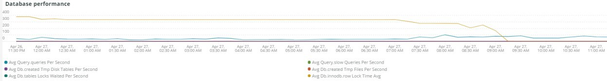
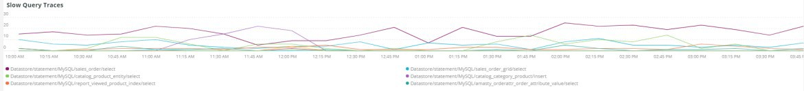

# Die [!UICONTROL MySQL] tab

## [!UICONTROL MySQL% free storage by node]

Viele Probleme werden dadurch verursacht, dass MySQL nicht mehr im Speicher für MySQL gespeichert ist (`datadir` MySQL-Konfigurationseinstellung, Standard ist `/data/mysql`) oder der `tmpdir` Der Platz ist knapp. Die Standardeinstellung `tmpdir` (MySQL-Einstellung) ist `/tmp`. Die **[!UICONTROL MySQL% free storage by node]** Frame betrachtet die `/, /tmp` (sofern als separate Bereitstellung definiert) und die `/data/mysql` Prozentsatz der freien Lagerung. Ab MySQL Version 5.7 (MariaDB Version 10.2) unkomprimiert `tmp` Tabellen werden in eine `tmp` Tablespace im `/data/mysql` in der Datei (ibtmp1). Diese Datei wird standardmäßig automatisch ohne Begrenzung erweitert. Da es sich um einen Tablespace handelt, nimmt die Größe nicht ab und wird beim Neustart von MySQL auf 12 MB zurückgesetzt.

## [!UICONTROL MySQL Connections by Node]

Die **[!UICONTROL MySQL Connections by Node]** frame zeigt Zeiträume von Datenbankknotenausfällen oder große Mengen von Verbindungen an.

## [!UICONTROL MySQL Node Summary]

Die **[!UICONTROL MySQL Node Summary]** -Tabelle zeigt Details zu Datenbankknoten wie Softwareversion und Instanztyp (Größe).

## [!UICONTROL Galera Number of Nodes in cluster]

Die **[!UICONTROL Galera Number of Nodes in cluster]** frame zeigt Informationen aus den MySQL-Protokollen an. Wenn Knoten einem Cluster beitreten und ihn verlassen, werden nur die Meldungen für den ausgewählten Zeitraum angezeigt. Wenn ein Knoten den Cluster vor dem Zeitrahmen verlässt, wird während dieses Zeitrahmens keine Meldung angezeigt. Wenn Sie vermuten, dass der Datenbank ein Knoten fehlt, erweitern Sie den Zeitraum auf einen größeren Zeitraum, um zu sehen, ob zusätzliche Informationen angezeigt werden. Wenn Informationen während des Zeitraums vorhanden sind, die weniger als alle Knoten im [!DNL Galera] Erweitern Sie den Zeitrahmen, um festzustellen, wann der Knoten den Cluster verlassen hat.

## [!UICONTROL MySQL shutdowns and starts]

Die **[!UICONTROL MySQL shutdowns and starts]** frame erkennt, wenn ein Knoten heruntergefahren wird. Die [!DNL Galera] -Knoten entfernt und aus der [!DNL Galera] Knoten. Dies führt normalerweise zu einem Neustart des MySQL-Dienstes.

## [!UICONTROL Galera log]

Die **[!UICONTROL Galera log]** frame zeigt die Anzahl bestimmter Signale aus den MySQL-Logs bezüglich [!DNL Galera] -Knoten, deren Status und die Statusänderungen der [!DNL Galera] Cluster.

* &#39;%1047 WSREP hat den Knoten noch nicht für die Anwendung vorbereitet (use%&#39;) als &#39;node_not_prep_for_use&#39;
* &#39;%\[ERROR\] WSREP: Fehlgeschlagen aus: wsrep_sst_xtrabackup-v2%&#39;) als &#39;xtrabackup_read_fail&#39;
* &#39;%\[ERROR\] WSREP: Prozess abgeschlossen mit Fehler: wsrep_sst_xtrabackup-v2 %&#39;) als &#39;xtrabackup_compl_w_err&#39;
* &#39;%\[ERROR\] WSREP: rbr write fail%&quot;) als &quot;rbr_write_fail&quot;
* &#39;%self-leave%&#39;) als &#39;susp_node&#39;
* &#39;%members = 3/3 (join/total)%&#39;) as&#39;3of3&#39;
* &#39;%members = 2/3 (join/total)%&#39;) as&#39;2of3&#39;
* &#39;%members = 2/2%&#39;) als &#39;2of2&#39;
* &#39;%members = 1/2%&#39;) as &#39;1of2&#39;
* &#39;%members = 1/3%&#39;) as &#39;1of3&#39;
* &#39;%members = 1/1%&#39;) als &#39;1of1&#39;
* &#39;%\[Hinweis\] /usr/sbin/mysqld (mysqld 10.%&#39;) as&#39;sql_restart&#39;
* &#39;%Quorum: Kein Knoten mit vollständigem Status:%&#39;) als &#39;no_node_count&#39;
* &#39;%WSREP: Mitglied 0%&#39;) als &quot;mem_0&quot;
* &#39;%WSREP: Mitglied 1,0%&quot;) als &quot;mem_1&quot;
* &#39;%WSREP: Mitglied 2%&#39;) as&#39;mem2&#39;
* &#39;%WSREP: Mit Gruppe synchronisiert, bereit für Verbindungen%&#39;) als &#39;bereit&#39;
* &#39;%/usr/sbin/mysqld, Version:%&#39;) als &#39;mysql_restart_mysql.slow&#39;
* &#39;%\[Hinweis\] WSREP: Neue Cluster-Ansicht: globaler Status:%&#39;) als &#39;galera_cluster_view_chng&#39;

## [!UICONTROL Galera Log by Host]

Die **[!UICONTROL Galera Log by Host]** frame ist mit dem **[!UICONTROL Galera log]** frame, bis auf die Tatsache, dass er nach Knoten aufgeteilt ist, um die Fehlerbehebung zu unterstützen.

## [!UICONTROL Database performance]

Die **[!UICONTROL Database performance]** frame zeigt die Datenbankleistung bei bestimmten Anforderungen an. Sie können jede Metrik sehen, indem Sie in den farbigen Symbolen unter dem Diagramm auf sie klicken. Viele der Metriken, die in [Überwachen der Leistung der MySQL-Datenbank mit New Relic](https://newrelic.com/blog/how-to-relic/how-to-monitor-mysql) in diesem Frame gefunden werden.

* average(query.queriesPerSecond)
* average(query.slowQueriesPerSecond)
* average(db.createdTmpDiskTablesPerSecond)
* average(db.createdTmpFilesPerSecond)
* average(db.tablesLocksWaitedPerSecond)
* average(db.innodb.rowLockTimeAvg)
* average(db.innodb.rowLockWaitsPerSecond)

## [!UICONTROL Transaction Database Call Count]

Die **[!UICONTROL Transaction Database Call Count]** frame zeigt die Anzahl der Datenbankaufrufe an, die von den einzelnen Transaktionsfacetten durchgeführt werden. Dies scheint auf Zeilen ausgerichtet zu sein und nicht auf Aussagen.

## [!UICONTROL Cron_schedule table updates]

Die **[!UICONTROL Cron_schedule table updates]** frame zeigt die maximale Dauer von Datenbankaktualisierungen an der Tabelle cron_schedule für den ausgewählten Zeitraum an.

## [!UICONTROL Slow Query Traces]

Die **[!UICONTROL Slow Query Traces]** frame zeigt die Tabelle und den Anfragetyp an, in denen langsame Abfragespuren vorhanden sind. Für Abfragetransaktionen, die länger als fünf Sekunden dauern, wird eine langsame Abfrage erstellt. Wichtig für diesen Frame sind die Aktualisierungs-Abfragen. Wenn eine Tabelle aktualisiert wird von `UPDATE`, `DELETE`und `INSERT` -Anweisungen verwenden, können sie Tabellen für einen bestimmten Zeitraum sperren.

Sogar `SELECT` -Anweisungen können Zeilen sperren, wenn sie mit FÜR UPDATE verwendet werden.

## [!UICONTROL Datastore Operations tables]

## [!UICONTROL Cron table change]

Die **[!UICONTROL Cron table change]** frame sucht nach Fehlermeldungen, die &quot;konnte keine Sperre für Cron-Auftrag erlangen:&quot;zusammen mit einem bestimmten PHP-Speicherfehler und Schlössern, die die `cron_schedule` Tabelle. Wenn die Variable `cron_schedule` -Tabelle gesperrt ist (z. B. durch eine `DELETE` -Abfrage ausgeführt wird), wird die Ausführung anderer Crons blockiert.

## [!UICONTROL Deadlocks]

Die **[!UICONTROL Deadlocks]** frame untersucht die folgenden aus den MySQL-Protokollen geparsten Zeichenfolgen:

* &#39;%PHP Fatal error: Zulässige Speichergröße von%&#39;) als php_mem_error
* &#39;%get lock; versucht, die Transaktion neu zu starten, war die Abfrage: DELETE VON \`cron_schedule%&#39;) als cron_sched_lock_del
* &quot;% lock für Cron-Auftrag: indexer_reindex_all_invalid%&#39;) als &#39;lock_indexer_reindex_all_invalid%&#39;
* &quot;% lock für Cron-Auftrag: cron_schedule%&#39;) als &#39;lock_cron_schedule&#39;
* &#39;% lock for cron job:%&#39;) as &#39;total_cron_lock&#39;
* &#39;%Allgemeiner Fehler: 1205 Sperrwartetimeout überschritten%&#39;) als &#39;sql_1205_lock&#39;
* &#39;%ERROR 1213 (40001): Deadlock beim Versuch gefunden, lock%&#39;) als &#39;sql_1213_lock&#39; zu erhalten
* &#39;%SQLSTATE[40001]: Serialisierungsfehler: 1213 Deadlock found%&#39;) als &#39;sql_1213_lock2&#39;
* &quot;% lock für Cron-Auftrag: indexer_update_all_views%&#39;) als &#39;lock_indexer_update_all_views&#39;
* &quot;% lock für Cron-Auftrag: sales_grid_order_bill_async_insert%&#39;) als &#39;lock_sales_grid_order_bill_async_insert&#39;,
* &quot;% lock für Cron-Auftrag: staging_remove_updates%&#39;) als &#39;lock_staging_remove_updates&#39;
* &quot;% lock für Cron-Auftrag: sales_grid_order_shipping_async_insert%&#39;) als &#39;lock_sales_grid_order_shipping_async_insert&#39;
* &quot;% lock für Cron-Auftrag: amazon_payments_process_queued_erstattments%&#39;) als &#39;lock_amazon_payments_process_queued_erstattungs&#39;
* &quot;% lock für Cron-Auftrag: sales_send_order_shipping_emails%&#39;) als &#39;lock_sales_send_order_shipping_emails&#39;
* &quot;% lock für Cron-Auftrag: staging_synchronize_entity_period%&#39;) als &#39;lock_staging_synchronize_entity_period&#39;
* &quot;% lock für Cron-Auftrag: indexer_clean_all_changelogs%&#39;) als &#39;lock_indexer_clean_all_changelogs&#39;
* &quot;% lock für Cron-Auftrag: magento_targetrule_index_reindex%&#39;) als &#39;lock_magento_targetrule_index_reindex&#39;
* &quot;% lock für Cron-Auftrag: newsletter_send_all%&#39;) als &#39;lock_newsletter_send_all&#39;
* &quot;% lock für Cron-Auftrag: newsletter_send_all%&#39;) als &#39;lock_newsletter_send_all&#39;
* &quot;% lock für Cron-Auftrag: sales_send_order_emails%&#39;) als &#39;lock_sales_send_order_emails&#39;
* &quot;% lock für Cron-Auftrag: sales_send_order_creditmemo_emails%&#39;) as &#39;lock_sales_send_order_creditmemo_emails&#39;
* &quot;% lock für Cron-Auftrag: sales_grid_order_creditmemo_async_insert%&#39;) als &#39;lock_sales_grid_order_creditmemo_async_insert&#39;
* &quot;% lock für Cron-Auftrag: bulk_cleanup%&#39;) als &#39;lock_bulk_cleanup&#39;
* &quot;% lock für Cron-Auftrag: flush_preview_quota%&#39;) als &#39;lock_flush_preview_quota&#39;
* &quot;% lock für Cron-Auftrag: sales_send_order_bill_emails%&#39;) als &#39;lock_sales_send_order_bill_emails&#39;
* &quot;% lock für Cron-Auftrag: sales_send_order_bill_emails%&#39;) als &#39;lock_sales_send_order_bill_emails&#39;
* &quot;% lock für Cron-Auftrag: captcha_delete_abgelaufene_images%&#39;) als &#39;lock_captcha_delete_abgelaufene_images&#39;
* &quot;% lock für Cron-Auftrag: magento_newrelicreporting_cron%&#39;) als &#39;lock_magento_newrelicreporting_cron&#39;
* &quot;% lock für Cron-Auftrag: outdated_authentication_failures_cleanup%&#39;) as &#39;lock_outdated_authentication_failures_cleanup&#39;
* &quot;% lock für Cron-Auftrag: send_notification%&#39;) als &#39;lock_send_notification&#39;
* &quot;% lock für Cron-Auftrag: magento_giftcardaccount_generage_codes_pool%&#39;) als &#39;lock_magento_giftcardaccount_generage_codes_pool&#39;
* &quot;% lock für Cron-Auftrag: catalog_product_frontend_actions_flush%&#39;) als &#39;lock_catalog_product_frontend_actions_flush&#39;
* &quot;% lock für Cron-Auftrag: mysqlmq_clean_messages%&#39;) als &#39;mysqlmq_clean_messages&#39;
* &quot;% lock für Cron-Auftrag: catalog_product_attribute_value_synchronize%&#39;) als &#39;lock_catalog_product_attribute_value_synchronize&#39;
* &quot;% lock für Cron-Auftrag: ddg_automation_importer%&#39;) als &#39;lock_ddg_automation_importer&#39;
* &quot;% lock für Cron-Auftrag: ddg_automation_views_and_wishlist%&#39;) als &#39;lock_ddg_automation_views_and_wishlist&#39;
* &quot;% lock für Cron-Auftrag: captcha_delete_old_try%&#39;) als &#39;lock_captcha_delete_old_try&#39;
* &quot;% lock für Cron-Auftrag: catalog_product_outdated_price_values_cleanup%&#39;) as &#39;lock_catalog_product_outdated_price_values_cleanup&#39;
* &quot;% lock für Cron-Auftrag: consumer_runner%&#39;) als &#39;lock_consumer_runner&#39;
* &quot;% lock für Cron-Auftrag: ddg_automation_customer_subscriber_Guest_sync%&#39;) als &#39;lock_ddg_automation_customer_subscriber_Guest_sync&#39;
* &quot;% lock für Cron-Auftrag: get_amazon_Capture_updates%&#39;) als &#39;lock_get_amazon_Capture_updates&#39;
* &quot;% lock für Cron-Auftrag: get_amazon_authorization_updates%&#39;) als &#39;lock_send_get_amazon_authorization_updates&#39;
* &quot;% lock für Cron-Auftrag: temando_process_platform_events%&#39;) als &#39;lock_temando_process_platform_events&#39;
* &quot;% lock für Cron-Auftrag: ddg_automation_status%&#39;) als &#39;lock_ddg_automation_status&#39;
* &quot;% lock für Cron-Auftrag: ddg_automation_status%&#39;) als &#39;lock_ddg_automation_status&#39;
* &quot;% lock für Cron-Auftrag: sales_clean_orders%&#39;) as &#39;lock_sales_clean_orders&#39;
* &quot;% lock für Cron-Auftrag: catalog_index_refresh_price%&#39;) als &#39;lock_catalog_index_refresh_price&#39;
* &quot;% lock für Cron-Auftrag: magento_reward_balance_warning_notification%&#39;) als &#39;lock_magento_reward_balance_warning_notification&#39;
* &quot;% lock für Cron-Auftrag: analytics_update%&#39;) als &#39;lock_analytics_update&#39;
* &quot;% lock für Cron-Auftrag: messagequeue_clean_outdated_lock%&#39;) als &#39;lock_messagequeue_clean_outdated_lock&#39;
* &quot;% lock für Cron-Auftrag: messagequeue_clean_outdated_lock%&#39;) als &#39;lock_messagequeue_clean_outdated_lock&#39;
* &quot;% lock für Cron-Auftrag: staging_apply_version%&#39;) als &#39;lock_staging_apply_version&#39;
* &quot;% lock für Cron-Auftrag: magento_reward_expire_points%&#39;) als &#39;lock_magento_reward_expire_points&#39;
* &quot;% lock für Cron-Auftrag: yotpo_yotpo_orders_sync%&#39;) als &#39;lock_yotpo_yotpo_orders_sync&#39;
* &quot;% lock für Cron-Auftrag: catalog_event_status_checker%&#39;) als &#39;lock_catalog_event_status_checker&#39;
* &quot;% lock für Cron-Auftrag: ddg_automation_campaign%&#39;) als &#39;lock_ddg_automation_campaign&#39;
* &quot;% lock für Cron-Auftrag: visitor_clean%&#39;) als &#39;lock_visitor_clean&#39;
* &quot;% lock für Cron-Auftrag: scconnector_verify_website%&#39;) als &#39;lock_scconnector_verify_website&#39;
* &quot;% lock für Cron-Auftrag: ddg_automation_email_templates%&#39;) als &#39;lock_ddg_automation_email_templates&#39;
* &quot;% lock für Cron-Auftrag: aggregate_sales_report_order_data%&#39;) als &#39;lock_aggregate_sales_report_order_data&#39;
* &quot;% lock für Cron-Auftrag: ddg_automation_catalog_sync%&#39;) als &#39;lock_ddg_automation

## [!UICONTROL DB Statistics]

Die **[!UICONTROL DB Statistics]** frame zeigt Löschvorgänge, Schreibvorgänge, gelesene Zeilen, Updates und langsame Abfragen pro Sekunde an.

## [!UICONTROL Request frequency]

## [!UICONTROL Database Errors]

Die **[!UICONTROL Database Errors]** frame zeigt eine Vielzahl von Datenbanken an [Warnungen und Fehler](https://mariadb.com/kb/en/mariadb-error-codes/):

* &#39;%Speichergröße, die für die temporäre Tabelle zugewiesen wird, beträgt mehr als 20 % von innodb_buffer_pool_size%&#39; als &#39;temp_tbl_buff_pool&#39;
* &#39;%\[ERROR\] WSREP: rbr write fail%&quot;) als &quot;rbr_write_fail&quot;
* &#39;%mysqld: Disk full%&#39;) als &#39;disk_full&#39;
* &#39;%Fehlernummer 28%&#39;) als &#39;err_28&#39;
* &#39;%Rollback%&#39;) als &#39;Rollback&#39;
* &#39;%Fremdschlüsseleinschränkung schlägt für table% fehl&#39;) als &#39;external_key_constraint&#39;
* &#39;%Error_code: 1114%&#39;) als &#39;sql_1114_full&#39;%CRITICAL: SQLSTATE[HY000] [2006] MySQL Server ist weg%&#39;) als &#39;sql_away&#39;
* &#39;%SQLSTATE[HY000] [1040] Zu viele Verbindungen%&#39;) als &#39;sql_1040&#39;
* &#39;%CRITICAL: SQLSTATE[HY000] [2002]%&#39;) als &#39;sql_2002&#39;
* &#39;%SQLSTATE[08S01]:%&#39;) als &#39;sql_1047&#39;
* &#39;%[Warnung] Verbindung abgebrochen%&#39;) als &#39;aborted_conn&#39;
* &#39;%SQLSTATE[23000]: Integrationsbeschränkungsverletzung:%&#39;) als &#39;sql_23000&#39;
* &#39;%1205 Lock wait timeout%&#39;) als &#39;sql_1205&#39;
* &#39;%SQLSTATE[HY000] [1049] Unbekannte Datenbank%&#39;) als &#39;sql_1049&#39;
* &#39;%SQLSTATE[42S02]: Basistabelle oder -ansicht nicht gefunden:%&#39;) als &#39;sql_42S02&#39;
* &#39;%Allgemeiner Fehler: 1114%&quot;) als &quot;sql_1114&quot;
* &#39;%SQLSTATE[40001]%&#39;) als &#39;sql_1213&#39;
* &#39;%SQLSTATE[42S22]: Spalte nicht gefunden: 1054 Unbekannte Spalte%&#39;) als &#39;sq1_1054&#39;
* &#39;%SQLSTATE[42000]: Syntaxfehler oder Zugriffsverletzung:%&#39;) as&#39;sql_42000&#39;
* &#39;%SQLSTATE[21000]: Kardinalitätsverstoß:%&#39;) als &#39;sql_1241&#39;
* &#39;%SQLSTATE[2003]:%&#39;) als &#39;sql_22003&#39;
* &#39;%SQLSTATE[HY000] [9000] Client mit IP-Adresse%&#39;) als &#39;sql_9000&#39;
* &#39;%SQLSTATE[HY000]: Allgemeiner Fehler: 2014%&quot;) als &quot;sql_2014&quot;
* &#39;%1927 Connection was kill%&#39;) as &#39;sql_1927&#39;
* &#39;%1062 \[ERROR\] InnoDB:%&#39;) as &#39;sql_1062_e&#39;
* &#39;&#39;%[Hinweis] WSREP: Speicherkarte auf Festplatte leeren ...%&quot;) als &quot;mem_map_flush&quot;
* &#39;%Interner MariaDB-Fehlercode: 1146%&quot;) als &quot;sql_1146&quot;
* &#39;%Interner MariaDB-Fehlercode: 1062%&quot;) als &#39;sql_1062&#39; * &#39;%1062&#39; [Warnung] InnoDB:%&#39;) als &#39;sql_1062_w&#39;
* &#39;%Interner MariaDB-Fehlercode: 1064%&quot;) als &quot;sql_1064&quot;
* &#39;%InnoDB: Assertionsfehler in Datei%&quot;) als &quot;assertion_err&quot;
* &#39;%mysqld_safe Anzahl der jetzt ausgeführten Prozesse: 0%&quot;) als &quot;mysql_oom&quot;
* &#39;%\[ERROR\] mysqld hat signal%&#39;) as &#39;mysql_sigterm&#39;
* &#39;%1452 Cannot add%&#39;) as &#39;sql_1452&#39;
* &#39;%ERROR 1698%&#39;) als &#39;sql_1698&#39;
* &#39;%SQLSTATE[HY000]: Allgemeiner Fehler: 3%&#39;) als &#39;cnt_wrt_tmp&#39;
* &#39;%Allgemeiner Fehler: 1 %&quot;) als &quot;sql_syntax&quot;
* &#39;%42S22%&#39;) als &#39;sql_42S22&#39;
* &#39;%InnoDB: Fehler (Duplikatschlüssel)%&#39;) als &#39;innodb_dup_key&#39; VON Log TIMESERIES

## [!UICONTROL DB Error Table]

Die **[!UICONTROL DB Error Table]** Frame zeigt dieselben Informationen wie **[!UICONTROL Database Errors]** -Frame, Sie können ihn jedoch nach Knoten und im Tabellenformat anzeigen. Siehe [MariaDB-Fehlercodes](https://mariadb.com/kb/en/mariadb-error-codes/) für weitere Informationen.

## [!UICONTROL Database Traces]

Die **[!UICONTROL Database Traces]** frame zeigt die Traces der Datenbank nach Typ in der ausgewählten Timeline an.

## [!UICONTROL Database processes]

Die **[!UICONTROL Database processes]** frame zeigt die Datenbankprozesse, Umgebungen und Knoten-IDs an.

## [!UICONTROL MySQL Non-Sleeping Threads by Node]

Die **[!UICONTROL MySQL Non-Sleeping Threads by Node]** frame zeigt die Verbindungs-Threads zur Datenbank an. Dieser Frame zeigt die aktiven Threads an.

## [!UICONTROL MySQL Running and Sleeping Threads by environment]

Die **[!UICONTROL MySQL Running and Sleeping Threads by environment]** frame zeigt aktive und schlafende Verbindungen zur Datenbank an. Wenn es Verbindungen zur Datenbank gibt, bei denen langsame Abfragen in den Ruhezustand versetzt wurden, werden schlafende Verbindungen hergestellt. Schlafende Verbindungen können Datenbankabfragen sein, die von gesperrten Zeilen oder Tabellen blockiert werden. Diese Schlafverbindungen enthalten auch PHP Worker-Verbindungen.

## [!UICONTROL MySQL mem used by node]

Die **[!UICONTROL MySQL mem used by node]** frame zeigt die Knotennutzung des Speichers durch MySQL. Auf größeren Sites kann es sich bei diesem Frame um kontinuierliche Balken mit Speicherkapazität von GB handeln.

## [!UICONTROL Database mysql-slow.log]

Die **[!UICONTROL Database mysql-slow.log]** frame zeigt die Typen der Abfrageanweisungen an, die sich im `mysql-slow.log` -Datei über den ausgewählten Zeitrahmen hinweg.
