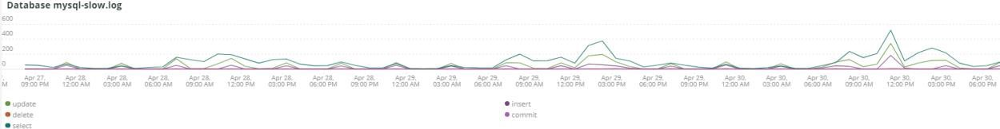

# Registerkarte [!UICONTROL MySQL]

## [!UICONTROL MySQL% free storage by node]

Viele Probleme werden dadurch verursacht, dass MySQL nicht genügend Speicherplatz im Speicher hat, der MySQL zugewiesen wurde (`datadir` MySQL-Konfigurationseinstellung, der Standardwert ist `/data/mysql`), oder dass dem `tmpdir` der Speicherplatz ausgeht. Der Standardwert `tmpdir` (MySQL-Einstellung) ist `/tmp`. Der Frame **[!UICONTROL MySQL% free storage by node]** betrachtet den `/, /tmp` (sofern als separate Bereitstellung definiert) und den `/data/mysql` Prozentsatz des freien Speichers. Ab MySQL Version 5.7 (MariaDB Version 10.2) werden unkomprimierte `tmp` -Tabellen in einen `tmp` -Tablespace im Verzeichnis `/data/mysql` in der Datei (ibtmp1) geschrieben. Diese Datei wird standardmäßig automatisch ohne Begrenzung erweitert. Da es sich um einen Tablespace handelt, nimmt die Größe nicht ab und wird beim Neustart von MySQL auf 12 MB zurückgesetzt.

## [!UICONTROL MySQL Connections by Node]

Der Frame &quot;**[!UICONTROL MySQL Connections by Node]**&quot;gibt Zeiträume an, in denen Datenbankknotenausfälle oder große Verbindungsvolumen aufgetreten sind.

## [!UICONTROL MySQL Node Summary]

Die Tabelle **[!UICONTROL MySQL Node Summary]** enthält Details zum Datenbankknoten, z. B. Softwareversion und Instanztyp (Größe).

## [!UICONTROL Galera Number of Nodes in cluster]

Der Frame **[!UICONTROL Galera Number of Nodes in cluster]** zeigt Informationen aus den MySQL-Protokollen an. Wenn Knoten einem Cluster beitreten und ihn verlassen, werden nur die Meldungen für den ausgewählten Zeitraum angezeigt. Wenn ein Knoten den Cluster vor dem Zeitrahmen verlässt, wird während dieses Zeitrahmens keine Meldung angezeigt. Wenn Sie vermuten, dass der Datenbank ein Knoten fehlt, erweitern Sie den Zeitraum auf einen größeren Zeitraum, um zu sehen, ob zusätzliche Informationen angezeigt werden. Wenn während des Zeitraums Informationen vorhanden sind, die auf weniger als alle Knoten im Cluster [!DNL Galera] hinweisen, erweitern Sie den Zeitraum, um festzustellen, wann der Knoten den Cluster verlassen hat.

## [!UICONTROL MySQL shutdowns and starts]

Der Frame **[!UICONTROL MySQL shutdowns and starts]** erkennt, wenn ein Knoten heruntergefahren wird. Die [!DNL Galera] -Knoten werden entfernt und vom [!DNL Galera] -Knoten selbst entfernt. Dies führt normalerweise zu einem Neustart des MySQL-Dienstes.

## [!UICONTROL Galera log]

Der Frame &quot;**[!UICONTROL Galera log]**&quot;zeigt die Anzahl bestimmter Signale aus den MySQL-Protokollen bezüglich [!DNL Galera] Knoten, deren Status und die Statusänderungen des [!DNL Galera] Clusters an.

* &#39;%1047 WSREP hat den Knoten noch nicht für die Anwendung vorbereitet (use%&#39;) als &#39;node_not_prep_for_use&#39;
* &#39;%\[ERROR\] WSREP: Failed read from: wsrep_sst_xtrabackup-v2%&#39;) as &#39;xtrabackup_read_fail&#39;
* &#39;%\[ERROR\] WSREP: Prozess abgeschlossen mit Fehler: wsrep_sst_xtrabackup-v2 %&#39;) als &#39;xtrabackup_compl_w_err&#39;
* &#39;%\[ERROR\] WSREP: rbr write fail%&#39;) as &#39;rbr_write_fail&#39;
* &#39;%self-leave%&#39;) als &#39;susp_node&#39;
* &#39;%members = 3/3 (join/total)%&#39;) as&#39;3of3&#39;
* &#39;%members = 2/3 (join/total)%&#39;) as&#39;2of3&#39;
* &#39;%members = 2/2%&#39;) als &#39;2of2&#39;
* &#39;%members = 1/2%&#39;) as &#39;1of2&#39;
* &#39;%members = 1/3%&#39;) as &#39;1of3&#39;
* &#39;%members = 1/1%&#39;) als &#39;1of1&#39;
* &#39;%\[Hinweis\] /usr/sbin/mysqld (mysqld 10.%&#39;) as&#39;sql_restart&#39;
* &#39;%Quorum: Kein Knoten mit vollständigem Status:%&#39;) als &#39;no_node_count&#39;
* &#39;%WSREP: Member 0%&#39;) as &#39;mem_0&#39;
* &#39;%WSREP: Member 1.0%&#39;) as &#39;mem_1&#39;
* &#39;%WSREP: Member 2%&#39;) as&#39;mem2&#39;
* &#39;%WSREP: Synchronisiert mit Gruppe, bereit für Verbindungen%&#39;) als &#39;bereit&#39;
* &#39;%/usr/sbin/mysqld, Version:%&#39;) als &#39;mysql_restart_mysql.slow&#39;
* &#39;%\[Hinweis\] WSREP: Neue Cluster-Ansicht: global state:%&#39;) as &#39;galera_cluster_view_chng&#39;

## [!UICONTROL Galera Log by Host]

Der Frame &quot;**[!UICONTROL Galera Log by Host]**&quot;entspricht dem Frame &quot;**[!UICONTROL Galera log]**&quot;, allerdings wird er nach Knoten aufgeschlüsselt, um die Fehlerbehebung zu unterstützen.

## [!UICONTROL Database performance]

Der Frame **[!UICONTROL Database performance]** zeigt die Datenbankleistung bei bestimmten Anforderungen an. Sie können jede Metrik sehen, indem Sie in den farbigen Symbolen unter dem Diagramm auf sie klicken. Viele der unter [Überwachung der MySQL-Datenbankleistung mit New Relic](https://newrelic.com/blog/how-to-relic/how-to-monitor-mysql) genannten Metriken finden Sie in diesem Frame.

* average(query.queriesPerSecond)
* average(query.slowQueriesPerSecond)
* average(db.createdTmpDiskTablesPerSecond)
* average(db.createdTmpFilesPerSecond)
* average(db.tablesLocksWaitedPerSecond)
* average(db.innodb.rowLockTimeAvg)
* average(db.innodb.rowLockWaitsPerSecond)

## [!UICONTROL Transaction Database Call Count]

Der Frame **[!UICONTROL Transaction Database Call Count]** zeigt die Anzahl der Datenbankaufrufe an, die von den einzelnen Transaktionsfacetten durchgeführt werden. Dies scheint auf Zeilen ausgerichtet zu sein und nicht auf Aussagen.

## [!UICONTROL Cron_schedule table updates]

Der Frame **[!UICONTROL Cron_schedule table updates]** zeigt die maximale Dauer von Datenbankaktualisierungen an der Tabelle cron_schedule für den ausgewählten Zeitraum an.

## [!UICONTROL Slow Query Traces]

Der Frame **[!UICONTROL Slow Query Traces]** zeigt die Tabelle und den Anfragetyp an, in denen langsame Abfragespuren vorhanden sind. Für Abfragetransaktionen, die länger als fünf Sekunden dauern, wird eine langsame Abfrage erstellt. Wichtig für diesen Frame sind die Aktualisierungs-Abfragen. Wenn eine Tabelle durch die Anweisungen `UPDATE`, `DELETE` und `INSERT` aktualisiert wird, können Tabellen für einen bestimmten Zeitraum gesperrt werden.

Selbst `SELECT` -Anweisungen können Zeilen sperren, wenn sie mit FOR UPDATE verwendet werden.

## [!UICONTROL Datastore Operations tables]

## [!UICONTROL Cron table change]

Der Frame &quot;**[!UICONTROL Cron table change]**&quot; sucht nach Fehlermeldungen, die einen bestimmten PHP-Speicherfehler und Sperren mit der Tabelle &quot;`cron_schedule`&quot; enthalten. Wenn die `cron_schedule` -Tabelle gesperrt ist (z. B. durch Ausführung einer `DELETE` -Abfrage), werden andere Crons daran gehindert, ausgeführt zu werden.

## [!UICONTROL Deadlocks]

Der Frame **[!UICONTROL Deadlocks]** betrachtet die folgenden aus den MySQL-Protokollen geparsten Zeichenfolgen:

* &#39;%PHP Fatal error: Allowed memory size of%&#39;) as php_mem_error
* &#39;%get lock; try restarting transaction, query was: DELETE FROM \`cron_schedule%&#39;) as cron_sched_lock_del
* &#39;% lock for cron job: indexer_reindex_all_invalid%&#39;) as &#39;lock_indexer_reindex_all_invalid%&#39;
* &#39;% lock for cron job: cron_schedule%&#39;) as &#39;lock_cron_schedule&#39;
* &#39;% lock for cron job:%&#39;) as &#39;total_cron_lock&#39;
* &#39;%Allgemeiner Fehler: 1205 Lock wait timeout exceeded%&#39;) as &#39;sql_1205_lock&#39;
* &#39;%ERROR 1213 (40001): Deadlock found when try to get lock%&#39;) as &#39;sql_1213_lock&#39;
* &#39;%SQLSTATE[40001]: Serialisierungsfehler: 1213 Deadlock found%&#39;) als &#39;sql_1213_lock2&#39;
* &#39;% lock for cron job: indexer_update_all_views%&#39;) as &#39;lock_indexer_update_all_views&#39;
* &#39;% lock for cron job: sales_grid_order_bill_async_insert%&#39;) as &#39;lock_sales_grid_order_bill_async_insert&#39;,
* &#39;% lock for cron job: staging_remove_updates%&#39;) as &#39;lock_staging_remove_updates&#39;
* &#39;% lock for cron job: sales_grid_order_shipping_async_insert%&#39;) as &#39;lock_sales_grid_order_shipping_async_insert&#39;
* &#39;% lock for cron job: amazon_payments_process_queued_erstatted%&#39;) as &#39;lock_amazon_payments_process_queued_erstattings&#39;
* &#39;% lock for cron job: sales_send_order_shipping_emails%&#39;) as &#39;lock_sales_send_order_emails&#39;
* &#39;% lock for cron job: staging_synchronize_entity_period%&#39;) als &#39;lock_staging_synchronize_entity_period&#39;
* &#39;% lock for cron job: indexer_clean_all_changelogs%&#39;) as &#39;lock_indexer_clean_all_changelogs&#39;
* &#39;% lock for cron job: magento_targetrule_index_reindex%&#39;) as &#39;lock_magento_target_rule_reindex&#39;
* &#39;% lock for cron job: newsletter_send_all%&#39;) as &#39;lock_newsletter_send_all&#39;
* &#39;% lock for cron job: newsletter_send_all%&#39;) as &#39;lock_newsletter_send_all&#39;
* &#39;% lock for cron job: sales_send_order_emails%&#39;) as &#39;lock_sales_send_order_emails&#39;
* &#39;% lock for cron job: sales_send_order_creditmemo_emails%&#39;) as &#39;lock_sales_send_order_creditmemo_emails&#39;
* &#39;% lock for cron job: sales_grid_order_creditmemo_async_insert%&#39;) as &#39;lock_sales_grid_order_creditmemo_async_insert&#39;
* &#39;% lock for cron job: bulk_cleanup%&#39;) as &#39;lock_bulk_cleanup&#39;
* &#39;% lock for cron job: flush_preview_quota%&#39;) as &#39;lock_flush_preview_quota&#39;
* &#39;% lock for cron job: sales_send_order_bill_emails%&#39;) as &#39;lock_sales_send_order_bill_emails&#39;
* &#39;% lock for cron job: sales_send_order_bill_emails%&#39;) as &#39;lock_sales_send_order_bill_emails&#39;
* &#39;% lock für Cron-Auftrag: captcha_delete_abgelaufene_Images%&#39;) als &#39;lock_captcha_delete_abgelaufene_images&#39;
* &#39;% lock for cron job: magento_newrelicreporting_cron%&#39;) as &#39;lock_magento_newrelicreporting_cron&#39;
* &#39;% lock for cron job: outdated_authentication_failures_cleanup%&#39;) as &#39;lock_outdated_authentication_failures_cleanup&#39;
* &#39;% lock for cron job: send_notification%&#39;) as &#39;lock_send_notification&#39;
* &#39;% lock for cron job: magento_giftcardaccount_generage_codes_pool%&#39;) as &#39;lock_magento_giftcardaccount_generage_codes_pool&#39;
* &#39;% lock for cron job: catalog_product_frontend_actions_flush%&#39;) as &#39;lock_catalog_product_frontend_actions_flush&#39;
* &#39;% lock for cron job: mysqlmq_clean_messages%&#39;) as &#39;mysqlmq_clean_messages&#39;
* &#39;% lock for cron job: catalog_product_attribute_value_synchronize%&#39;) as &#39;lock_catalog_product_attribute_value_synchronize&#39;
* &#39;% lock for cron job: ddg_automation_importer%&#39;) as &#39;lock_ddg_automation_importer&#39;
* &#39;% lock for cron job: ddg_automation_views_and_wishlist%&#39;) as &#39;lock_ddg_automation_views_and_wishlist&#39;
* &#39;% lock for cron job: captcha_delete_old_try%&#39;) as &#39;lock_captcha_delete_old_try&#39;
* &#39;% lock for cron job: catalog_product_outdated_price_values_cleanup%&#39;) as &#39;lock_catalog_product_outdated_price_values_cleanup&#39;
* &#39;% lock for cron job: consumer_runner%&#39;) as &#39;lock_consumer_runner&#39;
* &#39;% lock for cron job: ddg_automation_customer_subscriber_Guest_sync%&#39;) as &#39;lock_ddg_automation_customer_subscriber_Guest_sync&#39;
* &#39;% lock for cron job: get_amazon_Capture_updates%&#39;) as &#39;lock_get_amazon_Capture_updates&#39;
* &#39;% lock for cron job: get_amazon_authorization_updates%&#39;) as &#39;lock_send_get_amazon_authorization_updates&#39;
* &#39;% lock for cron job: temando_process_platform_events%&#39;) as &#39;lock_temando_process_platform_events&#39;
* &#39;% lock for cron job: ddg_automation_status%&#39;) as &#39;lock_ddg_automation_status&#39;
* &#39;% lock for cron job: ddg_automation_status%&#39;) as &#39;lock_ddg_automation_status&#39;
* &#39;% lock for cron job: sales_clean_orders%&#39;) as &#39;lock_sales_clean_orders&#39;
* &#39;% lock for cron job: catalog_index_refresh_price%&#39;) as &#39;lock_catalog_index_refresh_price&#39;
* &#39;% lock for cron job: magento_reward_balance_warning_notification%&#39;) as &#39;lock_magento_reward_balance_warning_notification&#39;
* &#39;% lock for cron job: analytics_update%&#39;) as &#39;lock_analytics_update&#39;
* &#39;% lock for cron job: messagequeue_clean_outdated_lock%&#39;) as &#39;lock_messagequeue_clean_outdated_lock&#39;&#39;
* &#39;% lock for cron job: messagequeue_clean_outdated_lock%&#39;) as &#39;lock_messagequeue_clean_outdated_lock&#39;&#39;
* &#39;% lock for cron job: staging_apply_version%&#39;) as &#39;lock_staging_apply_version&#39;
* &#39;% lock for cron job: magento_reward_expire_points%&#39;) as &#39;lock_magento_reward_expire_points&#39;
* &#39;% lock for cron job: yotpo_yotpo_orders_sync%&#39;) as &#39;lock_yotpo_yotpo_orders_sync&#39;
* &#39;% lock for cron job: catalog_event_status_checker%&#39;) as &#39;lock_catalog_event_status_checker&#39;
* &#39;% lock for cron job: ddg_automation_campaign%&#39;) as &#39;lock_ddg_automation_campaign&#39;
* &#39;% lock for cron job: visitor_clean%&#39;) as &#39;lock_visitor_clean&#39;
* &#39;% lock for cron job: scconnector_verify_website%&#39;) as &#39;lock_scconnector_verify_website&#39;
* &#39;% lock for cron job: ddg_automation_email_templates%&#39;) as &#39;lock_ddg_automation_email_templates&#39;
* &#39;% lock for cron job: aggregate_sales_report_order_data%&#39;) as &#39;lock_aggregate_sales_report_order_data&#39;
* &#39;% lock for cron job: ddg_automation_catalog_sync%&#39;) as &#39;lock_ddg_automation

## [!UICONTROL DB Statistics]

Der Frame **[!UICONTROL DB Statistics]** zeigt Löschvorgänge, Schreibvorgänge, gelesene Zeilen, Aktualisierungen und langsame Abfragen pro Sekunde an.

## [!UICONTROL Request frequency]

## [!UICONTROL Database Errors]

Der Frame **[!UICONTROL Database Errors]** zeigt eine Vielzahl von Datenbankwarnungen und -fehlern [ an:](https://mariadb.com/kb/en/mariadb-error-codes/)

* &#39;%Speichergröße, die für die temporäre Tabelle zugewiesen wird, beträgt mehr als 20 % von innodb_buffer_pool_size%&#39; als &#39;temp_tbl_buff_pool&#39;
* &#39;%\[ERROR\] WSREP: rbr write fail%&#39;) as &#39;rbr_write_fail&#39;
* &#39;%mysqld: Disk full%&#39;) as &#39;disk_full&#39;
* &#39;%Fehlernummer 28%&#39;) als &#39;err_28&#39;
* &#39;%Rollback%&#39;) als &#39;Rollback&#39;
* &#39;%Fremdschlüsseleinschränkung schlägt für table% fehl&#39;) als &#39;Fremdschlüssel-Einschränkung&#39;
* &#39;%Error_code: 114%&#39;) as &#39;sql_1114_full&#39;%CRITICAL: SQLSTATE[HY000] [2006] MySQL Server has away%&#39;) as &#39;sql_go&#39;
* &#39;%SQLSTATE[HY000] [1040] Zu viele Verbindungen%&#39;) als &#39;sql_1040&#39;
* &#39;%CRITICAL: SQLSTATE[HY000] [2002]%&#39;) as &#39;sql_2002&#39;
* &#39;%SQLSTATE[08S01]:%&#39;) als &#39;sql_1047&#39;
* &#39;%[Warnung] Verbindung abgebrochen%&#39;) als &#39;aborted_conn&#39;
* &#39;%SQLSTATE[23000]: Integrity constraint verletzungen:%&#39;) as &#39;sql_23000&#39;
* &#39;%1205 Lock wait timeout%&#39;) als &#39;sql_1205&#39;
* &#39;%SQLSTATE[HY000] [1049] Unbekannte Datenbank%&#39;) als &#39;sql_1049&#39;
* &#39;%SQLSTATE[42S02]: Basistabelle oder -ansicht nicht gefunden:%&#39;) als &#39;sql_42S02&#39;
* &#39;%Allgemeiner Fehler: 114%&#39;) als &#39;sql_1114&#39;
* &#39;%SQLSTATE[40001]%&#39;) als &#39;sql_1213&#39;
* &#39;%SQLSTATE[42S22]: Column not found: 1054 Unknown column%&#39;) as &#39;sq1_1054&#39;
* &#39;%SQLSTATE[42000]: Syntaxfehler oder Zugriffsverletzung:%&#39;) as&#39;sql_42000&#39;
* &#39;%SQLSTATE[21000]: Kardinalverletzung:%&#39;) als &#39;sql_1241&#39;
* &#39;%SQLSTATE[22003]:%&#39;) as &#39;sql_22003&#39;
* &#39;%SQLSTATE[HY000] [9000] Client mit IP-Adresse%&#39;) als &#39;sql_9000&#39;
* &#39;%SQLSTATE[HY000]: Allgemeiner Fehler: 2014%&#39;) als &#39;sql_2014&#39;
* &#39;%1927 Connection was kill%&#39;) as &#39;sql_1927&#39;
* &#39;%1062 \[ERROR\] InnoDB:%&#39;) as &#39;sql_1062_e&#39;
* &#39;&#39;%[Hinweis] WSREP: Speicherzuordnung auf Festplatte leeren..%&#39;) als &#39;mem_map_flush&#39;
* &#39;%Interner MariaDB-Fehlercode: 1146%&#39;) als &#39;sql_1146&#39;
* &#39;%Interner MariaDB-Fehlercode: 1062%&#39;) als &#39;sql_1062&#39; * &#39;%1062 [Warnung] InnoDB:%&#39;) als &#39;sql_1062_w&#39;
* &#39;%Interner MariaDB-Fehlercode: 1064%&#39;) als &#39;sql_1064&#39;
* &#39;%InnoDB: Assertion failure in file%&#39;) as &#39;assertion_err&#39;
* &#39;%mysqld_safe Anzahl der jetzt ausgeführten Prozesse: 0%&#39;) als &#39;mysql_oom&#39;
* &#39;%\[ERROR\] mysqld hat signal%&#39;) as &#39;mysql_sigterm&#39;
* &#39;%1452 Cannot add%&#39;) as &#39;sql_1452&#39;
* &#39;%ERROR 1698%&#39;) als &#39;sql_1698&#39;
* &#39;%SQLSTATE[HY000]: Allgemeiner Fehler: 3%&#39;) als &#39;cnt_wrt_tmp&#39;
* &#39;%Allgemeiner Fehler: 1 %&#39;) als &#39;sql_syntax&#39;
* &#39;%42S22%&#39;) als &#39;sql_42S22&#39;
* &#39;%InnoDB: Error (Duplicate key)%&#39;) as &#39;innodb_dup_key&#39; FROM Log TIMESERIES

## [!UICONTROL DB Error Table]

Der Frame **[!UICONTROL DB Error Table]** enthält dieselben Informationen wie der Frame **[!UICONTROL Database Errors]**, Sie können ihn jedoch nach Knoten und im Tabellenformat anzeigen. Weitere Informationen finden Sie unter [MariaDB-Fehlercodes](https://mariadb.com/kb/en/mariadb-error-codes/) .

## [!UICONTROL Database Traces]

Der Frame **[!UICONTROL Database Traces]** zeigt die Traces der Datenbank nach Typ über die ausgewählte Timeline hinweg an.

## [!UICONTROL Database processes]

Der Frame **[!UICONTROL Database processes]** zeigt die Datenbankprozesse, Umgebungen und Knoten-IDs an.

## [!UICONTROL MySQL Non-Sleeping Threads by Node]

Der Frame **[!UICONTROL MySQL Non-Sleeping Threads by Node]** zeigt die Verbindungs-Threads zur Datenbank an. Dieser Frame zeigt die aktiven Threads an.

## [!UICONTROL MySQL Running and Sleeping Threads by environment]

Der Frame **[!UICONTROL MySQL Running and Sleeping Threads by environment]** zeigt aktive und schlafende Verbindungen zur Datenbank an. Wenn es Verbindungen zur Datenbank gibt, bei denen langsame Abfragen in den Ruhezustand versetzt wurden, werden schlafende Verbindungen hergestellt. Schlafende Verbindungen können Datenbankabfragen sein, die von gesperrten Zeilen oder Tabellen blockiert werden. Diese Schlafverbindungen enthalten auch PHP Worker-Verbindungen.

## [!UICONTROL MySQL mem used by node]

Der Frame **[!UICONTROL MySQL mem used by node]** zeigt die Knotennutzung des Speichers durch MySQL. Auf größeren Sites kann es sich bei diesem Frame um kontinuierliche Balken mit Speicherkapazität von GB handeln.

## [!UICONTROL Database mysql-slow.log]

Der Frame **[!UICONTROL Database mysql-slow.log]** zeigt die Abfrageanweisungstypen an, die sich während des ausgewählten Zeitraums in der Datei `mysql-slow.log` befanden.
