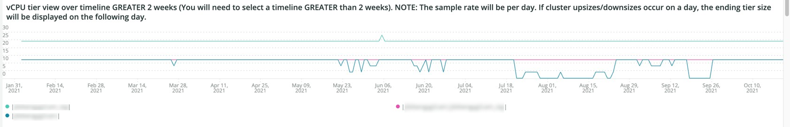
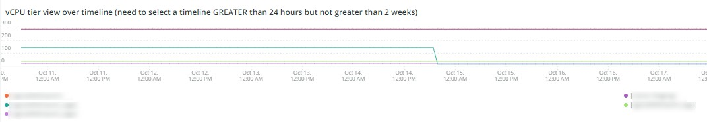

# Die [!UICONTROL Infra] tab

Die **[!UICONTROL Infra]** -Registerkarte isoliert Probleme und Ursachen von Infrastrukturproblemen. Weitere Informationen finden Sie in den Frames, die Sie auf der Registerkarte sehen können.

## [!UICONTROL Service Alerts – Infrastructure Alerts by Application name]

Die **[!UICONTROL Service Alerts – Infrastructure Alerts by Application name]** Das Diagramm zeigt die von der [!DNL New Relic] Infrastrukturagent. Dadurch werden Dienstneustarts angezeigt, von denen viele mit -Implementierungen verbunden sind.

## [!UICONTROL Inode usage by mount]

Die **[!UICONTROL Inode usage by mount]** frame zeigt die Nutzung des Indes durch die Bereitstellung über den ausgewählten Zeitrahmen hinweg an. Auch wenn es viel Speicherplatz gibt, der frei ist, zeigt ein Knoten, wenn ihm die Inodes ausgehen, einen Mangel an verfügbarem Speicher. Durch das Entfernen von Dateien (insbesondere kleinen) wird sowohl Speicherplatz freigesetzt als auch die Verfügbarkeit von Inodes gewährleistet.

## [!UICONTROL vCPU tier view over timeline GREATER 2 weeks]

Die **[!UICONTROL vCPU tier view over timeline GREATER 2 weeks]** frame zeigt die vCPU-Tier-Ansicht über den ausgewählten Zeitraum von mehr als zwei Wochen an. Dieser Frame untersucht die Anzahl der vCPUs, die der [!DNL New Relic] Anwendungsname angezeigt.

## [!UICONTROL vCPU tier view over timeline]

Die **[!UICONTROL vCPU tier view over timeline]** frame zeigt die vCPU-Tier-Ansicht über den ausgewählten Zeitraum von mehr als 24 Stunden an. Dieser Frame untersucht die Anzahl der vCPUs, die der [!DNL New Relic] Anwendungsname angezeigt. Es werden sowohl Cluster-Uploads als auch -Downloads angezeigt.

## [!UICONTROL vCPU tier view over timeline BY NODE]

Die **[!UICONTROL vCPU tier view over timeline BY NODE]** frame zeigt Ansichten der vCPU-Ebene über den ausgewählten Zeitrahmen nach Knoten an. Dieser Frame ist hilfreich, um den Verlust von Knoten zu erkennen oder Knoten zu vergrößern oder zu verkleinern. vCPU-Stufenansicht über Timeline BY NODE sollte sich die Timeline weniger als 24 Stunden ansehen.

## [!UICONTROL Instance details]

Die **[!UICONTROL Instance details]** -Tabelle zeigt die Instanzdetails jedes [!DNL New Relic] Anwendung.

## [!UICONTROL Logging, if there is a broken line for a node, it indicates non-responsive node during that time period]

Die **[!UICONTROL Logging, if there is a broken line for a node, it indicates non-responsive node during that time period]** frame zeigt nicht responsive Knoten über einen Zeitraum hinweg an.
